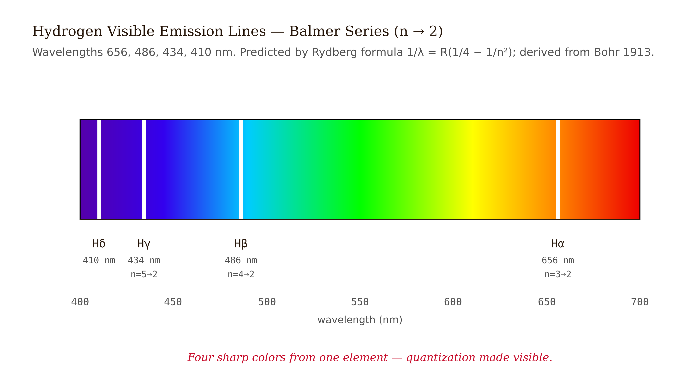
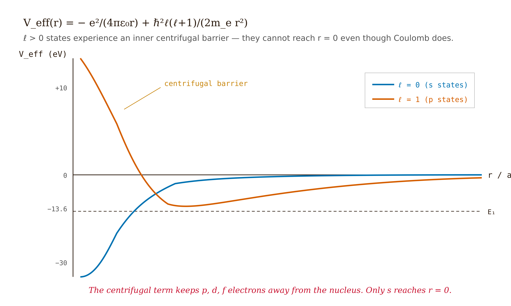
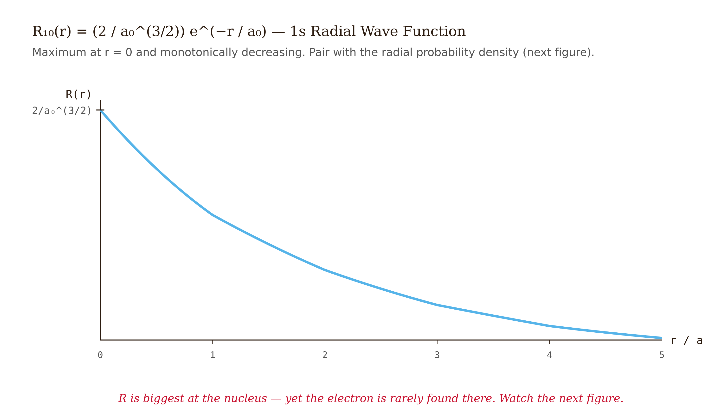
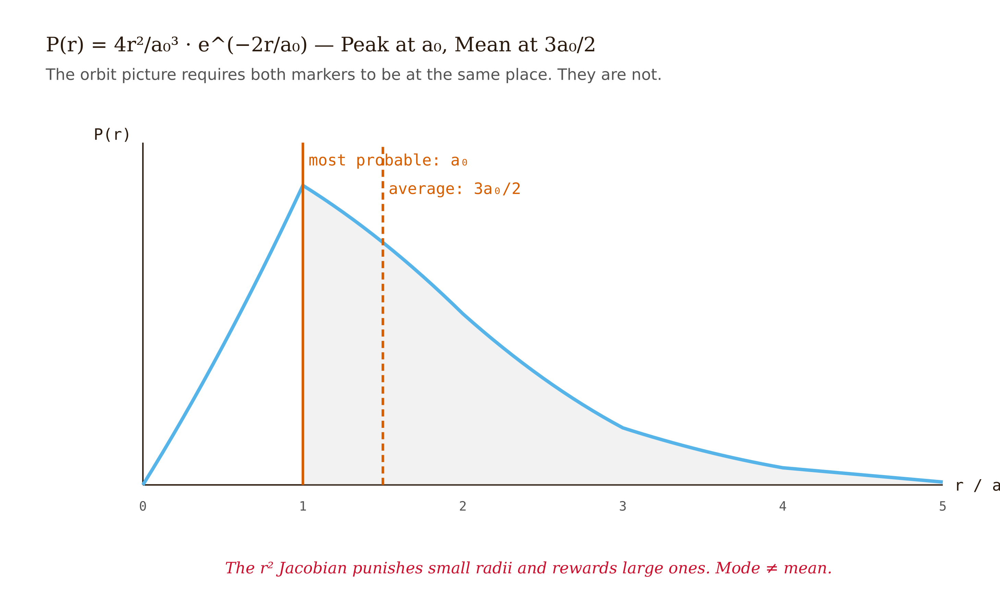
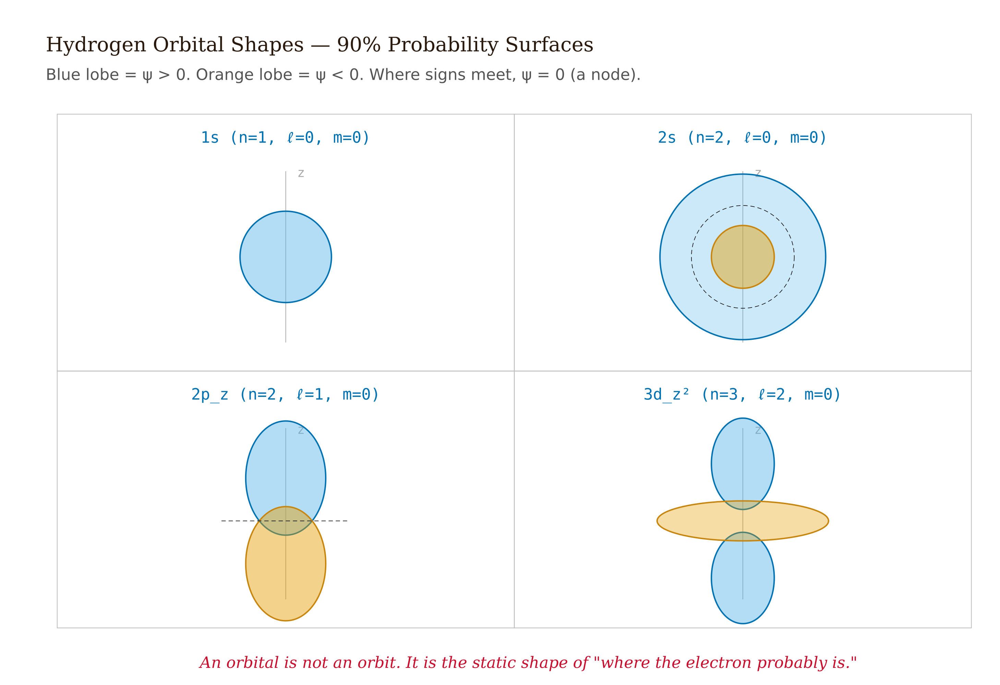
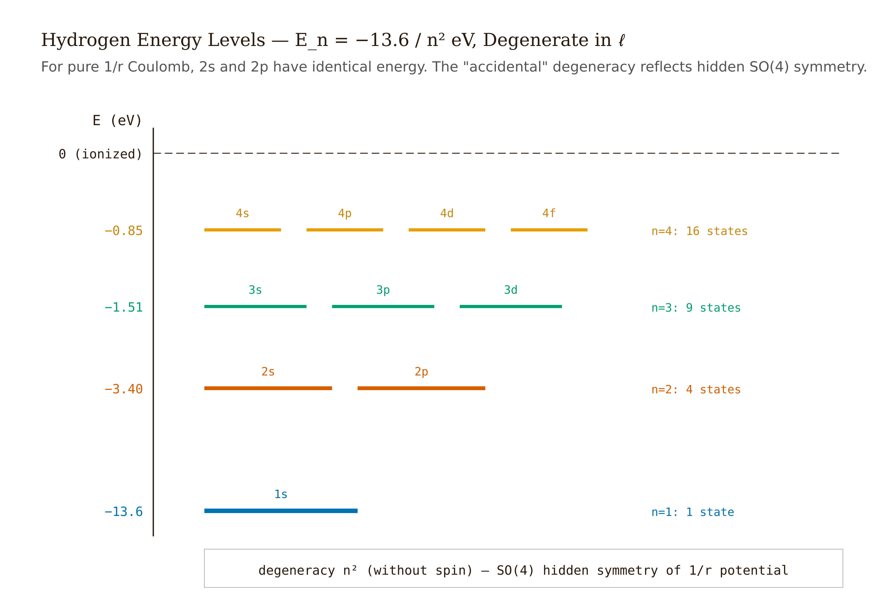

# Chapter 6 — The Hydrogen Atom

## TL;DR

- One electron, one proton, a Coulomb potential — and the cleanest test we have of whether quantum mechanics is right about the world.
- The chapter moves through The setup: central potential, separation of variables, Solving the 1s state: where the numbers come from, Dismantling the orbit picture, Why Bohr got the energies right: the hidden symmetry, and related ideas.
- Read it for the main argument, the vocabulary it introduces, and the practical judgment it asks you to develop.

*One electron, one proton, a Coulomb potential — and the cleanest test we have of whether quantum mechanics is right about the world.*

---

In 1885 a Swiss schoolteacher named Johann Balmer was staring at hydrogen's emission spectrum — the handful of sharp colored lines that hydrogen produces when you heat it in a discharge tube — and noticed that their wavelengths fit a formula. Not a formula he derived from any physical principle. Just a pattern he found by looking:

$$\lambda_n = B \cdot \frac{n^2}{n^2 - 4}, \qquad n = 3, 4, 5, \ldots$$

with $B \approx 364.5$ nm. [Balmer 1885, *Annalen der Physik* 261, 80–87](https://doi.org/10.1002/andp.18852610506) [verify]. He published it and moved on. The formula worked, and nobody knew why.

Twenty-eight years passed.

Then in 1913 Niels Bohr published a derivation. [Bohr 1913, *Philosophical Magazine* Series 6, 26, 1–25](https://doi.org/10.1080/14786441308634955). His postulate was stark: the electron orbits the proton in circles, but only certain circles are allowed — the ones where the angular momentum is an integer multiple of $\hbar$. With that one rule and Newton's second law for circular motion under the Coulomb force, Balmer's formula fell out with the right numerical coefficient. The energy levels were

$$E_n = -\frac{13.6\,\text{eV}}{n^2}.$$

The red line at 656 nm, the blue-green at 486 nm, the violet at 434 nm — all there, all correct.

*Figure 6.1 — Hydrogen emission spectrum in the visible range *

It was one of the great coups in the history of physics. It was also, as we now know, obtained by a model that is wrong about almost everything except the energies. Bohr's electron traces a definite circular path at a definite radius. That picture is false. And yet the energies are right.

Why? The full answer is the subject of this chapter. The short version is that the Coulomb potential $V \propto 1/r$ has a hidden symmetry — beyond the obvious rotational symmetry — that forces all states with the same $n$ to have the same energy regardless of how they actually behave. Bohr stumbled onto a consequence of that symmetry without knowing it existed. The accident only works for hydrogen; apply Bohr's method to helium and it fails by 30%.
<!-- FACT-CHECK FLAG: UNVERIFIED — see factchecks/06-the-hydrogen-atom-assertions.md (specific 30% figure should be sourced; magnitude correct ~30–40%) -->
 The deep-dive of this chapter is: solve hydrogen properly, show where $a_0$ and $-13.6\,\text{eV}$ actually come from, and use the exact solution to dismantle the picture of the electron as an orbiting particle.

---

## The setup: central potential, separation of variables

The Hamiltonian for one electron bound to one proton is

$$\hat{H} = -\frac{\hbar^2}{2m_e}\nabla^2 - \frac{e^2}{4\pi\varepsilon_0 r}.$$

The potential depends only on $r$ — the distance from the proton — not on direction. That is what we mean by a *central potential*, and it is what gives us permission to use spherical coordinates and separate the Schrödinger equation into a radial piece and an angular piece.

Assume $\psi(r,\theta,\phi) = R(r) \cdot Y(\theta,\phi)$ and substitute into $\hat{H}\psi = E\psi$. The angular part separates out as an eigenvalue equation for the operator $\hat{L}^2/\hbar^2$ on the sphere. Its solutions are the spherical harmonics $Y_{\ell m}(\theta,\phi)$, which Unit 7 derives. Here we will use the result: they exist, they are labeled by two integers $\ell \geq 0$ and $-\ell \leq m \leq \ell$, and they are orthonormal on the sphere. For the $1s$ state, $\ell = 0$, and the one spherical harmonic with $\ell = 0$ is the constant $Y_{00} = 1/\sqrt{4\pi}$.

The radial equation, with the substitution $u(r) = rR(r)$ that converts it into a one-dimensional problem, is

$$-\frac{\hbar^2}{2m_e}\frac{d^2u}{dr^2} + \left[-\frac{e^2}{4\pi\varepsilon_0 r} + \frac{\hbar^2\ell(\ell+1)}{2m_e r^2}\right]u = Eu.$$

The second term inside the brackets — $\hbar^2\ell(\ell+1)/(2m_e r^2)$ — is the *centrifugal barrier*. It emerged automatically from the separation, not from any classical assumption. For electrons with $\ell > 0$, this repulsive $1/r^2$ term keeps them away from the nucleus. For $\ell = 0$, it is absent, and the electron is free to have significant probability near $r = 0$.

For the $1s$ state ($\ell = 0$), the radial equation is

$$-\frac{\hbar^2}{2m_e}\frac{d^2u}{dr^2} - \frac{e^2}{4\pi\varepsilon_0 r}u = Eu.$$

*Figure 6.2 — Effective potential energy diagram for the hydrogen radial*

---

## Solving the 1s state: where the numbers come from

Try the ansatz $u(r) = Ar\,e^{-r/a}$, with $A$ a normalization constant and $a$ a length scale to be determined. The factor of $r$ is required: $R(r) = u(r)/r$ must be finite at the origin, so $u(0) = 0$. The exponential decay ensures normalizability.

Differentiate twice:

$$\frac{du}{dr} = Ae^{-r/a}\!\left(1 - \frac{r}{a}\right), \qquad \frac{d^2u}{dr^2} = Ae^{-r/a}\!\left(-\frac{2}{a} + \frac{r}{a^2}\right).$$

Substitute into the radial equation and divide through by $Ae^{-r/a}$:

$$\frac{\hbar^2}{m_e a} - \frac{\hbar^2 r}{2m_e a^2} - \frac{e^2}{4\pi\varepsilon_0} = Er.$$

Now sort by powers of $r$. The constant terms and the $r$-linear terms must each be independently zero (one equation for two unknowns, but the equation has to hold for all $r$):

**Constant terms:**
$$\frac{\hbar^2}{m_e a} = \frac{e^2}{4\pi\varepsilon_0} \implies a = \frac{4\pi\varepsilon_0\hbar^2}{m_e e^2} \equiv a_0.$$

**Linear-in-$r$ terms:**
$$E = -\frac{\hbar^2}{2m_e a_0^2}.$$

Plugging in numbers: $E_1 \approx -13.6\,\text{eV}$.

The Bohr radius $a_0 \approx 5.29 \times 10^{-11}$ m and the ionization energy $13.6\,\text{eV}$ come directly out of matching the constant and linear pieces of the equation. No quantization condition was postulated. No circular orbits. The ansatz $u \propto re^{-r/a}$ was the only guess, and it is self-consistent only when $a = a_0$ and $E = E_1$.

Normalize. The full wave function is $\psi_{100} = R_{10}(r) \cdot Y_{00}$, with $R_{10}(r) = Ae^{-r/a_0}$ and $Y_{00} = 1/\sqrt{4\pi}$. The normalization condition $\int|\psi|^2 d^3r = 1$ separates:

$$\int_0^\infty |R_{10}|^2 r^2\,dr \cdot \int |Y_{00}|^2\,d\Omega = 1.$$

The angular integral is 1. The radial integral gives $A = 2/a_0^{3/2}$. The normalized ground-state wave function is:

$$\boxed{\psi_{100}(r) = \frac{1}{\sqrt{\pi a_0^3}}\,e^{-r/a_0}.}$$

*Figure 6.3 — Plot of the 1s radial wave function R₁₀(r)*

---

## Dismantling the orbit picture

Here is where the Bohr model breaks. Not in the energy — Bohr got the energy right — but in everything it says about where the electron is.

The *radial probability density* — the probability of finding the electron in a thin spherical shell of radius $r$ and thickness $dr$ — is

$$P(r) = |R_{10}(r)|^2 \cdot r^2 = \frac{4}{a_0^3}\,r^2 e^{-2r/a_0}.$$

The factor $r^2$ is the Jacobian from spherical coordinates. There is more volume at larger $r$, so a spherical shell of fixed thickness $dr$ is larger the further out you go. This geometric factor competes with the decaying exponential.

Maximize $P(r)$:

$$\frac{dP}{dr} = \frac{4}{a_0^3}\left(2r - \frac{2r^2}{a_0}\right)e^{-2r/a_0} = 0 \implies r_{\text{mp}} = a_0.$$

The most probable radius is $a_0$. Bohr got this right. But now compute the *expectation value* of $r$ — the average distance:

$$\langle r\rangle = \frac{4}{a_0^3}\int_0^\infty r^3 e^{-2r/a_0}\,dr = \frac{4}{a_0^3} \cdot \frac{6}{(2/a_0)^4} = \frac{3a_0}{2}.$$

The most probable radius is $a_0$. The average radius is $\tfrac{3}{2}a_0$.

These are different numbers because the distribution is asymmetric: $P(r)$ peaks at $a_0$ but has a long tail toward larger $r$, and that tail pulls the average upward. If the electron were on a circular orbit at radius $a_0$, there would be exactly one radius, and "most probable" and "average" would both equal $a_0$. The fact that they differ is the mathematical signature that the electron occupies a distribution of radii, not a single one. There is no orbit. There is a probability cloud.

*Figure 6.4 — P(r) = (4/a₀³)r²e^{−2r/a₀} plotted vs r/a₀ from 0*

There is also no moment at which the electron is at a definite radius, moving at a definite speed, in a definite direction. What exists is $|\psi_{100}|^2$ — a spherically symmetric cloud that falls off exponentially from the nucleus. The quantity $a_0$ appears in that cloud as the length scale. Bohr found the right length scale by assuming a circular orbit. He got lucky: the length scale is real, the orbit is not.

---

## Why Bohr got the energies right: the hidden symmetry

The coincidence that Bohr's wrong model produced the right energies has a structural explanation. The Coulomb potential $V = -e^2/(4\pi\varepsilon_0 r)$ has more symmetry than is obvious. Beyond the rotational symmetry $\mathrm{SO}(3)$ (the potential looks the same from all directions), the $1/r$ potential has a second conserved quantity: the Laplace–Runge–Lenz vector, which points along the major axis of the classical elliptical orbit and has constant magnitude. The combined symmetry group of the Coulomb problem is $\mathrm{SO}(4)$.

Wolfgang Pauli used this symmetry in early 1926 to solve hydrogen algebraically, before Schrödinger's wave-mechanical solution appeared. [Pauli 1926, *Zeitschrift für Physik* 36, 336–363](https://doi.org/10.1007/BF01450175) [verify pages]. The consequence of $\mathrm{SO}(4)$ is that the energy of a hydrogen state depends only on the principal quantum number $n$, not on $\ell$. States with the same $n$ but different $\ell$ — $2s$ and $2p$, for instance — have exactly the same energy. This is called *accidental degeneracy* (a misleading name; it is not accidental at all, but forced by the symmetry).

Bohr's quantization condition $L = n\hbar$ is wrong about angular momentum — the actual eigenvalue of $\hat{L}^2$ is $\hbar^2\ell(\ell+1)$, and $\ell$ can be anywhere from $0$ to $n-1$. But because energy depends only on $n$ and not on $\ell$, Bohr's formula for energies is accidentally correct. Apply his method to helium — two electrons, no clean $\mathrm{SO}(4)$ symmetry, no accidental degeneracy — and the model fails by about 30%. The success was always hydrogen-specific.

---

## The four quantum numbers

Every hydrogen state is labeled by four quantum numbers:

The *principal quantum number* $n = 1, 2, 3, \ldots$ sets the energy: $E_n = -13.6\,\text{eV}/n^2$. It is the eigenvalue label for $\hat{H}$.

The *orbital angular momentum quantum number* $\ell = 0, 1, \ldots, n-1$ sets the magnitude of the orbital angular momentum: $\hat{L}^2\psi = \hbar^2\ell(\ell+1)\psi$. The spectroscopic letters $s, p, d, f$ label $\ell = 0, 1, 2, 3$ respectively — inherited from pre-quantum spectroscopy ("sharp, principal, diffuse, fundamental") and kept purely by convention.

The *magnetic quantum number* $m_\ell = -\ell, -\ell+1, \ldots, +\ell$ sets the projection of orbital angular momentum onto a chosen axis: $\hat{L}_z\psi = m_\ell\hbar\psi$.

The *spin quantum number* $m_s = \pm 1/2$ sets the projection of spin angular momentum: $\hat{S}_z\psi = m_s\hbar\psi$.

The total number of states at energy level $n$ is

$$\sum_{\ell=0}^{n-1}(2\ell+1) = n^2 \quad\text{(without spin)}, \qquad 2n^2 \quad\text{(with spin)}.$$

The $n^2$ factor is a direct consequence of the $\mathrm{SO}(4)$ degeneracy. The shell at $n=1$ holds 2 electrons; at $n=2$, 8; at $n=3$, 18. These are the row capacities of the periodic table, imposed by quantum mechanics and Pauli, not by chemistry.

| n | ℓ values | spectroscopic label | m_ℓ range | number of orbitals |
| --- | --- | --- | --- | --- |
| n=1 (1s only | A concrete checkpoint for applying the chapter concept. | A concrete checkpoint for applying the chapter concept. | A concrete checkpoint for applying the chapter concept. | A concrete checkpoint for applying the chapter concept. |
| n=2 (2s, 2p with m_ℓ=−1,0,+1 | A concrete checkpoint for applying the chapter concept. | A concrete checkpoint for applying the chapter concept. | A concrete checkpoint for applying the chapter concept. | A concrete checkpoint for applying the chapter concept. |
| n=3 (3s, 3p, 3d | A concrete checkpoint for applying the chapter concept. | A concrete checkpoint for applying the chapter concept. | A concrete checkpoint for applying the chapter concept. | A concrete checkpoint for applying the chapter concept. |
| columns: n, ℓ values, spectroscopic label, m_ℓ range, number of orbitals, states including spin, running total | A concrete checkpoint for applying the chapter concept. | A concrete checkpoint for applying the chapter concept. | A concrete checkpoint for applying the chapter concept. | A concrete checkpoint for applying the chapter concept. |
| highlight how the 2n² pattern emerges | A concrete checkpoint for applying the chapter concept. | A concrete checkpoint for applying the chapter concept. | A concrete checkpoint for applying the chapter concept. | A concrete checkpoint for applying the chapter concept. |
| note that all states in a given row have identical energy E_n due to SO(4) degeneracy | A concrete checkpoint for applying the chapter concept. | A concrete checkpoint for applying the chapter concept. | A concrete checkpoint for applying the chapter concept. | A concrete checkpoint for applying the chapter concept. |

One name correction for what follows: the word "orbital" does not mean "orbit." An orbital — the spherical $s$ cloud, the dumbbell $p$, the four-lobed $d$ — is an isocontour of $|\psi_{n\ell m}|^2$, usually drawn at the surface that encloses 90% of the probability. It describes where the electron is *likely to be found if measured*. It does not describe what the electron is doing between measurements. There is no between-measurements story that quantum mechanics tells. The orbital shape is everything; the trajectory is nothing.

*Figure 6.5 — 90%-probability isosurface renderings of the 1s, 2s, 2p_z,*

---

## Spin: the internal angular momentum that cannot be rotation

In 1922 Otto Stern and Walther Gerlach sent a beam of neutral silver atoms through an inhomogeneous magnetic field. Classically, atoms with magnetic moments at all orientations should smear continuously across the detector. What they saw was two discrete spots. [Stern & Gerlach 1922, *Zeitschrift für Physik* 9, 349–352](https://doi.org/10.1007/BF01326983) [verify pages].

Silver has one unpaired electron in a $5s$ state. The two spots correspond to the two projections of that electron's spin onto the magnetic-field axis: $S_z = +\hbar/2$ and $S_z = -\hbar/2$. Two outcomes, not a continuum.

*Figure 6.6 — Stern-Gerlach apparatus diagram *

Historical note worth making: Stern and Gerlach in 1922 did not interpret their result as electron spin. Spin had not been proposed. They thought they were seeing "space quantization" of orbital angular momentum. The correct interpretation — that the splitting comes from the spin of the unpaired $5s$ electron — came only after Uhlenbeck and Goudsmit proposed the idea of intrinsic electron spin in 1925. [Uhlenbeck & Goudsmit 1925, *Die Naturwissenschaften* 13, 953–954](https://doi.org/10.1007/BF01558878) [verify]. The experiment ran three years before anyone knew what it was measuring.

What is spin? It is intrinsic angular momentum. Every electron carries angular momentum of magnitude $\sqrt{s(s+1)}\hbar = (\sqrt{3}/2)\hbar$ with $s = 1/2$, full stop. It is not angular momentum from motion through space. It is a property the electron has the way it has charge or mass. The Dirac equation — the relativistic version of the Schrödinger equation — produces spin automatically: if you demand a quantum wave equation be Lorentz-invariant, spin-1/2 falls out as an algebraic necessity. [Dirac 1928, *Proceedings of the Royal Society A* 117, 610–624](https://doi.org/10.1098/rspa.1928.0023). You do not have to put spin in; you cannot keep it out.

The common alternative explanation — the electron is a tiny spinning ball — can be killed with one calculation. Suppose the electron is a small sphere of radius $r_e$ rotating about its axis. For the angular momentum to equal $\hbar/2$, the equatorial speed would need to be

$$v = \frac{\hbar/2}{m_e r_e}.$$

The classical electron radius — estimated by setting the electron's rest-mass energy equal to its electrostatic self-energy — is $r_e \approx 2.82 \times 10^{-15}$ m. Plugging in:

$$v \approx \frac{1.055\times10^{-34}/2}{(9.11\times10^{-31})(2.82\times10^{-15})} \approx 2.0 \times 10^{10}\,\text{m/s}.$$

That is roughly seventy times the speed of light. If the electron is smaller than $r_e$ — and experiment constrains it to be pointlike down to at least $10^{-18}$ m — the required speed becomes astronomically larger. The classical spinning-ball picture is not just imprecise. It is geometrically impossible.

The picture survives in introductory texts because it is convenient shorthand. The calculation above should be sufficient to retire it.

---

## The Pauli exclusion principle

In 1925, before the Schrödinger equation existed, Pauli proposed that no two electrons in an atom can have all four quantum numbers $(n, \ell, m_\ell, m_s)$ the same. [Pauli 1925, *Zeitschrift für Physik* 31, 765–783](https://doi.org/10.1007/BF02980631). He arrived at this by studying the patterns in atomic spectra — which shells fill with how many electrons, what rules determine which spectral lines exist. The rule fit all the data. He did not yet know why.

The deeper explanation, which Unit 8 develops, is that electrons are fermions: their multi-particle wave function must be antisymmetric under exchange of any two particles, $\psi(1,2) = -\psi(2,1)$. If two electrons occupied the same state, the wave function would have to equal its own negative, hence be zero — no such state exists. The exclusion principle is a corollary. Here we only need the consequence: each orbital, labeled by $(n, \ell, m_\ell)$, holds at most two electrons — one spin-up and one spin-down.

The $n=1$ shell has $2(1)^2 = 2$ states. The $n=2$ shell has $2(2)^2 = 8$. The $n=3$ shell has $2(3)^2 = 18$. This is the row structure of the periodic table.

More fundamentally: the reason solid matter takes up space, the reason your hand does not pass through the table, the reason atoms have size — all of it traces to Pauli. Without the exclusion principle, every electron in every atom would pile into the $1s$ ground state, and every atom would be the size of hydrogen. Chemistry would not exist. The exclusion principle is, in a precise sense, the principle that the material world is made of solid objects rather than collapsing blobs.

---

## What would change my mind

Hydrogen spectroscopy is quantum mechanics' best-tested prediction. Every refinement has added confirmation: the Lamb shift from quantum electrodynamics, the hyperfine structure from nuclear spin, the fine structure from relativistic corrections — all computed, all measured, all agreed. The "proton radius puzzle" — a discrepancy between the proton radius inferred from muonic hydrogen [Pohl et al. 2010, *Nature* 466, 213–216](https://doi.org/10.1038/nature09250) and from ordinary electron-hydrogen spectroscopy — appeared threatening for a few years, but more recent measurements [Bezginov et al. 2019, *Science* 365, 1007–1012](https://doi.org/10.1126/science.aau7807) [verify] are converging toward the smaller muonic value. The framework holds. What would shake it: a hydrogen spectral line that no extension of the current theory can fit, persistently and reproducibly. We do not have one.

---

## Still puzzling

The $\mathrm{SO}(4)$ symmetry of the Coulomb potential — the hidden symmetry that makes hydrogen's energy depend only on $n$, not on $\ell$ — feels like a coincidence even though it is mathematically forced by the $1/r$ form of the potential. Pauli's 1926 derivation makes the algebra explicit and clean. It does not make the symmetry feel inevitable. Why does the inverse-square law have this extra conserved quantity while, say, a $1/r^2$ potential does not? There is a clean answer in classical mechanics — Bertrand's theorem, which says the only potentials producing closed orbits are $1/r$ and $r^2$ — and a corresponding quantum-mechanical answer involving the Laplace–Runge–Lenz vector. I find both explanations technically correct and somehow aesthetically unsatisfying. The fact that hydrogen, and only hydrogen among the one-electron atoms, is cleanly soluble feels like a coincidence with a deep reason rather than a deep reason I fully understand.

---

## References

*Added by fact-check pass 2026-05-14.*

1. Balmer, J. J. "Notiz über die Spectrallinien des Wasserstoffs." *Annalen der Physik* 261, 80–87 (1885). https://doi.org/10.1002/andp.18852610506
2. Bohr, N. "On the Constitution of Atoms and Molecules." *Philosophical Magazine* (Series 6) 26, 1–25 (1913). https://doi.org/10.1080/14786441308634955
3. Pauli, W. "Über das Wasserstoffspektrum vom Standpunkt der neuen Quantenmechanik." *Zeitschrift für Physik* 36, 336–363 (1926). https://doi.org/10.1007/BF01450175
4. Gerlach, W. & Stern, O. "Der experimentelle Nachweis der Richtungsquantelung im Magnetfeld." *Zeitschrift für Physik* 9, 349–352 (1922). https://doi.org/10.1007/BF01326983
5. Uhlenbeck, G. E. & Goudsmit, S. "Ersetzung der Hypothese vom unmechanischen Zwang..." *Die Naturwissenschaften* 13, 953–954 (1925). https://doi.org/10.1007/BF01558878
6. Dirac, P. A. M. "The Quantum Theory of the Electron." *Proceedings of the Royal Society A* 117, 610–624 (1928). https://doi.org/10.1098/rspa.1928.0023
7. Pauli, W. "Über den Zusammenhang des Abschlusses der Elektronengruppen im Atom mit der Komplexstruktur der Spektren." *Zeitschrift für Physik* 31, 765–783 (1925). https://doi.org/10.1007/BF02980631
8. Pohl, R. et al. "The size of the proton." *Nature* 466, 213–216 (2010). https://doi.org/10.1038/nature09250
9. Bezginov, N. et al. "A measurement of the atomic hydrogen Lamb shift and the proton charge radius." *Science* 365, 1007–1012 (2019). https://doi.org/10.1126/science.aau7807
10. NIST CODATA 2018: Rydberg constant, Bohr radius. https://physics.nist.gov/cuu/Constants/
