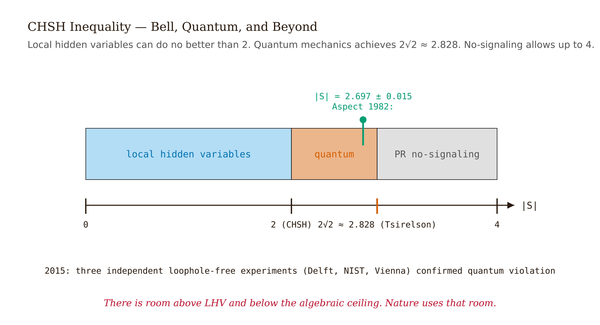
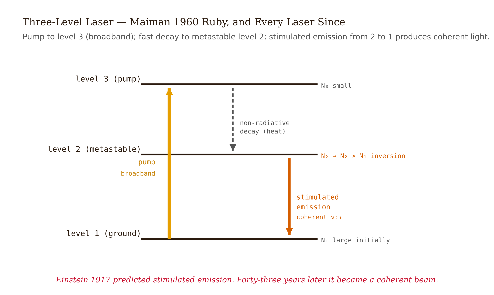
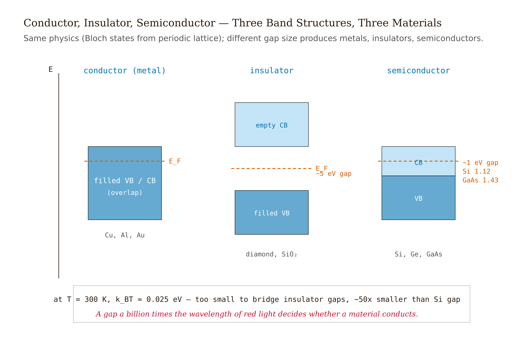
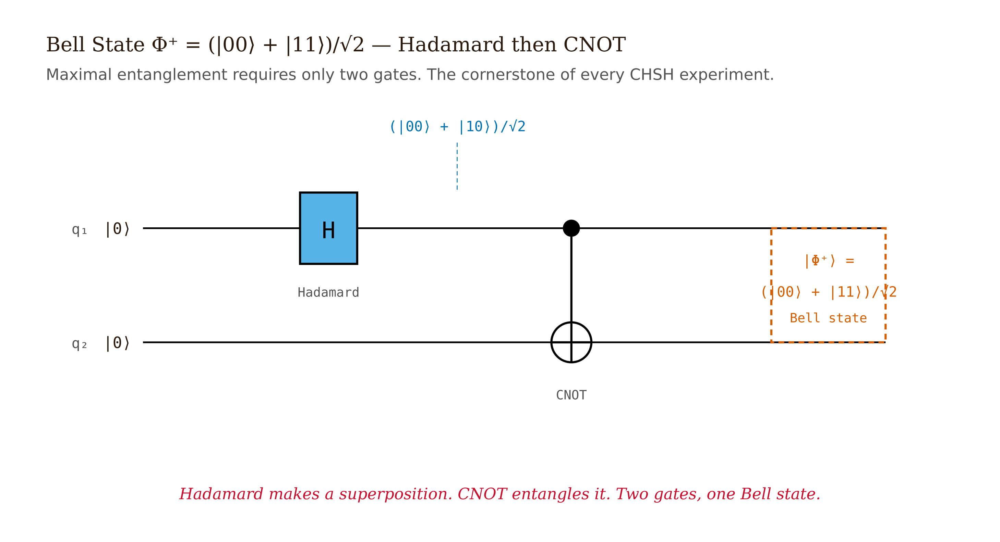
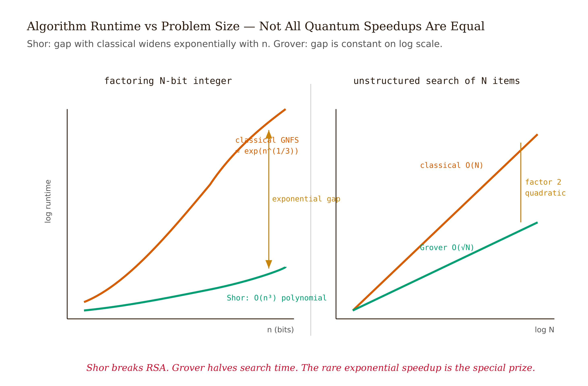
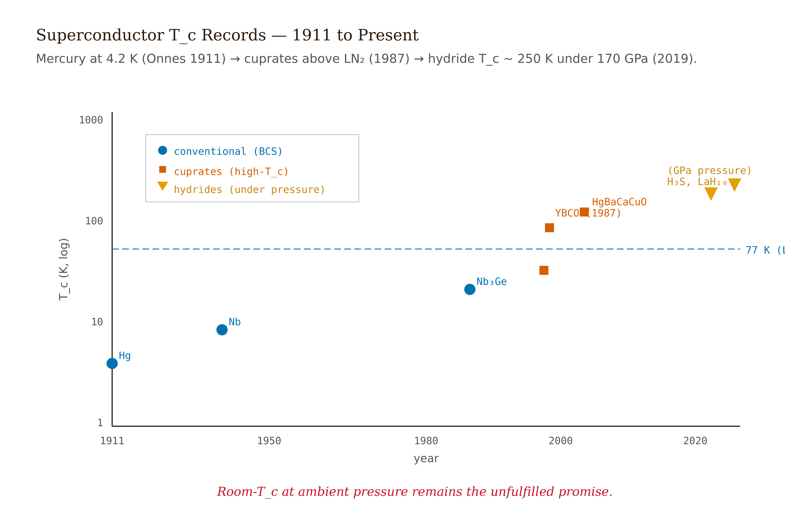
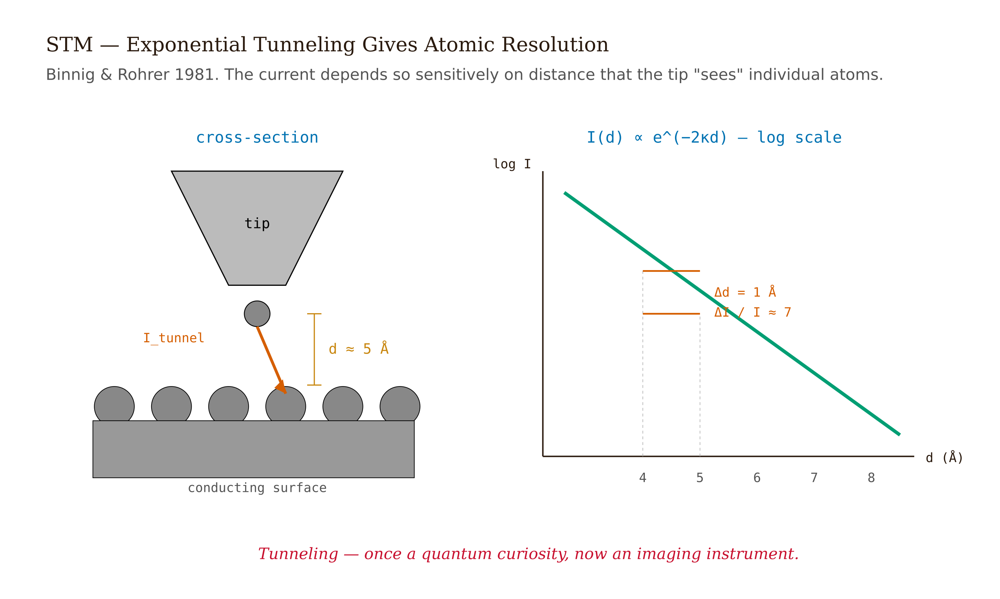

# Chapter 10 — Quantum Mechanics in the Modern World

## TL;DR

- Bell's theorem is now a Nobel Prize.
- The chapter moves through Entanglement, EPR, and the CHSH inequality, Lasers and stimulated emission, Semiconductors and band theory, Quantum computing, and related ideas.
- Read it for the main argument, the vocabulary it introduces, and the practical judgment it asks you to develop.

*Bell's theorem is now a Nobel Prize. Lasers are a ten-figure industry. Quantum computing is a hardware race. Foundational quantum mechanics has stopped being only philosophy.*

---

In October 2022 the Nobel Committee for Physics gave its prize to Alain Aspect, John Clauser, and Anton Zeilinger for experiments with entangled photons. The prize announcement named "quantum information science" as a field — a discipline that did not exist when most of the cited work was done.

What makes the award unusual is its target. This is a Nobel Prize for closing a foundational argument. In 1935 Einstein, Podolsky, and Rosen published a thought experiment arguing that quantum mechanics must be incomplete — that there must be hidden variables underlying the probabilistic predictions, restoring the determinism and locality that the theory appeared to sacrifice. In 1964 John Bell turned that philosophical argument into a quantitative test: an inequality that any local hidden-variable theory must satisfy, and that quantum mechanics predicts should be violated by about 41%. In 1981–1982 Aspect and collaborators measured the violation in the lab. In 2015 three independent groups closed the remaining experimental loopholes simultaneously. The verdict: local hidden-variable theories of the form Einstein envisioned are ruled out at more than ten standard deviations. The 2022 Nobel is the physics community's formal acknowledgment that this argument is settled.

The mathematical content underneath the Nobel is approximately one page of algebra. It is worth doing carefully.

This chapter connects six modern applications — entanglement and Bell's theorem, lasers, semiconductors, quantum computing, superconductivity, and tunneling — to the formalism built in earlier chapters. Each one is a place where quantum mechanics stopped being theoretical and became an industry, a Nobel Prize, or an open race.

*Aging note.* Specific qubit counts, post-quantum cryptography migration milestones, and high-$T_c$ records will be out of date within one or two years of this writing (2026). Numbers are labeled `[verify, 2026]` where this applies; the conceptual structure survives any reasonable update.

---

## Entanglement, EPR, and the CHSH inequality

Einstein, Podolsky, and Rosen's 1935 paper ([*Physical Review* 47, 777–780](https://doi.org/10.1103/PhysRev.47.777)) ran a thought experiment: two particles prepared in a correlated state and then separated by a large distance. Measure particle A; you instantly know what particle B would give for the same measurement. EPR's argument: B was spacelike-separated from A at the time; no physical influence could have passed between them; therefore B's outcome was determined before the measurement — a "hidden variable." But quantum mechanics forbids assigning simultaneous definite values to non-commuting observables, so, EPR concluded, quantum mechanics must be incomplete.

David Bohm restated the argument in 1951 using two spin-1/2 particles in the singlet state (which you have met in Unit 7 as the spin part of parahelium's ground state):

$$|\psi_\text{singlet}\rangle = \frac{1}{\sqrt{2}}\left(|\uparrow\rangle_A|\downarrow\rangle_B - |\downarrow\rangle_A|\uparrow\rangle_B\right).$$

Total spin zero. Any spin measurement along any axis perfectly anticorrelates the two outcomes. Bell's 1964 insight ([*Physics Physique Fizika* 1, 195–200](https://doi.org/10.1103/PhysicsPhysiqueFizika.1.195)) was that this perfect anticorrelation, by itself, is not enough to distinguish quantum mechanics from a hidden-variable theory — but the *angular* dependence of the correlations for non-parallel axes is.

Here is the CHSH inequality derivation ([Clauser, Horne, Shimony, Holt 1969, *PRL* 23, 880–884](https://doi.org/10.1103/PhysRevLett.23.880)). Alice has two measurement settings $a_1$ and $a_2$; Bob has $b_1$ and $b_2$. Each measurement produces a binary outcome in $\{+1, -1\}$. In any local hidden-variable theory, the outcomes are determined by a shared hidden variable $\lambda$ and the local setting:

$$A_i = A_i(a_i, \lambda) \in \{+1,-1\}, \qquad B_j = B_j(b_j, \lambda) \in \{+1,-1\}.$$

For each $\lambda$, form the combination

$$S(\lambda) = A_1 B_1 + A_1 B_2 + A_2 B_1 - A_2 B_2 = A_1(B_1 + B_2) + A_2(B_1 - B_2).$$

Since $B_1, B_2 \in \{+1,-1\}$: either $B_1 = B_2$, in which case $B_1 + B_2 = \pm 2$ and $B_1 - B_2 = 0$; or $B_1 = -B_2$, in which case $B_1 + B_2 = 0$ and $B_1 - B_2 = \pm 2$. Either way, exactly one of the two parentheses is $\pm 2$ and the other is $0$. So $|S(\lambda)| = 2$ for every $\lambda$. Average over the distribution of hidden variables:

$$|\langle S\rangle_\text{LHV}| \leq 2.$$

In terms of the experimentally measurable correlation functions $E(a_i, b_j) = \langle A_i B_j\rangle$:

$$\boxed{|E(a_1,b_1) + E(a_1,b_2) + E(a_2,b_1) - E(a_2,b_2)| \leq 2 \quad \text{(CHSH, any LHV).}}$$

That derivation rests on one assumption: outcomes are predetermined functions of $\lambda$ and the local setting, with no faster-than-light coordination between Alice's and Bob's sides.

Now compute the same combination for the quantum singlet. The correlation function for spin-1/2 measurements along directions separated by angle $\theta_{AB}$ is

$$E_\text{QM}(\hat{n}_A, \hat{n}_B) = -\cos\theta_{AB}.$$

Choose the angles that maximize $|S|$. Take $a_1 = 0$, $a_2 = \pi/2$, $b_1 = \pi/4$, $b_2 = -\pi/4$. The four angle differences are all $\pi/4$ except $\theta_{22} = 3\pi/4$. Computing:

$$E(a_1,b_1) = -\cos(\pi/4) = -1/\sqrt{2},$$
$$E(a_1,b_2) = -\cos(\pi/4) = -1/\sqrt{2},$$
$$E(a_2,b_1) = -\cos(\pi/4) = -1/\sqrt{2},$$
$$E(a_2,b_2) = -\cos(3\pi/4) = +1/\sqrt{2}.$$

$$S = -1/\sqrt{2} - 1/\sqrt{2} - 1/\sqrt{2} - 1/\sqrt{2} = -4/\sqrt{2} = -2\sqrt{2}.$$

$$|S|_\text{QM} = 2\sqrt{2} \approx 2.828.$$

Local hidden variables are bounded by 2. Quantum mechanics gives $2\sqrt{2}$. The gap is about 41%. The Tsirelson bound ([Tsirelson 1980, *Letters in Mathematical Physics* 4, 93–100](https://doi.org/10.1007/BF00417500)) says no quantum state with any measurement axes can exceed $2\sqrt{2}$; the singlet at these axes saturates it.

*Figure 10.1 — Number line or bar diagram showing three regions*

Aspect, Grangier, and Roger in 1981–1982 measured $S = 2.697 \pm 0.015$ with polarization-entangled photons from a calcium cascade source ([*PRL* 49, 91](https://doi.org/10.1103/PhysRevLett.49.91); *PRL* 49, 1804](https://doi.org/10.1103/PhysRevLett.49.1804)). Violates the CHSH bound by tens of standard deviations, but left two loopholes open: detection efficiency (most photons missed — the detected subsample might not be representative) and locality (could a signal have passed between the detectors during the measurement?). In 2015, three independent loophole-free experiments closed both simultaneously:

- Hensen et al. ([*Nature* 526, 682–686](https://doi.org/10.1038/nature15759)), Delft, NV centers in diamond, 1.3 km apart.
- Giustina et al. ([*PRL* 115, 250401](https://doi.org/10.1103/PhysRevLett.115.250401)), Vienna, entangled photons.
- Shalm et al. ([*PRL* 115, 250402](https://doi.org/10.1103/PhysRevLett.115.250402)), NIST Boulder, entangled photons.

The verdict: local hidden-variable theories of the EPR form are ruled out at $>10\sigma$. The only escape routes left are exotic — signals propagating faster than light in a way that permits no controllable communication, or superdeterminism (the experimenters' measurement choices were themselves predetermined to fake the violation). Neither is popular.

One important clarification: entanglement does not allow faster-than-light communication. The marginal probability for Bob's outcome is unchanged by Alice's measurement choice — this is the no-signaling theorem, a theorem in quantum mechanics, not an assumption. To learn about the *correlation* (which is non-classical), Alice and Bob must compare data, and the comparison travels at light speed.

---

## Lasers and stimulated emission

In 1917 Einstein introduced three radiative processes between atomic levels of energies $E_1 < E_2$ ([*Physikalische Zeitschrift* 18, 121–128](https://en.wikisource.org/wiki/Translation:On_the_Quantum_Theory_of_Radiation)): absorption (rate $\propto B_{12}\rho(\nu)N_1$), spontaneous emission (rate $\propto A_{21}N_2$, independent of the field), and stimulated emission (rate $\propto B_{21}\rho(\nu)N_2$, proportional to the field, with the emitted photon coherent with the stimulating field). Stimulated emission was the new piece. Einstein deduced its necessity from thermodynamic consistency: in thermal equilibrium, the rates must balance and the field must follow Planck's distribution. Setting absorption equal to total emission gives

$$\frac{A_{21}}{B_{21}} = \frac{8\pi h\nu^3}{c^3}, \qquad B_{21} = B_{12}.$$

The first relation says spontaneous emission dominates at high frequency ($\nu^3$ scaling) and stimulated emission at low frequency — which is why lasing is easy in the infrared and nearly impossible in the gamma-ray regime. The second says the matrix element governing emission and absorption is identical, which follows from Fermi's golden rule applied to the dipole coupling between atom and radiation field.

Lasing requires *population inversion*: $N_2 > N_1$. In thermal equilibrium this is impossible — Boltzmann puts most population in the lower level. Inversion is achieved by pumping atoms into a third or fourth level from which they decay to the upper laser level faster than the laser transition rate. Theodore Maiman built the first laser in May 1960 at Hughes Research Labs, a ruby rod pumped by a flashlamp, producing 694.3 nm red light in pulses ([Maiman 1960, *Nature* 187, 493–494](https://doi.org/10.1038/187493a0)). *Physical Review Letters* rejected the paper as too incremental. Within a year there were HeNe, semiconductor, and CO$_2$ lasers.

By 2026 [verify], lasers are a ten-figure annual industry — fiber-optic communications, surgical and industrial cutting, optical storage, spectroscopy, precision metrology, ranging. The principle is unchanged from 1917. What Einstein computed from thermodynamic consistency about a single pair of energy levels became a technology that rewired the world's communications infrastructure.
<!-- FACT-CHECK FLAG: UNVERIFIED — see factchecks/10-quantum-mechanics-in-the-modern-world-assertions.md -->

*Figure 10.2 — Energy level diagram *

---

## Semiconductors and band theory

Felix Bloch's 1928 thesis ([*Zeitschrift für Physik* 52, 555–600](https://doi.org/10.1007/BF01339455)) established that the eigenstates of a single electron in a perfectly periodic crystal potential take the form

$$\psi_{n,\mathbf{k}}(\mathbf{r}) = e^{i\mathbf{k}\cdot\mathbf{r}}\,u_{n,\mathbf{k}}(\mathbf{r}),$$

where $u_{n,\mathbf{k}}$ has the same periodicity as the lattice — Bloch's theorem. The energy $E_n(\mathbf{k})$ forms a *band*, and there are forbidden gaps between bands. The Kronig–Penney model ([Kronig and Penney 1931, *Proceedings of the Royal Society A* 130, 499](https://doi.org/10.1098/rspa.1931.0019)) makes this concrete for a 1D periodic array of barriers: apply Bloch's theorem and match boundary conditions to get

$$\cos(ka) = \cos(qa) + \frac{mV_0 a}{\hbar^2 q}\sin(qa),$$

where $q = \sqrt{2mE}/\hbar$. The left side is bounded between $\pm 1$; the right side has stretches where $|\text{RHS}| > 1$ and no real $k$ exists. Those stretches are the forbidden gaps. Bands and gaps emerge from solving the Schrödinger equation in a periodic potential — no extra assumptions.

*Conductors* have a partially-filled band with empty states immediately above filled ones. *Insulators* have a fully-filled valence band separated from the empty conduction band by $\sim 5$ eV — thermal energy ($k_BT \approx 0.025$ eV at room temperature) cannot bridge it. *Semiconductors* sit in between with gaps of 0.5–2 eV: silicon at 1.12 eV, gallium arsenide at 1.43 eV. Thermal excitation populates the conduction band at room temperature in measurable amounts.

*Figure 10.3 — Three side-by-side band diagrams *

Doping shifts the populations. Adding phosphorus (five valence electrons) to silicon (four valence electrons) injects electrons into the conduction band — n-type. Adding boron (three valence electrons) creates holes in the valence band — p-type. A pn junction develops a built-in electric field in its depletion region and is the heart of every diode, LED, photovoltaic cell, and transistor. The MOSFET switches current via a gate-voltage-controlled inversion layer. The Intel 4004 of 1971 had 2,300 transistors; current chips have tens of billions — all resting on Bloch's 1928 theorem and the Born-rule probability interpretation of $|\psi|^2$.

---

## Quantum computing

A *qubit* is a two-level quantum system. The general state is

$$|\psi\rangle = \alpha|0\rangle + \beta|1\rangle, \qquad |\alpha|^2 + |\beta|^2 = 1.$$

A computation is a unitary operation on $N$-qubit Hilbert space of dimension $2^N$, implemented as a circuit of one- and two-qubit gates, with measurement at the end collapsing the state to a classical bit string with Born-rule probabilities. Two ingredients distinguish quantum from classical: superposition (a qubit can be in any complex linear combination of $|0\rangle$ and $|1\rangle$, with phases that allow interference) and entanglement (an $N$-qubit state has $2^N$ complex amplitudes, exponentially more than the $2N$ real numbers needed for $N$ independent classical bits).

The single-qubit gates include the Pauli matrices ($\hat{X}$ for bit flip, $\hat{Z}$ for phase flip) and the Hadamard

$$\hat{H} = \frac{1}{\sqrt{2}}\begin{pmatrix}1 & 1\\1 & -1\end{pmatrix}, \qquad \hat{H}|0\rangle = \frac{|0\rangle + |1\rangle}{\sqrt{2}}, \quad \hat{H}|1\rangle = \frac{|0\rangle - |1\rangle}{\sqrt{2}}.$$

The two-qubit CNOT flips the target qubit when the control is $|1\rangle$. The combination Hadamard plus CNOT generates entanglement from a product state:

$$|00\rangle \xrightarrow{H\otimes I} \frac{1}{\sqrt{2}}(|00\rangle + |10\rangle) \xrightarrow{\text{CNOT}} \frac{1}{\sqrt{2}}(|00\rangle + |11\rangle).$$

That output is a Bell state — the same maximally entangled state at the heart of every CHSH experiment, produced in two gates. CNOT plus arbitrary single-qubit unitaries forms a universal gate set ([DiVincenzo 1995, *Physical Review A* 51, 1015](https://doi.org/10.1103/PhysRevA.51.1015)) — every multi-qubit unitary decomposes into this set with polynomially many gates.

*Figure 10.4 — Quantum circuit diagram for the Bell-state generation *

Two algorithms anchor the field. *Shor's algorithm* ([Shor 1994; 1997, *SIAM Journal on Computing* 26, 1484](https://doi.org/10.1109/SFCS.1994.365700)) factors an $n$-bit integer in $O(n^3)$ operations on a quantum computer, against the best known classical algorithm's $\exp(O(n^{1/3}(\log n)^{2/3}))$ — a super-polynomial speedup. A sufficiently large fault-tolerant quantum computer would break RSA. *Grover's algorithm* ([Grover 1996](https://doi.org/10.1145/237814.237866)) searches an $N$-item unsorted database in $O(\sqrt{N})$ queries against the classical $O(N)$ — a quadratic speedup, significant but not exponential.

*Figure 10.5 — Log-log plot of runtime vs*

As of 2026 [verify], the field is in the NISQ era (Preskill 2018, [*Quantum* 2, 79](https://doi.org/10.22331/q-2018-08-06-79)) — hardware with hundreds to thousands of noisy qubits, not yet error-corrected to fault tolerance. IBM's Condor processor announced around 1,100 superconducting qubits in late 2023; Google's Sycamore family has been demonstrated through 70 qubits; Quantinuum's H2 trapped-ion system offers high-fidelity all-to-all connectivity; Atom Computing has demonstrated neutral-atom arrays exceeding 1,000 qubits [verify, 2026]. Google's 2023 paper ([Acharya et al. 2023, *Nature* 614, 676–681](https://doi.org/10.1038/s41586-022-05434-1)) demonstrated below-threshold logical qubits — increasing surface-code distance from 3 to 5 reduced the logical error rate — which is the first experimental evidence that quantum error correction scales as theory predicts. But from below-threshold demonstration to fault-tolerant factoring of 2048-bit keys, the engineering distance is enormous.
<!-- FACT-CHECK FLAG: UNVERIFIED — see factchecks/10-quantum-mechanics-in-the-modern-world-assertions.md -->

The honest framing: no quantum computer has as of 2026 demonstrated useful speedup on a practically important problem. The 2019 "quantum supremacy" result (Google Sycamore, [*Nature* 574, 505](https://doi.org/10.1038/s41586-019-1666-5)) was a sampling task with no practical utility, and the classical-simulation runtime estimate was revised downward by orders of magnitude within months. These experiments demonstrate that quantum hardware can do something hard to simulate classically; they do not demonstrate that quantum hardware can solve problems people need solved.

The practical response to the *future* threat from Shor's algorithm is *post-quantum cryptography*. NIST finalized FIPS 203 (CRYSTALS-Kyber), FIPS 204 (CRYSTALS-Dilithium), and FIPS 205 (SPHINCS+) in August 2024 [verify; current standards at [NIST PQC](https://csrc.nist.gov/projects/post-quantum-cryptography)]. Internet infrastructure migration is underway now, in anticipation of a large quantum computer that does not yet exist. The timeline is set by prudence about hardware progress, not by an existing threat.

---

## Superconductivity

Heike Kamerlingh Onnes discovered in 1911 that mercury's resistance drops abruptly to zero below 4.2 K (Onnes 1911). The phenomenon — resistance exactly zero, persistent currents lasting effectively indefinitely — was the fact. The explanation took 46 years.

BCS theory (Bardeen, Cooper, Schrieffer 1957, [*Physical Review* 108, 1175](https://doi.org/10.1103/PhysRev.108.1175)) supplied the mechanism. Cooper's key result ([*Physical Review* 104, 1189](https://doi.org/10.1103/PhysRev.104.1189)) was that in the presence of any attractive interaction between two electrons near the Fermi surface, however weak, the Fermi sea is unstable against formation of bound pairs of opposite-momentum, opposite-spin electrons — "Cooper pairs." These pairs have integer spin and act as composite bosons (Unit 8). At low temperature they condense into a macroscopic quantum state with a definite phase, separated from single-particle excitations by an energy gap $\Delta$.

The BCS gap equation at zero temperature gives

$$\Delta \approx 2\hbar\omega_D\,e^{-1/N(0)V},$$

where $N(0)$ is the density of states at the Fermi level, $V$ is the attractive coupling, and $\omega_D$ is the Debye frequency. The non-analytic $e^{-1/V}$ dependence is why no perturbation theory in small $V$ can find this result — all Taylor coefficients of $e^{-1/V}$ at $V=0$ are zero. BCS found it through a variational ansatz, not perturbation theory.

The prediction $2\Delta/k_BT_c \approx 3.53$ is universal in the weak-coupling limit. For aluminum: $\Delta \approx 0.17$ meV predicts $T_c \approx 1.1$ K; measured $T_c = 1.18$ K, within 7%. Zero resistance follows because pair-breaking requires supplying energy $2\Delta$; at $k_BT \ll \Delta$ no scattering process has this energy available. The supercurrent also expels magnetic flux — the Meissner effect ([Meissner and Ochsenfeld 1933, *Naturwissenschaften* 21, 787](https://doi.org/10.1007/BF01504252)) — which distinguishes superconductors from hypothetical perfect conductors and falls out of the BCS theory through the London equations.

Bednorz and Müller's 1986 discovery ([*Zeitschrift für Physik B* 64, 189](https://doi.org/10.1007/BF01303701)) of superconductivity in copper-oxide perovskites at $T_c \approx 35$ K broke the picture. YBa$_2$Cu$_3$O$_7$ followed at $T_c \approx 93$ K (above liquid nitrogen's 77 K boiling point), making economically practical high-$T_c$ materials suddenly real. Nobel 1987, the fastest in the history of the prize. Under extreme pressure, hydrogen sulfide reaches $\sim 203$ K ([Drozdov et al. 2015, *Nature* 525, 73](https://doi.org/10.1038/nature14964)) and lanthanum hydride reaches $\sim 250$ K at $\sim 170$ GPa ([Somayazulu et al. 2019, *PRL* 122, 027001](https://doi.org/10.1103/PhysRevLett.122.027001)). Room-temperature ambient-pressure superconductivity has not been demonstrated as of 2026 [verify]. The mechanism for cuprate superconductivity — forty years after discovery — remains contested.
<!-- FACT-CHECK FLAG: UNVERIFIED — see factchecks/10-quantum-mechanics-in-the-modern-world-assertions.md -->

*Figure 10.6 — Timeline of superconductor T_c records from 1911 to*

---

## Tunneling applications

The WKB tunneling formula from Unit 9 produces an exponential dependence of tunneling current on barrier width that generates a long catalog of technologies and natural phenomena.

*Scanning tunneling microscopy.* Binnig and Rohrer at IBM Zurich in 1981–1982 ([*PRL* 49, 57](https://doi.org/10.1103/PhysRevLett.49.57)); Nobel 1986. A sharp metal tip brought ångström-close to a conducting surface allows electrons to tunnel through the vacuum gap. The current depends exponentially on gap distance $d$:

$$I \propto e^{-2\kappa d}, \qquad \kappa \approx \sqrt{2m_e\phi}/\hbar,$$

where $\phi$ is the work function. For $\phi = 4$ eV, $\kappa \approx 1\,\text{Å}^{-1}$, so a 1 Å change in $d$ changes the current by $e^2 \approx 7.4$. STM resolves individual atoms because the exponential sensitivity means the tunneling current is dominated by the single closest atom on the tip. The exponential does all the spatial resolution work.

*Figure 10.7 — STM cross-section diagram *

*Flash memory.* The floating-gate transistor writes a bit by tunneling electrons through a thin oxide layer onto an isolated gate; the gate charge shifts the transistor's threshold voltage. Flash retains data for years without power because the tunneling rate at read-bias voltage is exponentially small — the same WKB exponential that spans 24 orders of magnitude in alpha-decay half-lives is what makes flash retain data over decades while remaining writable at write voltage.

*Alpha decay.* Gamow 1928 ([*Zeitschrift für Physik* 51, 204](https://doi.org/10.1007/BF01343196)) modeled the alpha particle as a wave packet tunneling through the Coulomb barrier outside the nuclear potential. The WKB formula reproduces the Geiger–Nuttall relation $\log(T_{1/2}) \propto Z/\sqrt{E_\alpha}$ — the first nuclear-physics calculation done with quantum mechanics.

*Josephson junctions.* Cooper-pair tunneling across an insulating barrier between two superconductors ([Josephson 1962, *Physics Letters* 1, 251](https://doi.org/10.1016/0031-9163(62)91369-0)) produces a supercurrent at zero voltage (DC Josephson effect) and an oscillating current at frequency $2eV/\hbar$ under DC bias (AC Josephson effect). SQUIDs — superconducting quantum interference devices based on Josephson junctions — are the most sensitive magnetometers known and underlie the SI definition of the volt since 1990.

*Biological tunneling.* Electron tunneling in respiratory and photosynthetic electron-transport chains is well-established (Marcus theory). Proton tunneling in DNA base pairs was proposed by Löwdin ([*Reviews of Modern Physics* 35, 724, 1963](https://doi.org/10.1103/RevModPhys.35.724)) as a source of spontaneous mutation — the mechanism is real; whether it is quantitatively significant compared to thermal tautomerization is debated. The 2007 claim of long-lived quantum coherence in photosynthetic energy transfer ([Engel et al., *Nature* 446, 782](https://doi.org/10.1038/nature05678)) has been substantially walked back; current consensus is that coherences are present but short-lived and not the dominant mechanism for energy-transfer efficiency [verify, 2024–2026].
<!-- FACT-CHECK FLAG: UNVERIFIED — see factchecks/10-quantum-mechanics-in-the-modern-world-assertions.md -->

---

## What would change my mind

Some of this chapter's claims are stable; others have aging risk.

*Stable*: local hidden-variable theories of the EPR form are ruled out by Bell tests. The Einstein $A/B$ relations hold. Bloch's theorem and band theory hold. BCS accounts for conventional superconductivity. WKB tunneling explains STM, flash memory, and alpha decay.

*Aging within 1–2 years*: quantum-computing hardware metrics (qubit counts, error rates, error-correction milestones) [verify 2026]; high-$T_c$ records; post-quantum cryptography migration rates. The *structure* of progress is more durable than any specific number.

Four scenarios would force a substantial rewrite. A demonstration of *useful quantum advantage* — a quantum computer solving a practically important problem faster than any classical algorithm — would shift §4.4's timeline framing. A *reproducible room-temperature ambient-pressure superconductor* would shift §4.5 significantly; this has been claimed and not reproduced several times between 2020–2024. A *credible Bell-inequality experimental anomaly* — an experiment that fails to find the predicted violation — would force reconsideration of the entanglement section; none has appeared in sixty years of increasingly careful experiments. And a *loophole-free demonstration that quantum-biological coherence is essential to a biological function* would strengthen the tunneling-biology paragraph; the field has been moving in the opposite direction since 2014 [verify].

---

## Still puzzling

**Bell's theorem rules out local hidden variables, not everything.** The experiment rules out the conjunction of counterfactual definiteness, locality, and freedom of choice. Different interpretations of quantum mechanics drop different ones: many-worlds keeps all three and adds branches; Bohmian mechanics is explicitly non-local; QBism drops counterfactual definiteness. The theorem closes one specific argument — an important one — without settling the interpretation question.

**Why has high-$T_c$ cuprate pairing resisted theoretical closure for forty years?** Multiple coupling channels likely compete in a regime where current theoretical methods have genuine trouble. This is one of the rare cases in modern condensed-matter physics where a major experimental phenomenon has not been explained after decades of effort. I find it honestly puzzling.

**What is the actual landscape of useful quantum algorithms?** Shor's algorithm gives exponential speedup for factoring. Grover's gives quadratic speedup for unstructured search. Quantum simulation gives plausible exponential speedup for certain Hamiltonians. Beyond that, the list of quantum algorithms with proven super-polynomial speedup on practically relevant problems is short. The complexity class BQP is not known to contain NP — quantum computers do not in general solve NP-complete problems in polynomial time.

**What is the 2022 Nobel's actual scope?** Aspect, Clauser, and Zeilinger established experimentally that local hidden variables of the EPR form do not describe quantum correlations. They did not settle which interpretation of quantum mechanics is correct, whether quantum mechanics is foundationally complete, or whether it is the large-scale limit of some more fundamental theory. The Nobel closes one specific argument. The foundational discussion continues.

---

## References

*Added by fact-check pass 2026-05-14.*

1. The Nobel Prize in Physics 2022 — Aspect, Clauser, Zeilinger. https://www.nobelprize.org/prizes/physics/2022/
2. Clauser, J. F., Horne, M. A., Shimony, A. & Holt, R. A. "Proposed Experiment to Test Local Hidden-Variable Theories." *Physical Review Letters* 23, 880–884 (1969). https://doi.org/10.1103/PhysRevLett.23.880
3. Cirel'son, B. S. "Quantum generalizations of Bell's inequality." *Letters in Mathematical Physics* 4, 93–100 (1980). https://doi.org/10.1007/BF00417500
4. Aspect, A., Dalibard, J. & Roger, G. "Experimental Test of Bell's Inequalities Using Time-Varying Analyzers." *Physical Review Letters* 49, 1804–1807 (1982). https://doi.org/10.1103/PhysRevLett.49.1804
5. Hensen, B. et al. "Loophole-free Bell inequality violation using electron spins separated by 1.3 kilometres." *Nature* 526, 682 (2015). https://doi.org/10.1038/nature15759
6. Giustina, M. et al. "Significant-Loophole-Free Test of Bell's Theorem with Entangled Photons." *Physical Review Letters* 115, 250401 (2015).
7. Shalm, L. K. et al. "Strong Loophole-Free Test of Local Realism." *Physical Review Letters* 115, 250402 (2015).
8. Einstein, A. "Zur Quantentheorie der Strahlung." *Physikalische Zeitschrift* 18, 121–128 (1917).
9. Maiman, T. H. "Stimulated Optical Radiation in Ruby." *Nature* 187, 493–494 (1960). https://doi.org/10.1038/187493a0
10. Bloch, F. "Über die Quantenmechanik der Elektronen in Kristallgittern." *Zeitschrift für Physik* 52, 555–600 (1928).
11. Kronig, R. de L. & Penney, W. G. *Proceedings of the Royal Society A* 130, 499 (1931).
12. Shor, P. W. "Polynomial-Time Algorithms for Prime Factorization and Discrete Logarithms on a Quantum Computer." *SIAM Journal on Computing* 26, 1484 (1997).
13. DiVincenzo, D. P. "Two-bit gates are universal for quantum computation." *Physical Review A* 51, 1015 (1995). https://doi.org/10.1103/PhysRevA.51.1015
14. Bardeen, J., Cooper, L. N. & Schrieffer, J. R. "Theory of Superconductivity." *Physical Review* 108, 1175–1204 (1957). https://doi.org/10.1103/PhysRev.108.1175
15. Bednorz, J. G. & Müller, K. A. "Possible high-T_c superconductivity in the Ba−La−Cu−O system." *Zeitschrift für Physik B* 64, 189 (1986).
16. Drozdov, A. P. et al. *Nature* 525, 73 (2015). https://doi.org/10.1038/nature14964
17. Somayazulu, M. et al. *Physical Review Letters* 122, 027001 (2019).
18. Binnig, G., Rohrer, H., Gerber, Ch. & Weibel, E. "Surface Studies by Scanning Tunneling Microscopy." *Physical Review Letters* 49, 57–61 (1982). https://doi.org/10.1103/PhysRevLett.49.57
19. Josephson, B. D. "Possible new effects in superconductive tunnelling." *Physics Letters* 1, 251–253 (1962).
20. Acharya, R. et al. "Suppressing quantum errors by scaling a surface code logical qubit." *Nature* 614, 676 (2023). https://doi.org/10.1038/s41586-022-05434-1
21. NIST FIPS 203/204/205 (Aug 2024). https://csrc.nist.gov/projects/post-quantum-cryptography
