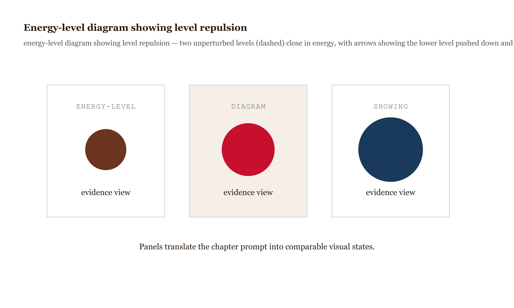
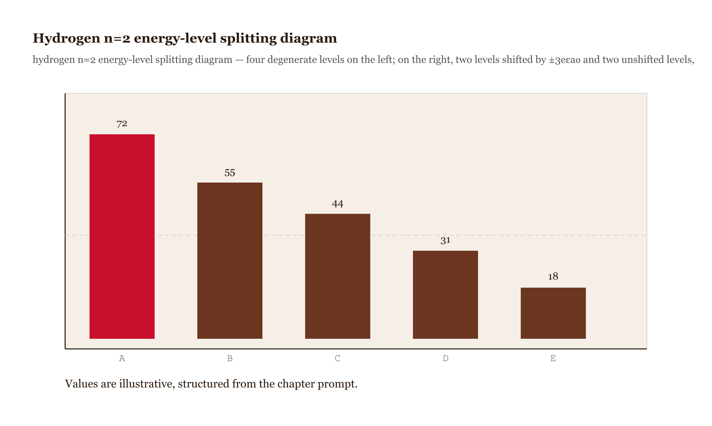
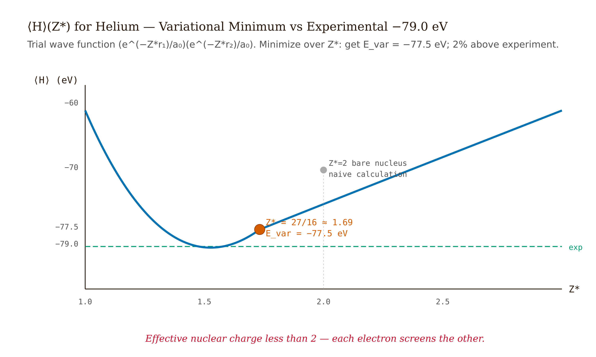
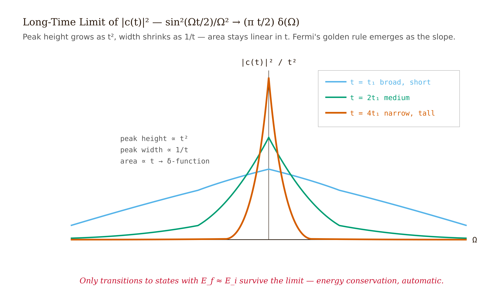

# Chapter 9 — Approximation Methods

## TL;DR

- Five Tools for the Problems Schrödinger Couldn't Solve.
- We move through time-independent perturbation theory, degenerate perturbation theory, the variational principle, and the WKB approximation.
- Read it for the main argument, the vocabulary it introduces, and the practical judgment it asks you to develop.

*Five Tools for the Problems Schrödinger Couldn't Solve.*

---

It is worth stating plainly something the quantum mechanics curriculum can easily hide. Every problem we have solved so far — the infinite square well, the harmonic oscillator, the hydrogen atom — has an exact closed-form solution. From that pattern, it would be reasonable to conclude that quantum mechanics is a subject in which you write down the Schrödinger equation and solve it. That conclusion is not correct.

The list of exactly-solvable quantum problems is short. Helium — three particles, just one more Coulomb interaction than hydrogen — is already not on it. Real atoms beyond hydrogen, real molecules, interacting electrons in a solid, and the vast majority of perturbations to any clean system: none of these admit closed-form eigenstates. Schrödinger published his equation in 1926 and solved the hydrogen atom that same year. He did not solve helium in any closed form. Nobody has.

What Egil Hylleraas published in 1929 was something different: a *variational* calculation. You pick a trial wave function with a few adjustable parameters, compute the expectation value of the Hamiltonian as a function of those parameters, and minimize. With six parameters, Hylleraas reproduced the experimental ground-state energy of helium to four significant figures. The wave function was approximate, but the number was right. This is the working mode of practical quantum mechanics: an approximate wave function that gives the right energy is good enough to build the next decade of physics on.

This chapter develops five such methods and explains what each one is for.

---

## Time-independent perturbation theory

Here is the setup. We have an exactly-solvable Hamiltonian $\hat{H}_0$ with known eigenstates $|n^{(0)}\rangle$ and energies $E_n^{(0)}$, plus a small correction $\hat{H}'$ that we want to treat as a perturbation. The full Hamiltonian is $\hat{H} = \hat{H}_0 + \lambda\hat{H}'$, where $\lambda$ is a bookkeeping parameter we will set to 1 at the end. We assume that the exact energies and states can be expanded in powers of $\lambda$:

$$|n\rangle = |n^{(0)}\rangle + \lambda|n^{(1)}\rangle + \lambda^2|n^{(2)}\rangle + \cdots, \qquad E_n = E_n^{(0)} + \lambda E_n^{(1)} + \lambda^2 E_n^{(2)} + \cdots.$$

Substitute into $\hat{H}|n\rangle = E_n|n\rangle$ and match powers of $\lambda$.

The $\lambda^0$ equation is just the unperturbed problem. The $\lambda^1$ equation is

$$\hat{H}_0|n^{(1)}\rangle + \hat{H}'|n^{(0)}\rangle = E_n^{(0)}|n^{(1)}\rangle + E_n^{(1)}|n^{(0)}\rangle.$$

We project onto $\langle n^{(0)}|$ from the left. The first and third terms cancel because $\langle n^{(0)}|\hat{H}_0 = E_n^{(0)}\langle n^{(0)}|$ and $\langle n^{(0)}|n^{(0)}\rangle = 1$. What remains is the **first-order energy correction**:

$$\boxed{E_n^{(1)} = \langle n^{(0)} | \hat{H}' | n^{(0)} \rangle.}$$

We sandwich the perturbation between the unperturbed state and read off the shift. It is simple, but it tells us right away whether a perturbation changes the energy at all — and sometimes it does not.

Consider, for example, the first-order Stark effect on the hydrogen ground state. The perturbation is $\hat{H}' = e\hat{z}\mathcal{E}$ for an electric field $\mathcal{E}$ along $z$. The correction is

$$E_{1s}^{(1)} = e\mathcal{E}\int|\psi_{1s}|^2 z\,d^3r = 0,$$

because $|\psi_{1s}|^2$ is spherically symmetric and $z$ is an odd function of position. The integral of an odd function times an even one over all space is zero. So hydrogen in the ground state has no first-order Stark effect. The effect appears at second order instead — the electric field mixes $|1s\rangle$ with excited states that *do* carry a nonzero $\langle z\rangle$, and second-order perturbation theory captures that mixing.

For the first-order **state** correction, we project the same $\lambda^1$ equation onto $\langle m^{(0)}|$ for $m \neq n$:

$$|n^{(1)}\rangle = \sum_{m \neq n}\frac{\langle m^{(0)} | \hat{H}' | n^{(0)}\rangle}{E_n^{(0)} - E_m^{(0)}} |m^{(0)}\rangle.$$

The state mixes in contributions from every other unperturbed state, each weighted by the off-diagonal matrix element of $\hat{H}'$ and divided by the energy gap. The smaller the gap, the larger the mixing — and the more cautious we should be about whether the expansion converges.

The **second-order energy correction** is

$$E_n^{(2)} = \sum_{m \neq n}\frac{|\langle m^{(0)} | \hat{H}' | n^{(0)}\rangle|^2}{E_n^{(0)} - E_m^{(0)}}.$$

For the ground state, every denominator $E_0^{(0)} - E_m^{(0)}$ is negative and every numerator is non-negative, so $E_0^{(2)} \leq 0$ always. The second-order correction to the ground-state energy is always non-positive. This is *level repulsion*: a perturbation pushes the ground state down and excited states up, and it does so more strongly the closer the levels lie. The effect runs through band-structure physics, nuclear physics, and quantum chemistry wherever two levels approach each other and avoid crossing.

*Figure 9.1 — Energy-level diagram showing level repulsion *

One point about convergence deserves to be stated explicitly: the perturbation series often does not converge in the usual sense. Freeman Dyson argued in 1952 that QED perturbation theory must be an asymptotic series with zero radius of convergence. The physical reason is this: if you flip the sign of the electric charge from $+e$ to $-e$, electrons would attract each other and the vacuum would be unstable. So the series cannot be analytic at the origin in the coupling constant, and the radius of convergence is zero. Summing the series term by term makes it diverge — yet the first few terms give excellent numerical results anyway, because the series is *asymptotically* accurate near the expansion point. Perturbation theory is useful precisely because those first few terms are accurate, not because the full series converges.

---

## Degenerate perturbation theory

When two or more unperturbed states share the same energy, the first-order state-correction denominator $E_n^{(0)} - E_m^{(0)}$ goes to zero and the formula above blows up. The remedy is conceptually simple: choose the *right* basis within the degenerate subspace before applying the perturbation.

We restrict $\hat{H}'$ to the degenerate subspace and diagonalize the resulting matrix. The eigenvalues are the first-order energy corrections; the eigenvectors are the "good" zeroth-order states. For a two-fold degeneracy with states $|a^{(0)}\rangle$ and $|b^{(0)}\rangle$, the matrix is

$$W = \begin{pmatrix} \langle a^{(0)} | \hat{H}' | a^{(0)} \rangle & \langle a^{(0)} | \hat{H}' | b^{(0)} \rangle \\ \langle b^{(0)} | \hat{H}' | a^{(0)} \rangle & \langle b^{(0)} | \hat{H}' | b^{(0)} \rangle \end{pmatrix}.$$

The conceptual content is this: the unperturbed degeneracy did not single out any preferred basis. The perturbation breaks the tie and reveals which basis was the right one all along.

A clean example is the linear Stark effect on hydrogen $n=2$. The four degenerate states are $|2s\rangle, |2p_x\rangle, |2p_y\rangle, |2p_z\rangle$, all at the same energy. The perturbation $\hat{H}' = e\hat{z}\mathcal{E}$ has matrix elements that vanish by parity except between $|2s\rangle$ and $|2p_z\rangle$ (the dipole operator $z$ connects states of opposite parity, and $|2s\rangle$ is even while $|2p_z\rangle$ is odd). The two-by-two block in the $\{|2s\rangle, |2p_z\rangle\}$ subspace is

$$W = \begin{pmatrix} 0 & -3e\mathcal{E} a_0 \\ -3e\mathcal{E} a_0 & 0 \end{pmatrix},$$

with eigenvalues $\pm 3e\mathcal{E} a_0$. The $|2p_x\rangle$ and $|2p_y\rangle$ states are untouched — no matrix elements connect them to anything. So the $n=2$ manifold of hydrogen splits *linearly* with the electric field: two outer states shifted by $\pm 3e\mathcal{E} a_0$, two inner states unshifted. This is the linear Stark effect. It happens because the accidental degeneracy of $|2s\rangle$ and $|2p_z\rangle$ in hydrogen lets the perturbation mix them at first order in a way that produces a net dipole moment.

*Figure 9.2 — Hydrogen n=2 energy-level splitting diagram *

---

## The variational principle

Perturbation theory needs a small parameter. The variational method does not. For any normalized trial state $|\psi_{\text{trial}}\rangle$,

$$\boxed{\langle\psi_{\text{trial}} | \hat{H} | \psi_{\text{trial}}\rangle \geq E_{\text{ground}}.}$$

The proof takes two lines. Expand $|\psi_{\text{trial}}\rangle = \sum_n c_n|n\rangle$ in the energy eigenbasis (which we do not know, but which exists). Then $\langle\hat{H}\rangle = \sum_n |c_n|^2 E_n \geq E_{\text{ground}} \sum_n |c_n|^2 = E_{\text{ground}}$. Equality holds only when all the weight sits on the ground state.

The method has three virtues. First, no expansion parameter is needed — we can apply it to helium without pretending that the electron-electron repulsion is small. Second, the bound is one-sided: we can never *overestimate* the ground-state energy. Third, the energy error is second order in the deviation of $|\psi_{\text{trial}}\rangle$ from the true ground state — so even a mediocre trial state yields a good energy estimate.

The helium calculation puts all three on display. The trial state is a product of two hydrogen-like $1s$ orbitals, but with an adjustable effective nuclear charge $Z^{*}$:

$$\psi_{\text{trial}}(\mathbf{r}_1, \mathbf{r}_2) = \frac{(Z^{*})^3}{\pi a_0^3}\, e^{-Z^{*}(r_1 + r_2)/a_0}.$$

The idea is that each electron partially screens the nucleus from the other, so the effective charge each electron sees is less than the bare $Z = 2$. In atomic units (where energies are in Hartrees, $1\ \text{Hartree} = 27.2\ \text{eV}$), we compute $\langle\hat{H}\rangle$ in three pieces. Kinetic energy: $(Z^{*})^2$ (two electrons, each contributing $(Z^{*})^2/2$). Electron-nucleus attraction: $-2ZZ^{*}$ (each electron in a $Z^{*}$ orbital has $\langle 1/r\rangle = Z^{*}$, and the true nuclear charge is $Z$). Electron-electron repulsion: $(5/8)Z^{*}$ (a standard Coulomb integral for two $1s$ orbitals with charge $Z^{*}$).

Combining these:

$$\langle\hat{H}\rangle(Z^{*}) = (Z^{*})^2 - 2ZZ^{*} + \frac{5}{8}Z^{*}.$$

Minimize over $Z^{*}$:

$$\frac{d\langle\hat{H}\rangle}{dZ^{*}} = 2Z^{*} - 2Z + \frac{5}{8} = 0 \implies Z^{*} = Z - \frac{5}{16}.$$

For helium, $Z = 2$, so $Z^{*} = 27/16 \approx 1.69$. The variational ground-state energy is

$$E_{\text{var}} = -(Z^{*})^2 = -(27/16)^2 \approx -2.848\ \text{Hartree} \approx -77.5\ \text{eV}.$$

The experimental value is $-79.0$ eV. The one-parameter variational result lands within 2% — and it carries a clear physical story: each electron sees an effective nuclear charge of about 1.69 because the other electron screens 5/16 of the bare charge of 2.

*Figure 9.3 — ⟨H⟩(Z*) vs Z* for helium *

There is one thing to be careful about. The variational method gives us the ground-state *energy* reliably, but not necessarily the ground-state *wave function* for every other purpose. The energy converges much faster than the wave function, so variational energies are accurate to many decimal places in modern quantum chemistry, while observables that depend sensitively on the wave function — like the charge density at the nucleus — require more care.

---

## The WKB approximation

The WKB approximation is the leading term in an expansion of the Schrödinger equation in powers of $\hbar$. The physical idea is this: when the potential varies slowly compared to the local de Broglie wavelength, the wave function locally looks like a plane wave, and we can carry the local momentum along with us as the wave propagates.

In the classically allowed region where $E > V(x)$, we define the local classical momentum $p(x) = \sqrt{2m(E-V(x))}$. The WKB wave function is

$$\psi(x) \approx \frac{C}{\sqrt{p(x)}}\,\exp\!\left(\pm\frac{i}{\hbar}\int p(x')\,dx'\right).$$

In the classically forbidden region where $E < V(x)$, $p(x)$ becomes imaginary; the wave function decays exponentially instead of oscillating. The approximation is valid when $|d\lambda/dx| \ll 1$ — that is, when the de Broglie wavelength $\lambda = h/p$ changes slowly compared to itself.

**Tunneling.** For a barrier running from $x=a$ to $x=b$ with $E < V(x)$ throughout, the transmission probability is

$$T \approx \exp\!\left(-\frac{2}{\hbar}\int_a^b \sqrt{2m(V(x)-E)}\,dx\right).$$

The integral inside the exponential is the action across the barrier. Because the transmission depends exponentially on this integral, small changes in barrier shape produce enormous changes in transmission probability. Alpha-decay half-lives across the periodic table span 24 orders of magnitude — from microseconds for some polonium isotopes to billions of years for thorium — for alpha-particle energies that differ by only a factor of two. That entire range comes from modest changes fed into an exponential. George Gamow in 1928 derived the empirical Geiger-Nuttall law from exactly this WKB tunneling formula applied to the Coulomb barrier around a nucleus. One page of physics explained what had been mysterious since 1911.

**Bohr-Sommerfeld quantization.** For a particle bound between classical turning points $a$ and $b$, the WKB quantization condition is

$$\oint p(x)\,dx = 2\int_a^b p(x)\,dx = \left(n + \tfrac{1}{2}\right)\cdot 2\pi\hbar.$$

The $+1/2$ is the Maslov index. It arises from matching the WKB solution to an Airy function at each turning point, where the potential is locally linear and the approximation has to be patched. Two turning points, two matchings, a total phase contribution of $\pi/2$ — hence $(n+1/2)$ rather than the $n$ that Bohr's 1913 rule naively predicted. Applied to the harmonic oscillator, this recovers the exact spectrum $E_n = (n+1/2)\hbar\omega$.

---

## Time-dependent perturbation theory and Fermi's golden rule

Now the perturbation has a clock. $\hat{H}'(t)$ depends on time; we turn it on at $t=0$; the system starts in eigenstate $|i\rangle$ of the unperturbed Hamiltonian. We want the probability of finding it in a different eigenstate $|f\rangle$ at time $t$.

We write the evolving state as $|\psi(t)\rangle = \sum_n c_n(t) e^{-iE_n t/\hbar} |n\rangle$, with $c_n(0) = \delta_{ni}$. Projecting the Schrödinger equation onto $\langle f|$:

$$i\hbar\,\dot{c}_f(t) = \sum_n \langle f|\hat{H}'(t)|n\rangle\,e^{i\omega_{fn}t}\,c_n(t),$$

where $\omega_{fn} = (E_f - E_n)/\hbar$. This is exact — an infinite set of coupled equations.

In first-order perturbation theory, we approximate $c_n(t) \approx \delta_{ni}$ on the right-hand side, keeping only the initial state. Then:

$$i\hbar\,\dot{c}_f^{(1)}(t) = \langle f|\hat{H}'(t)|i\rangle\,e^{i\omega_{fi}t}.$$

Integrate from 0 to $t$:

$$c_f^{(1)}(t) = \frac{1}{i\hbar}\int_0^t \langle f|\hat{H}'(t')|i\rangle\,e^{i\omega_{fi}t'}\,dt'.$$

The squared amplitude $|c_f^{(1)}(t)|^2$ is the transition probability to first order.

Now we specialize to a sinusoidal perturbation $\hat{H}'(t) = \hat{V}(e^{i\omega t} + e^{-i\omega t})$ for $t > 0$. Near resonance ($\omega \approx \omega_{fi}$), the $e^{i(\omega_{fi}-\omega)t'}$ term dominates after integration while the other averages away. The transition probability becomes

$$|c_f^{(1)}(t)|^2 = \frac{|\langle f|\hat{V}|i\rangle|^2}{\hbar^2}\cdot\frac{4\sin^2\!\left[(\omega_{fi}-\omega)t/2\right]}{(\omega_{fi}-\omega)^2}.$$

This is the central result. Let $\Omega = \omega_{fi} - \omega$ be the detuning from resonance. As a function of $\Omega$, the transition probability is a squared sinc function — peaked at $\Omega = 0$, of width $\sim 1/t$, with peak height $\sim t^2$. As $t \to \infty$, the peak grows infinitely narrow and tall, approaching a delta function: in the distributional sense,

$$\frac{\sin^2(\Omega t/2)}{\Omega^2} \to \frac{\pi t}{2}\,\delta(\Omega).$$

*Figure 9.4 — Sin²(Ωt/2)/Ω² vs Ω for three values of t*

Substitute and simplify:

$$|c_f^{(1)}(t)|^2 \to \frac{2\pi t}{\hbar^2}\,|\langle f|\hat{V}|i\rangle|^2\,\delta(\omega_{fi}-\omega).$$

The probability grows linearly in time — the signature of a constant transition rate. The rate per unit time is the coefficient:

$$W_{i\to f} = \frac{2\pi}{\hbar}\,|\langle f|\hat{V}|i\rangle|^2\,\delta(E_f - E_i - \hbar\omega).$$

In most applications the final state belongs to a continuum with density of states $\rho(E_f)$. We integrate over final states; the delta function picks out $E_f = E_i + \hbar\omega$:

$$\boxed{W_{i\to f} = \frac{2\pi}{\hbar}\,|\langle f|\hat{H}'|i\rangle|^2\,\rho(E_f).}$$

This is **Fermi's golden rule**. Dirac derived it in 1927. Fermi named it "Golden Rule No. 2" in his lecture notes, and the misattribution stuck.

It is worth pausing on what this formula contains. The matrix element $|\langle f|\hat{H}'|i\rangle|^2$ encodes the *coupling* between initial and final states — how strongly the perturbation connects them. The density of states $\rho(E_f)$ encodes how many final states are available at the resonance energy. The product gives the rate. A large coupling into a sparse final-state continuum can give the same rate as a weak coupling into a dense one.

The applications are everywhere: spontaneous emission (the Einstein $A$ coefficients come directly from this formula, with the radiation field supplying the continuum), beta decay (Fermi's original use case, where the emitted electron and neutrino form the continuum), photoionization, Raman scattering, neutron capture cross sections, LED efficiency, photovoltaic quantum yield. Anywhere a quantum system transitions from a discrete state into a continuum under a time-dependent perturbation, the golden rule supplies the rate.

The rule rests on three conditions that must hold simultaneously, and they pull in opposite directions. The *long-time* condition requires $t \gg 1/\omega_{fi}$ for the delta-function approximation to hold. The *first-order* condition requires $|c_f^{(1)}|^2 \ll 1$, so that replacing $c_n(t) \approx \delta_{ni}$ on the right-hand side stays valid. And the *continuum* condition requires that final states be densely packed at $E_f = E_i + \hbar\omega$ — the formula does not apply to transitions between discrete bound states, where we get Rabi oscillations instead of a steady rate. The tension between the first two conditions — long time is needed for one but forbidden by the other — means the golden rule applies in a specific intermediate-time window, and recognizing that window is part of using it correctly.

---

## Five methods, five jobs

Let us say what each method is actually for.

**Non-degenerate perturbation theory** is for any system with a small correction to an exactly-solvable Hamiltonian and non-degenerate unperturbed levels. Hydrogen fine structure (relativistic correction, spin-orbit coupling, Darwin term) is the canonical example. Each correction is of order $\alpha^2$ times the binding energy — about $10^{-4}$ eV — and first-order perturbation theory gets the leading-order contribution right.

**Degenerate perturbation theory** is the same idea but for degenerate levels, where we must first choose the right basis by diagonalizing the perturbation within the degenerate subspace. The linear Stark effect, the splitting of hydrogen $n=2$ in a magnetic field, and level repulsion near band crossings are all its business.

**The variational principle** is for ground-state energies when we have no small parameter. Helium is the prototype. Modern quantum chemistry runs the same idea on molecules with thousands of parameters in the trial function, using computers to do the minimization. The Hartree-Fock method, density functional theory, and variational quantum eigensolvers on quantum hardware are all descendants of the same two-line proof.

**WKB** is for slowly-varying potentials where semi-classical reasoning applies. Tunneling probabilities and quantization conditions in smooth potentials are its natural domain. It fails near classical turning points (which is why the Maslov correction exists) and for rapidly varying potentials.

**Time-dependent perturbation theory / Fermi's golden rule** is for transitions driven by a time-dependent perturbation into a continuum. This is the formula that powers Chapter 10 — spontaneous emission, scattering rates, and everything built on the interaction between atoms and the radiation field. Learn it once and apply it everywhere.

The deeper unity is that all five methods are approximations to the same Schrödinger equation under different conditions. Perturbation theory expands in a small parameter. The variational method constrains the search to a family of trial states. WKB expands in $\hbar$. Time-dependent perturbation theory expands in the coupling strength and takes a specific limit. What determines which method to use is not what the textbook chapter is titled — it is what the physical problem is actually asking.

| method | when to use it | what it requires | what it gives you | canonical example |
| --- | --- | --- | --- | --- |
| Nondegenerate perturbation theory | Small correction to isolated energy levels | Small parameter and nonzero level gaps | Energy and state shifts order by order | Anharmonic oscillator |
| Degenerate perturbation theory | Small correction inside a degenerate subspace | Matrix of the perturbation within that subspace | Split levels and correct zeroth-order combinations | Stark effect in hydrogen |
| Variational method | Ground-state estimate when exact solution is hard | Normalized trial wave function with tunable parameters | Upper bound on the ground-state energy | Helium ground-state estimate |
| WKB | Slowly varying potentials or tunneling barriers | Classical momentum varying slowly away from turning points | Quantization rules and tunneling exponents | Barrier penetration and alpha decay |
| Time-dependent perturbation theory | Transitions driven by time-dependent interactions | Weak coupling and initial/final states | Transition amplitudes and rates | Fermi's golden rule |

---

## A note on convergence

The methods above produce series or estimates. It is worth saying clearly what "convergence" means in each case.

Perturbation theory in a coupling $\lambda$ often produces a series that is asymptotic rather than convergent. The anharmonic oscillator with a $\lambda\hat{x}^4$ term has a perturbation series with zero radius of convergence (Bender and Wu showed this in 1969). So does QED. The series diverges if you sum all terms, but the first few terms give excellent numerical estimates — and those first few terms are what you actually compute. Asymptotic series are useful precisely because you stop before the terms start growing, which is where the estimate is best.

The variational principle, on the other hand, gives a *bound* — not an approximation that might be off in either direction. The energy estimate is guaranteed to be an overestimate of the true ground-state energy. That one-sidedness is a powerful property, and it is what made Hylleraas's 1929 calculation so convincing: his result was not just close to experiment, it was provably above the true ground-state energy.

Both of these are quite different from Fermi's golden rule, which is an approximation valid in a specific time window. It is not a convergent series; it is a limit. And it fails qualitatively — not just quantitatively — when the conditions for the long-time, weak-coupling, continuum limit are not met.

Knowing which kind of approximation you are using — a convergent expansion, an asymptotic series, a variational bound, or a limiting formula — is as important as knowing the formula itself.

---

## Exercises

**Warm-up**

**W1.** State the five formulas derived in this chapter: first-order energy correction, first-order state correction, second-order energy correction, WKB transmission probability, and Fermi's golden rule. For each, write one sentence naming the condition under which it is valid, and one sentence naming a situation where it fails. *(Tests recall plus the conditions, which are as important as the formulas themselves.)*

**W2.** The first-order Stark effect on hydrogen $1s$ is zero because the integral $\int |\psi_{1s}|^2 z\,d^3r$ vanishes. Explain in two sentences — without computing the integral — why it must be zero. Then explain why the same argument does *not* show that $\langle 1s | \hat{z}^2 | 1s \rangle = 0$. *(Tests physical understanding of parity and symmetry; the second part prevents memorizing "odd function = zero" without thinking about what changes when you square.)*

**W3.** For the variational helium calculation, the electron-electron repulsion contributes $+(5/8)Z^{*}$ to $\langle\hat{H}\rangle$ in atomic units. (a) Explain in one sentence why this term increases with $Z^{*}$ — what is the physical effect of squeezing both electron wave functions toward the nucleus? (b) Without recomputing, predict whether the optimal $Z^{*}$ for lithium ($Z=3$) will be larger or smaller than for helium ($Z=2$), and by approximately how much. *(Forces physical reasoning before and after the calculation; part (b) is answered by the formula $Z^{*} = Z - 5/16$.)*

**Application**

**A1.** Compute the first-order Stark effect on hydrogen $n=2$. The four degenerate states are $|2s\rangle, |2p_x\rangle, |2p_y\rangle, |2p_z\rangle$ and the perturbation is $\hat{H}' = e\hat{z}\mathcal{E}$. (a) State by symmetry which of the sixteen matrix elements $\langle i|\hat{H}'|j\rangle$ are nonzero. (b) Build the $4\times 4$ $W$-matrix and identify the nontrivial $2\times 2$ block. (c) Diagonalize the block and report all four corrected energies. The matrix element you need is $\langle 2s|e\hat{z}\mathcal{E}|2p_z\rangle = -3e\mathcal{E} a_0$, which you may quote without derivation. *(A complete worked execution of degenerate perturbation theory; part (a) requires parity, part (c) requires eigenvalue calculation.)*

**A2.** Apply the WKB tunneling formula to a triangular barrier: $V(x) = V_0(1 - x/L)$ for $0 \leq x \leq L$, $V = 0$ outside. A particle of energy $E < V_0$ is incident from the left. (a) Find the classical turning point $x_0$ where $V(x_0) = E$. (b) Compute $T_{\text{WKB}}$ by evaluating the integral $\int_{x_0}^{L}\sqrt{2m(V(x)-E)}\,dx$. (c) Compare your result qualitatively to the rectangular-barrier formula: for the same barrier area and height, which barrier transmits more, and why? *(The integral is straightforward; part (c) is a physical reasoning question about how barrier shape affects tunneling.)*

**A3.** Derive Fermi's golden rule from the beginning. Start from the first-order transition amplitude $c_f^{(1)}(t) = (1/i\hbar)\int_0^t \langle f|\hat{H}'(t')|i\rangle\,e^{i\omega_{fi}t'}\,dt'$. Specialize to a sinusoidal perturbation $\hat{H}'(t) = \hat{V}(e^{i\omega t} + e^{-i\omega t})$. Make the resonant approximation. Compute $|c_f^{(1)}(t)|^2$. Apply the long-time limit using $\sin^2(\Omega t/2)/\Omega^2 \to (\pi t/2)\delta(\Omega)$. Integrate over a density of final states $\rho(E_f)$. State explicitly at each step which physical approximation you are making. *(Full derivation; the instruction to label each approximation is intentional — it forces the student to distinguish the mathematical steps from the physical ones.)*

**Synthesis**

**S1.** You are given five Hamiltonians and asked to choose the right approximation method. For each, name the method and write two sentences justifying your choice — what makes the problem suited to that method, and what would make it fail. (a) Anharmonic oscillator $\hat{H} = \hat{p}^2/2m + (1/2)m\omega^2\hat{x}^2 + \lambda\hat{x}^4$ for small $\lambda$. (b) Helium ground-state energy. (c) Electron tunneling through a 1 nm silicon-dioxide barrier in a flash memory cell. (d) Hydrogen atom in a constant electric field of $10^7$ V/m (compare $eEa_0$ to $E_1$, then decide). (e) Photoionization rate of a hydrogen atom illuminated by a continuous-wave laser. *(Tests diagnostic judgment, not calculation; the student must identify the physical regime, not apply a memorized template.)*

**S2.** The second-order energy correction $E_n^{(2)} = \sum_{m\neq n} |\langle m^{(0)}|\hat{H}'|n^{(0)}\rangle|^2 / (E_n^{(0)} - E_m^{(0)})$ is always negative for the ground state. (a) Write down the analogous statement for an excited state — is $E_n^{(2)}$ always negative, always positive, or can it be either? Explain using the signs of the denominators. (b) For hydrogen in an electric field, the second-order correction to the $1s$ energy is $E_{1s}^{(2)} = -\frac{9}{4}\epsilon_0 a_0^3 \mathcal{E}^2$ (you may quote this). This defines the ground-state polarizability $\alpha = 9a_0^3/2$ via $E^{(2)} = -(1/2)\alpha\mathcal{E}^2$. Explain in one sentence why the second-order (not first-order) correction gives the polarizability. *(Connects the abstract formula to a measurable physical quantity; part (a) tests whether the student understands the sign structure rather than just memorizing the ground-state result.)*

**Challenge**

**C1.** Dyson's 1952 argument says that QED perturbation theory in the fine-structure constant $\alpha$ cannot converge because the theory with $\alpha < 0$ (like charges attract) is unstable. (a) Explain in your own words why instability of the $\alpha < 0$ theory implies zero radius of convergence for the $\alpha > 0$ series. (b) QED predictions for the electron anomalous magnetic moment agree with experiment to 12 significant figures, computed through fifth-order perturbation theory. How is this consistent with a divergent series? (c) For the anharmonic oscillator $\hat{H} = (1/2)\hat{p}^2 + (1/2)\hat{x}^2 + \lambda\hat{x}^4$, the perturbation series in $\lambda$ also has zero radius of convergence. Does this mean the $\lambda > 0$ anharmonic oscillator is physically ill-defined? Explain. *(Tests whether the student distinguishes "the series diverges" from "the physics is wrong"; the three parts escalate from mathematical to physical reasoning.)*

---

## References

*Added by fact-check pass 2026-05-14.*

1. Hylleraas, E. A. "Neue Berechnung der Energie des Heliums im Grundzustande, sowie des tiefsten Terms von Ortho-Helium." *Zeitschrift für Physik* 54, 347–366 (1929). https://doi.org/10.1007/BF01375457
2. Dirac, P. A. M. "The Quantum Theory of the Emission and Absorption of Radiation." *Proceedings of the Royal Society A* 114, 243–265 (1927). https://doi.org/10.1098/rspa.1927.0039
3. Fermi, E. *Nuclear Physics: A Course Given by Enrico Fermi at the University of Chicago*. U. Chicago Press, 1950.
4. Dyson, F. J. "Divergence of Perturbation Theory in Quantum Electrodynamics." *Physical Review* 85, 631–632 (1952). https://doi.org/10.1103/PhysRev.85.631
5. Bender, C. M. & Wu, T. T. "Anharmonic Oscillator." *Physical Review* 184, 1231–1260 (1969). https://doi.org/10.1103/PhysRev.184.1231
