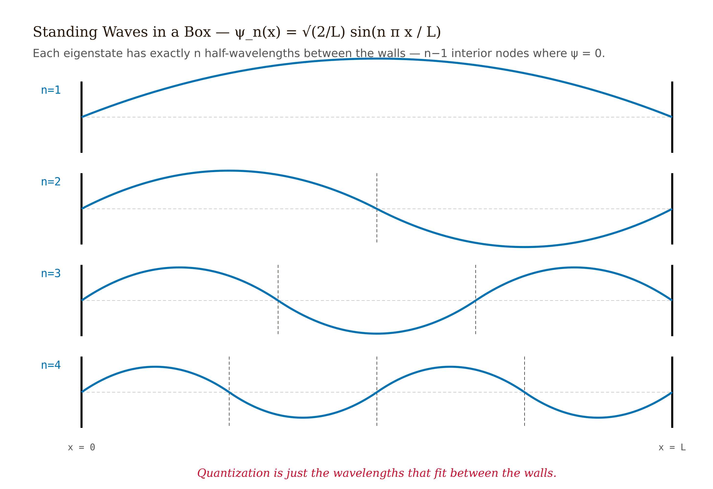
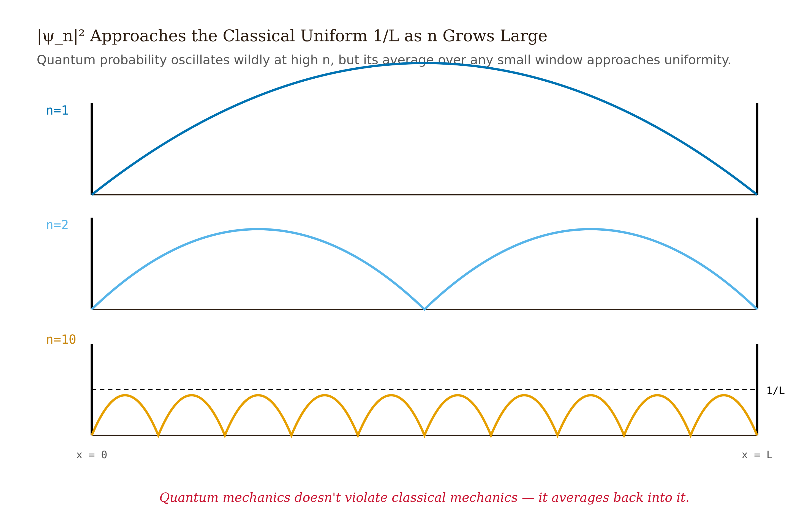
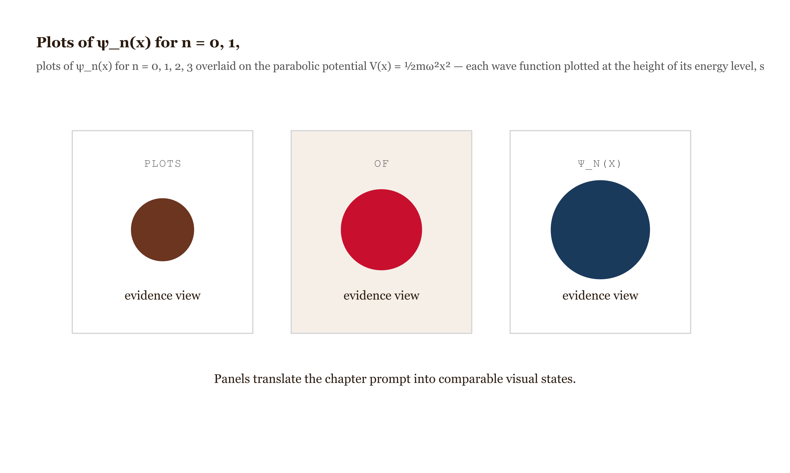
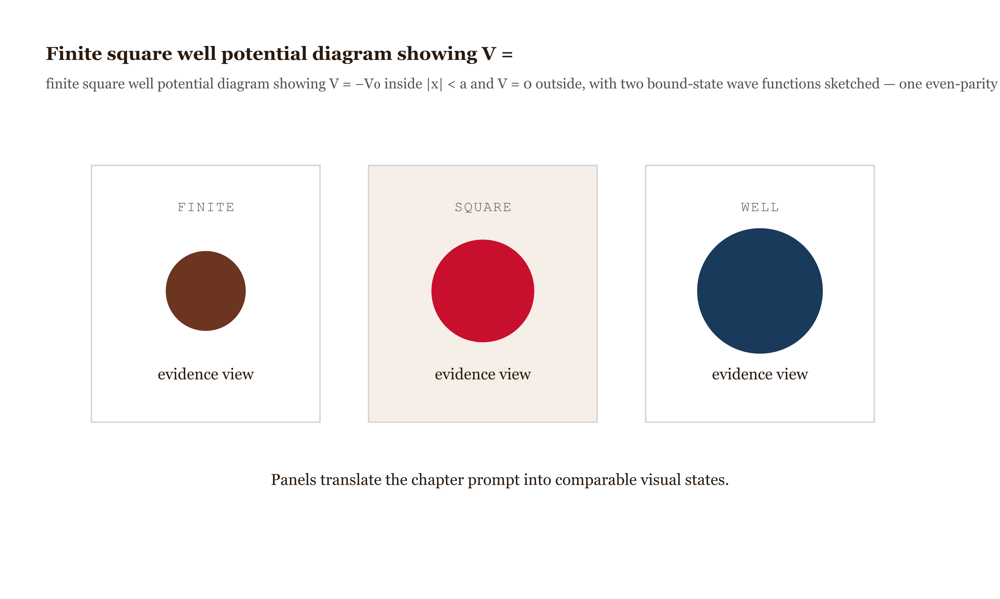
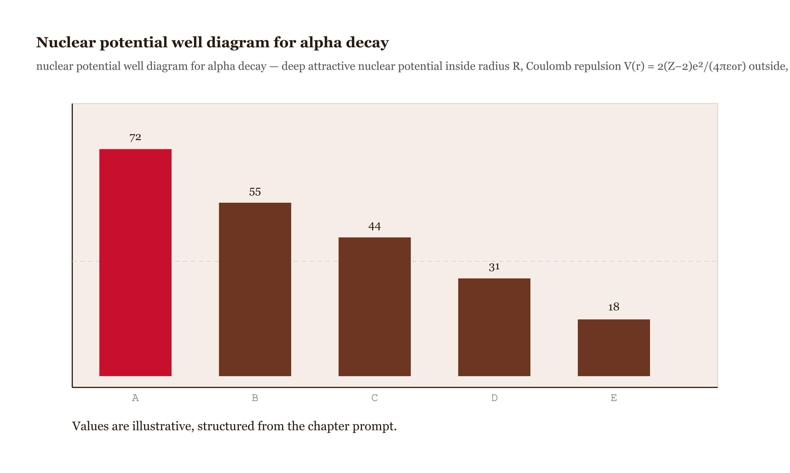
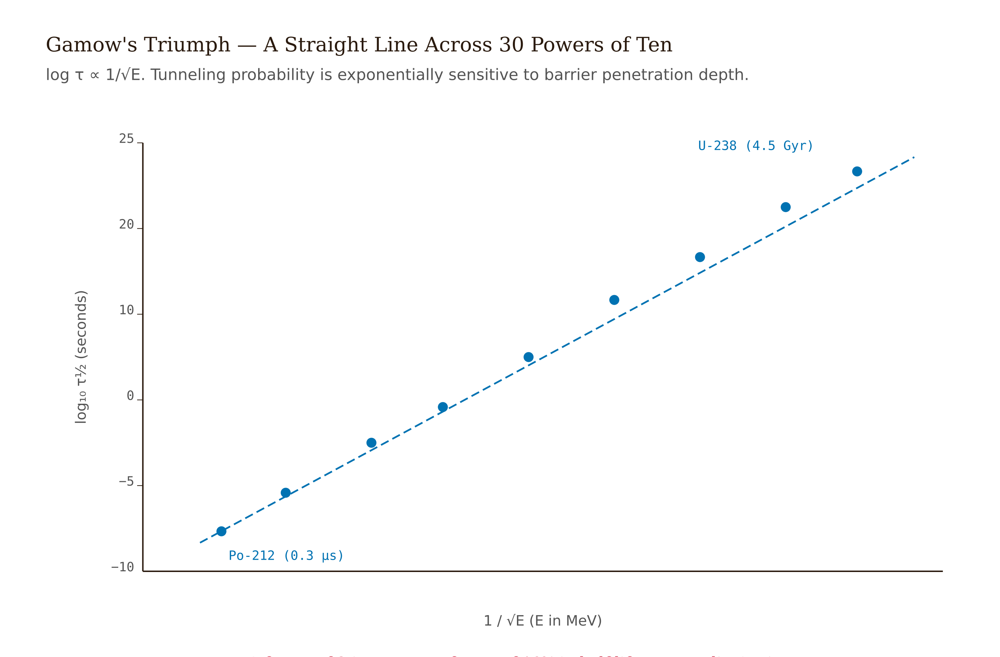

# Chapter 4 — One-Dimensional Problems

## TL;DR

- Why the lowest energy level in a box never sits on the floor — and what zero-point energy costs you.
- The infinite square well, the harmonic oscillator (two routes to the same answer), the finite square well, tunneling and WKB.
- Read it for the argument, the vocabulary, and the judgment it asks of you.

*Why the Bottom Rung Is Never on the Floor.*

---

Here is a question almost nobody thinks to ask the first time they see the energy diagram for a particle trapped in a box. The levels are drawn as horizontal lines climbing the page: $E_1, E_2, E_3, \ldots$ The lowest one sits above the bottom of the box, not on it. The student copies the formula, does the homework, moves on. But the question is right there: why isn't the bottom rung on the floor?

Classically it can be. A particle bouncing between two perfectly hard walls can, in principle, be brought to rest. Give it no kinetic energy, $E = 0$, and it just sits there; nothing in Newton's laws objects. The quantum particle in the same box, however, has a ground-state energy

$$E_1 = \frac{\pi^2 \hbar^2}{2mL^2}$$

which is strictly positive, grows as you shrink the box, and cannot be removed no matter how carefully you cool the system. This is zero-point energy, and it is not a quirk of boxes. The harmonic oscillator has it. A hydrogen atom has it. Liquid helium refuses to freeze at atmospheric pressure all the way down to absolute zero, because the zero-point motion of the helium atoms is enough to keep them from locking into a lattice.

The reason is the uncertainty principle, made quantitative. Confine a particle to a box of width $L$. Its position uncertainty can be no larger than $L$, so $\sigma_x \lesssim L$. By the Robertson inequality (derived in Chapter 5), the momentum uncertainty satisfies $\sigma_p \geq \hbar/(2\sigma_x)$, so $\sigma_p \gtrsim \hbar/(2L)$. The expected kinetic energy is therefore at least

$$\langle T \rangle = \frac{\langle p^2 \rangle}{2m} \geq \frac{\sigma_p^2}{2m} \gtrsim \frac{\hbar^2}{8mL^2}.$$

The exact box answer is $\pi^2\hbar^2/(2mL^2)$; the uncertainty estimate gives $\hbar^2/(8mL^2)$. Same form — both go as $\hbar^2/(mL^2)$ — and the factor of roughly 40 between them is geometry, not physics. The physics is that confinement forces finite position uncertainty, finite position uncertainty forces nonzero momentum uncertainty, and nonzero momentum means nonzero kinetic energy. You cannot have a quantum particle that is both localized and at rest. The bottom rung sits above the floor because no quantum state holds both conditions at once.

This chapter uses four specific potentials to work out, arithmetically, what that means.

---

## The infinite square well

Trap a particle between two perfectly hard walls at $x = 0$ and $x = L$. Inside, no forces; outside, the potential is infinite and $\psi = 0$ exactly. The time-independent Schrödinger equation inside is

$$-\frac{\hbar^2}{2m}\frac{d^2\psi}{dx^2} = E\,\psi.$$

Write $k^2 = 2mE/\hbar^2$. The general solution is $\psi = A\sin(kx) + B\cos(kx)$. Apply the boundary conditions: $\psi(0) = 0$ kills the cosine, $B = 0$; then $\psi(L) = 0$ requires $kL = n\pi$ for integer $n$. Each integer gives an allowed wave vector, hence an allowed energy. Normalize $\int_0^L |\psi|^2\,dx = 1$ to fix $A = \sqrt{2/L}$:

$$\psi_n(x) = \sqrt{\frac{2}{L}}\sin\!\left(\frac{n\pi x}{L}\right), \qquad E_n = \frac{n^2\pi^2\hbar^2}{2mL^2}, \qquad n = 1, 2, 3, \ldots$$

*Figure 4.1 — First four wave functions ψ₁ through ψ₄ plotted*

The index starts at $n = 1$, not $n = 0$. Setting $n = 0$ gives $\psi \equiv 0$ everywhere — not a wave function, just the absence of a particle. The ground state is $n = 1$, with energy exactly $E_1 = \pi^2\hbar^2/(2mL^2)$ — the positive floor we were asking about.

The structure is easy to see. The wave functions are standing waves in the box: $\sin(n\pi x/L)$ fits exactly $n$ half-wavelengths between the walls. More half-wavelengths means shorter wavelength, means larger momentum, means larger kinetic energy. The spectrum $E_n \propto n^2$ is just the statement that cramming more oscillations into a fixed interval costs energy quadratically. The $n = 1$ state has exactly one half-wavelength across the box — the least you can have while still satisfying both boundary conditions with a non-trivial function.

**A probability calculation.** For a particle in the $n = 1$ state, the probability of finding it in the central third of the box ($L/3 \leq x \leq 2L/3$) is

$$P_1 = \frac{2}{L}\int_{L/3}^{2L/3}\sin^2\!\left(\frac{\pi x}{L}\right)dx = \frac{1}{3} + \frac{\sqrt{3}}{2\pi} \approx 0.609.$$

More than a third. The $n = 1$ wave function peaks in the middle (no interior nodes), so the center carries more probability than the edges. For $n = 2$, there is a node at $x = L/2$, and the central third is depleted instead: $P_2 \approx 0.196$. At large $n$, the rapid oscillations of $\sin^2$ average to $1/2$, and $P_n \to 1/3$ — the classical answer, in which a uniformly bouncing particle spends equal time in equal lengths. That is one face of the correspondence principle: at large quantum numbers, the quantum distribution approaches the classical one.

*Figure 4.2 — |ψ_n|² for n = 1, 2, 10 plotted*

---

## The harmonic oscillator — two routes to the same answer

A particle in a parabolic potential $V(x) = \tfrac{1}{2}m\omega^2 x^2$. Classically, a mass on a spring. Quantum-mechanically, this single problem is the most-reused mechanism in all of physics: every smooth potential looks parabolic near a minimum, every mode of the electromagnetic field is one of these, every phonon in a crystal is one of these, and most of quantum field theory is built out of them. I'll show you two routes to the energy spectrum — an algebraic one and an analytic one — because watching two independent paths converge on the same answer is one of the best ways to convince yourself you actually understand something.

**The algebraic route: ladder operators.** The Hamiltonian is

$$\hat{H} = \frac{\hat{p}^2}{2m} + \frac{1}{2}m\omega^2\hat{x}^2.$$

Define two operators

$$\hat{a}_\pm = \frac{1}{\sqrt{2\hbar m\omega}}\bigl(\mp i\hat{p} + m\omega\hat{x}\bigr).$$

Two facts do all the work.

*Fact 1.* Using $[\hat{x}, \hat{p}] = i\hbar$, compute

$$[\hat{a}_-, \hat{a}_+] = 1.$$

*Fact 2.* Expand $\hat{a}_+\hat{a}_-$:

$$\hat{H} = \hbar\omega\!\left(\hat{a}_+\hat{a}_- + \tfrac{1}{2}\right).$$

From these two facts, commuting $\hat{H}$ with each ladder operator gives

$$[\hat{H}, \hat{a}_\pm] = \pm\hbar\omega\,\hat{a}_\pm.$$

Here is the consequence. Suppose $|\psi\rangle$ is an eigenstate of $\hat{H}$ with energy $E$. Then

$$\hat{H}\hat{a}_+|\psi\rangle = (E + \hbar\omega)\,\hat{a}_+|\psi\rangle.$$

So $\hat{a}_+|\psi\rangle$ is a new eigenstate, one rung higher in energy. Likewise $\hat{a}_-|\psi\rangle$ sits one rung lower. You can climb or descend the spectrum in steps of $\hbar\omega$. The ladder has a bottom because $\hat{H}$ is a sum of squared Hermitian operators and is therefore non-negative: $\langle\hat{H}\rangle \geq 0$ always. So there must be a state $|0\rangle$ that cannot be lowered further — it satisfies $\hat{a}_-|0\rangle = 0$. Plug that into the Hamiltonian:

$$\hat{H}|0\rangle = \hbar\omega\!\left(\hat{a}_+\hat{a}_- + \tfrac{1}{2}\right)|0\rangle = \frac{\hbar\omega}{2}|0\rangle.$$

The ground state has energy $\hbar\omega/2$, not zero. Every higher state is built by climbing: $|n\rangle \propto (\hat{a}_+)^n|0\rangle$, with energy

$$E_n = \hbar\omega\!\left(n + \tfrac{1}{2}\right), \qquad n = 0, 1, 2, \ldots$$

The ground state here is labeled $n = 0$ (unlike the box, where it was $n = 1$) because the lowest-rung state is a genuine normalizable state, not the trivial zero function.

A word on what the ladder operators actually are. In the quantization of the electromagnetic field, the same construction reappears: $\hat{a}^\dagger_k$ and $\hat{a}_k$ create and destroy photons of mode $k$. In condensed matter, they create and destroy phonons. The equation $\hat{H} = \hbar\omega(\hat{N} + 1/2)$ with $\hat{N} = \hat{a}_+\hat{a}_-$ is the prototype for second quantization. This is not an algebraic trick for dodging a differential equation; it is the mechanism by which particles come into existence in quantum field theory. You are building that mechanism here, in its simplest form.

**The analytic route.** The differential-equation approach makes the same point from a different angle. In the dimensionless variable $\xi = \sqrt{m\omega/\hbar}\,x$, the Schrödinger equation becomes

$$\frac{d^2\psi}{d\xi^2} = (\xi^2 - K)\psi, \qquad K = \frac{2E}{\hbar\omega}.$$

For large $|\xi|$, solutions behave as $e^{\pm\xi^2/2}$; only the decaying one is normalizable. Factor it out: $\psi = h(\xi)\,e^{-\xi^2/2}$. The remaining function $h$ satisfies the Hermite equation, and requiring its power series to terminate (otherwise the wave function blows up at infinity) forces $K = 2n + 1$, giving $E_n = \hbar\omega(n + 1/2)$. The terminating polynomials are the Hermite polynomials $H_n(\xi)$, and the ground state — with $H_0(\xi) = 1$ — is the Gaussian

$$\psi_0(x) = \left(\frac{m\omega}{\pi\hbar}\right)^{1/4}\exp\!\left(-\frac{m\omega x^2}{2\hbar}\right).$$

*Figure 4.3 — Plots of ψ_n(x) for n = 0, 1,*

You can also get this straight from $\hat{a}_-|0\rangle = 0$. In the position representation that condition reads

$$\frac{d\psi_0}{dx} = -\frac{m\omega}{\hbar}\,x\,\psi_0,$$

a first-order linear ODE whose solution is the same Gaussian. The algebraic route and the analytic route give the same function. No surprise — they are descriptions of the same physics — but seeing it spelled out removes any lingering doubt that one of the derivations hid an error.

The width of the ground-state Gaussian is $x_0 = \sqrt{\hbar/(m\omega)}$, depending only on $\hbar$ and the spring constant buried in $\omega$. The ground state saturates the Robertson uncertainty bound: $\sigma_x\sigma_p = \hbar/2$ exactly, as you can verify using the ladder operators to compute $\langle\hat{x}^2\rangle$ and $\langle\hat{p}^2\rangle$.

---

## The finite square well

Pull the walls down from infinite to a finite depth $V_0$. Let $V(x) = -V_0$ for $|x| < a$ and zero outside. Two things now happen that did not happen in the infinite well.

First, the spectrum splits into bound states (discrete, $E < 0$) and scattering states (continuous, $E > 0$). This is the finite well's version of the infinite well's isolated rungs — there are still discrete rungs, but now they sit inside a finite potential, with a continuum above them.

Second, and more striking: in the classically forbidden region outside the well, the wave function is not zero. Inside, $\psi$ oscillates. Outside, the Schrödinger equation gives $\psi'' = \kappa^2\psi$ with $\kappa = \sqrt{-2mE}/\hbar > 0$, and the normalizable solution is $\psi \propto e^{-\kappa|x|}$ — an exponentially decaying tail reaching into the region where a classical particle of the same energy could not exist. The particle leaks.

*Figure 4.4 — Finite square well potential diagram showing V =*

Matching $\psi$ and $d\psi/dx$ at $x = \pm a$ gives a transcendental equation. For even-parity bound states it takes the form

$$z\tan z = \sqrt{z_0^2 - z^2}, \qquad z = ka, \quad z_0^2 = \frac{2mV_0 a^2}{\hbar^2}.$$

The dimensionless depth $z_0$ determines how many bound states fit. Very shallow wells support only one. Deeper wells support more, the count running roughly $z_0/(\pi/2)$ rounded up. One remarkable fact: in one dimension a finite well always has at least one bound state, no matter how shallow. This is special to one dimension and should not be generalized — a three-dimensional spherically symmetric well requires the depth to clear a critical threshold before it binds anything at all. A student who has only worked in one dimension is at risk of learning exactly the wrong lesson.

For an electron in a well of depth 50 eV and width 0.5 nm, the leakage depth is instructive. With $V_0 - E \approx 1$ eV into the barrier, $\kappa \approx 5.1\ \text{nm}^{-1}$, and at distance $d = 1\ \text{nm}$ outside the wall the probability density is reduced by $e^{-2\kappa d} \approx e^{-10.2} \approx 3.7 \times 10^{-5}$. Small. Not zero. The scanning tunneling microscope reads signals at exactly these suppression levels and turns them into atomic-resolution images of surfaces. The leakage is small enough to look negligible in a textbook problem and large enough to image atoms at Bell Labs.

---

## Tunneling and the WKB approximation

If the wave function leaks into a classically forbidden region, it can leak *through* one. A classical ball thrown at a wall it cannot climb bounces back, every time, with certainty. A quantum particle aimed at the same barrier has a nonzero probability of turning up on the other side. This is tunneling, and the exponential decay of the wave function inside the barrier is what controls how probable it is.

For a rectangular barrier of height $V_0$ and width $L$, with particle energy $E < V_0$, the exact transmission coefficient is

$$T = \left[1 + \frac{V_0^2}{4E(V_0 - E)}\sinh^2(\kappa L)\right]^{-1}, \qquad \kappa = \frac{\sqrt{2m(V_0 - E)}}{\hbar}.$$

For thick barriers ($\kappa L \gg 1$), $\sinh(\kappa L) \approx \tfrac{1}{2}e^{\kappa L}$ and this simplifies to

$$T \approx 16\,\frac{E}{V_0}\!\left(1 - \frac{E}{V_0}\right) e^{-2\kappa L}.$$

The pre-exponential factor is a slowly varying number of order 1. The exponential is everything. Halve the barrier width and $T$ grows by $e^{\kappa L}$ — typically many orders of magnitude. This is the quantitative reason the scanning tunneling microscope (Binnig and Rohrer, 1982, Nobel Prize 1986) works: a change of 0.1 nm in the tip-to-surface distance changes the tunneling current by roughly a factor of ten. The exponential sensitivity makes the microscope useful; the quantum mechanics of leaking wave functions makes the exponential sensitivity inevitable.

**Non-rectangular barriers: the WKB approximation.** Real barriers are not rectangular. The Coulomb barrier around an atomic nucleus — the one that traps alpha particles — has the shape of a Coulomb repulsion curve, $V(r) \propto 1/r$ outside the nuclear surface. The Wentzel-Kramers-Brillouin approximation generalizes the rectangular result by replacing the fixed exponent $2\kappa L$ with an integral over the varying local momentum. For a barrier region $[a, b]$ where $V(x) > E$, the transmission probability is

$$T \approx \exp\!\left(-\frac{2}{\hbar}\int_a^b \sqrt{2m\bigl(V(x) - E\bigr)}\,dx\right).$$

The integrand is the magnitude of the (imaginary) momentum inside the barrier: $|p(x)| = \sqrt{2m(V(x) - E)}$. WKB works when $V(x)$ varies slowly on the scale of the local de Broglie wavelength. It breaks down at the classical turning points ($V = E$, where the momentum goes to zero), and patching the approximation across those points takes more careful analysis. But the core result — that $\ln T$ is minus twice the integral of $|p(x)|/\hbar$ across the barrier — is what carries the applications.

**Alpha decay: Gamow's calculation.** A heavy nucleus like uranium-238 contains an alpha particle (helium-4 nucleus) sitting in the nuclear potential well, ringed by a Coulomb barrier. The Coulomb repulsion between the alpha ($+2e$) and the residual nucleus ($(Z-2)e$) at the *touching* radius $R \approx 9$ fm — roughly the daughter nuclear radius plus the alpha radius, $R \approx 1.2\,\text{fm} \cdot (A_{\text{daughter}}^{1/3} + 4^{1/3})$ — is about 28 MeV for uranium. But the alpha particles emitted from U-238 carry only about 4.27 MeV. Classically they cannot escape. They tunnel.

Apply the WKB formula to the Coulomb barrier. The barrier runs from the nuclear radius $r_1 = R$ to the outer turning point $r_2$ where $V(r_2) = E$, i.e., $r_2 = 2(Z-2)e^2/(4\pi\epsilon_0 E)$. The integral

$$\gamma = \frac{1}{\hbar}\int_{r_1}^{r_2}\sqrt{2m(V(r) - E)}\,dr$$

has a closed form involving $\arccos$, and in the thick-barrier limit $r_2 \gg r_1$ it reduces to the Gamow factor

$$\gamma \approx \frac{\pi(Z-2)e^2}{4\pi\epsilon_0\hbar v}$$

where $v = \sqrt{2E/m}$ is the asymptotic velocity. For U-238, plugging in $E = 4.27$ MeV and $Z = 92$ gives $\gamma \approx 44$, so $T = e^{-2\gamma} \approx e^{-88}$. Multiply by the assault frequency $v/R \approx 2 \times 10^{21}\ \text{s}^{-1}$ and you get a half-life of order $10^{17}$ seconds — a few billion years. The measured half-life of U-238 is $4.5 \times 10^9$ years. Order-of-magnitude agreement from a one-page calculation George Gamow published in 1928.

*Figure 4.5 — Nuclear potential well diagram for alpha decay *

What makes this calculation worth sitting with is the dynamic range. Alpha-decay half-lives across the periodic table span 24 orders of magnitude: from microseconds for Po-212 to $10^{17}$ years for Th-232. That entire range — 24 orders of magnitude — is produced by modest changes in $Z$ and $E$ fed through an exponential. Po-212 has $E \approx 8.78$ MeV; Th-232 has $E \approx 4.01$ MeV. The energies differ by roughly a factor of two; the half-lives differ by a factor of $10^{24}$. The exponential does that. The Geiger-Nuttall law — the empirical observation, known since 1911, that a plot of $\log(\text{half-life})$ against $1/\sqrt{E}$ falls on a straight line — was a mystery for nearly two decades. When Gamow's calculation landed, it explained the straight line in one page of quantum mechanics.
<!-- FACT-CHECK FLAG: UNVERIFIED — see factchecks/04-one-dimensional-problems-assertions.md -->

*Figure 4.6 — Geiger-Nuttall plot *

---

## What these four systems are doing

The infinite square well, the harmonic oscillator, the finite square well, and the tunneling barrier are not four separate topics. They are four faces of one thing: the interplay between confinement, uncertainty, and the exponential character of wave functions in classically forbidden regions.

Every confined system has a positive energy floor, because confinement means finite position uncertainty, finite position uncertainty means nonzero momentum, and nonzero momentum means nonzero kinetic energy. That floor is the zero-point energy. The box makes it most visible. The oscillator makes it most reusable — every bound state in nature is approximately harmonic near its minimum, and the ladder operators that solve this one system are the prototype for the creation and annihilation operators of quantum field theory.

Every finite barrier has a nonzero transmission probability, because the wave function decays exponentially but does not vanish inside classically forbidden regions. The rectangular barrier makes the calculation exact; WKB extends it to realistic potentials. Alpha decay is the payoff, in one of the cleanest quantitative agreements between quantum mechanics and nuclear physics: a 1928 calculation, one page long, recovering measured half-lives across 24 orders of magnitude.

These are toy systems in the sense that they are exactly solvable and heavily idealized. They are not toys in the sense that matters: the physics they contain is serious. The harmonic oscillator alone underlies quantum optics, condensed matter physics, and quantum field theory. The tunneling barrier underlies the scanning tunneling microscope and the alpha-decay lifetime of every heavy nucleus ever measured. Solve these four well and most of the rest of the course is variations on a theme.

---

## Exercises

**Warm-up**

**W1.** Write down from memory the eigenfunctions and energy spectra for (a) the infinite square well of width $L$ and (b) the quantum harmonic oscillator with angular frequency $\omega$. State the ground-state energy in each case and identify the source of the nonzero zero-point energy in one plain-English sentence each. *(Tests recall and the physical interpretation built throughout the chapter.)*

**W2.** For the infinite square well, sketch $\psi_n(x)$ and $|\psi_n(x)|^2$ for $n = 1, 2, 3$. Mark all nodes. Count them: how many interior nodes does $\psi_n$ have? Then explain, in terms of standing waves fitting inside the box, why $E_n \propto n^2$ rather than $n$. *(Connects the visual structure of the wave function to the energy scaling; the node-count pattern is the key.)*

**W3.** An electron is confined to an infinite square well of width $L = 0.5$ nm (roughly the diameter of a small atom). Compute $E_1$ in eV. Then compute the ratio $E_2/E_1$ and $E_3/E_1$. At what temperature would thermal energy $k_B T$ equal $E_1$? *(Grounds the abstract formula in numbers; the temperature comparison tells the student whether quantum effects matter at room temperature for this system.)*

**Application**

**A1.** Repeat the central-third probability calculation from the chapter for the *left* third of the box ($0 \leq x \leq L/3$) in the $n = 2$ state. Then verify that $P_\text{left} + P_\text{middle} + P_\text{right} = 1$. By symmetry, what must be true of $P_\text{left}$ vs. $P_\text{right}$, and does your calculation confirm it? *(Tests whether the student can execute the integral independently and apply symmetry as a check.)*

**A2.** Use the ladder operators to compute $\langle \hat{x}^2 \rangle$ and $\langle \hat{p}^2 \rangle$ in the $n$-th eigenstate of the harmonic oscillator. Express $\hat{x}$ and $\hat{p}$ in terms of $\hat{a}_\pm$, then use $\hat{a}_- |n\rangle = \sqrt{n}\,|n-1\rangle$ and $\hat{a}_+ |n\rangle = \sqrt{n+1}\,|n+1\rangle$. Show that $\sigma_x \sigma_p = (n + 1/2)\hbar$, and confirm that the Robertson bound $\sigma_x \sigma_p \geq \hbar/2$ is saturated only for $n = 0$. *(Applies the algebraic method to a non-trivial matrix element; the saturation result ties the oscillator back to the uncertainty principle argument in the introduction.)*

**A3.** A particle of mass $m$ and energy $E$ encounters a rectangular barrier of height $V_0 = 2E$ and width $L$. (a) Write down $\kappa$ in terms of $m$, $E$, and $\hbar$. (b) Compute $T$ exactly using the full formula, then compute it using the thick-barrier approximation. At what value of $\kappa L$ does the approximation agree with the exact result to within 10%? (c) If the barrier width is halved, by what factor does $T$ increase? *(Calibrates when the thick-barrier approximation is safe; part (c) forces the student to confront the exponential sensitivity directly.)*

**Synthesis**

**S1.** The ground-state energy of the infinite square well is $E_1 = \pi^2\hbar^2/(2mL^2)$. The uncertainty-principle estimate from the introduction gives $E_\text{est} \approx \hbar^2/(8mL^2)$. The two differ by a factor of $4\pi^2 \approx 39$. Explain in physical terms why the estimate is off by this factor — specifically, what assumption in the estimate is too loose. Then apply the same uncertainty-principle logic to the harmonic oscillator: minimize $\langle T \rangle + \langle V \rangle$ over $\sigma_p$ (using $\langle V \rangle \geq \frac{1}{2}m\omega^2\sigma_x^2$ and the Robertson bound) and show that the estimate gives $E_0 \geq \hbar\omega/2$ — this time exactly right. Why does the estimate work exactly for the oscillator but only order-of-magnitude for the box? *(Connects two sections of the chapter through a single thread; the answer involves the Gaussian ground state of the oscillator saturating the Robertson bound.)*

**S2.** Estimate the alpha-decay half-life of polonium-212 ($Z = 84$, alpha energy $E \approx 8.78$ MeV) using the Gamow approach from the chapter. Then estimate Th-232 ($Z = 90$, $E \approx 4.01$ MeV). Compare your estimates to the measured values (Po-212: $\sim 0.3\ \mu$s; Th-232: $\sim 1.4 \times 10^{10}$ years). The two alpha energies differ by roughly a factor of two. The half-lives differ by roughly $10^{24}$. Write two sentences explaining, quantitatively, how a factor-of-two energy difference produces a $10^{24}$ range in half-life. *(Requires executing the Gamow integral twice with different inputs; the two-sentence explanation tests whether the student has genuinely internalized the exponential dependence rather than just computing it.)*

**Challenge**

**C1.** In the chapter's treatment of the finite square well, we stated that "in one dimension, a finite well always has at least one bound state, no matter how shallow." Prove this for the even-parity case by examining the graphical solution of $z\tan z = \sqrt{z_0^2 - z^2}$ in the limit $z_0 \to 0$. Show that the two curves always intersect for any $z_0 > 0$, no matter how small. Then explain in one paragraph, without equations, why this argument fails in three dimensions for a spherical well — what is physically different about confinement in 3D that removes the guarantee? *(Goes beyond the chapter's explicit content by requiring the student to work from the transcendental equation rather than look up the result; the 3D comparison tests ecosystem thinking across dimensionality.)*

---

## LLM Exercises

**LLM-E1.** Ask a language model to explain zero-point energy to a general audience, then again to an audience with a background in classical mechanics. In each version, identify whether the model invokes the uncertainty principle and, if it does, whether it states it qualitatively or quantitatively. Does either explanation give the $1/L^2$ scaling of the zero-point energy in the box? If not, ask it to add that and evaluate whether its derivation is correct.

**LLM-E2.** Paste the ladder-operator derivation from this chapter (from "Define $\hat{a}_\pm$..." through "$E_n = \hbar\omega(n + 1/2)$") into a language model and ask it to verify each algebraic step. Where does it confirm the algebra correctly, where does it flag a real error, and where does it hallucinate an error that isn't there? Then ask it to explain in plain language why the floor of the spectrum exists — whether it gets the physical reason right or substitutes a circular restatement.

**LLM-E3.** Ask a language model to explain Gamow's alpha-decay calculation. Evaluate: does it state the WKB formula correctly? Does it identify the Gamow exponent and explain its dependence on $Z$ and $E$? Does it explain why 24 orders of magnitude of half-life variation corresponds to a relatively modest change in energy? Supply the numbers if it does not and ask it to check whether the scaling is consistent.

**LLM-E4.** Give a language model this claim: "Quantum tunneling means a particle passes through a barrier instantly." Ask it to evaluate the claim. A strong response will distinguish transmission probability (which the chapter covers and which is uncontroversial) from tunneling time (which is genuinely unsettled and which the chapter flags as an open problem). Does the model acknowledge the open question, or does it give a confident answer to a question that is not resolved?

**LLM-E5.** Ask a language model: "Does a finite square well in one dimension always have at least one bound state?" Then ask: "Does the same statement hold for a three-dimensional spherical well?" A correct response distinguishes the two cases (1D always binds; 3D requires critical depth). If the model gets it wrong or collapses the two cases, show it the relevant argument and ask it to explain where its first response went wrong.

---

## References

*Added by fact-check pass 2026-05-14.*

1. Binnig, G. & Rohrer, H. "Scanning Tunneling Microscopy—from Birth to Adolescence." *Reviews of Modern Physics* 59, 615 (1987).
2. Gamow, G. "Zur Quantentheorie des Atomkernes." *Zeitschrift für Physik* 51, 204–212 (1928). https://doi.org/10.1007/BF01343196
3. Gurney, R. W. & Condon, E. U. "Wave Mechanics and Radioactive Disintegration." *Nature* 122, 439 (1928).
4. Geiger, H. & Nuttall, J. M. "The ranges of the α particles from various radioactive substances and a relation between range and period of transformation." *Phil. Mag.* 22, 613 (1911).
5. Simon, B. "The bound state of weakly coupled Schrödinger operators in one and two dimensions." *Annals of Physics* 97, 279 (1976).
6. NNDC Nuclear Wallet Cards. https://www.nndc.bnl.gov/
