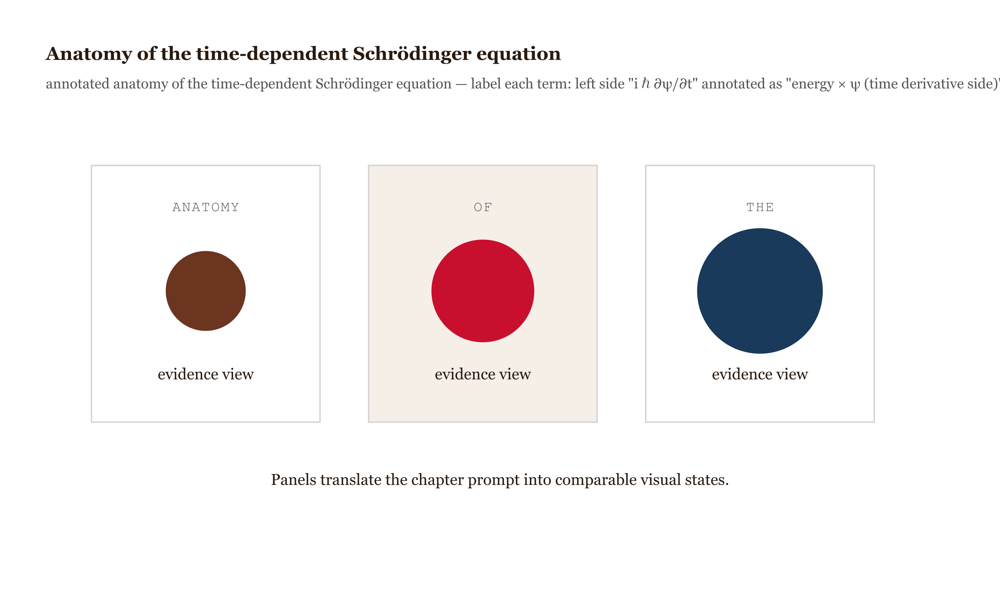
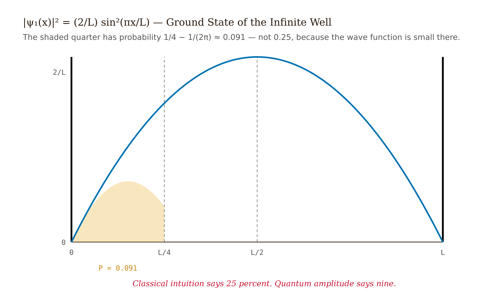
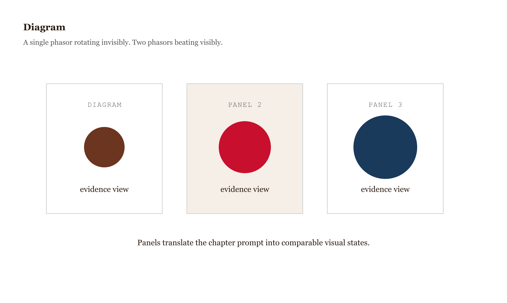
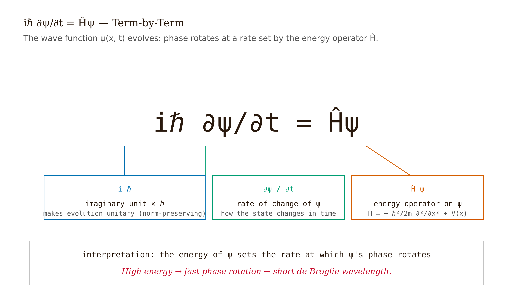
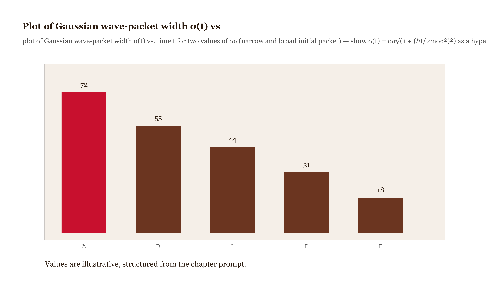

# Chapter 3 — The Schrödinger Equation

## TL;DR

- The dynamical law of quantum mechanics was guessed, not proved.
- The chapter moves through The plausibility argument, The Born rule: what $|\psi|^2$ means, Normalization is preserved, and why Hermiticity is the reason, Stationary states, and related ideas.
- Read it for the main argument, the vocabulary it introduces, and the practical judgment it asks you to develop.

*The dynamical law of quantum mechanics was guessed, not proved. Here is what it says, why it works, and what it refuses to tell you.*

---

In the last weeks of 1925, Erwin Schrödinger went up into the Swiss Alps for a Christmas holiday, lodging at the Villa Herwig in Arosa, and came back down in January 1926 carrying an equation. Walter Moore's biography (*Schrödinger: Life and Thought*, Cambridge University Press, 1989) [*verify exact chapter*] recounts the visit; the folklore of physics supplies its own embellishments about who went with him. The result, at any rate, is beyond dispute. Four papers ran in *Annalen der Physik* starting in January 1926 [Schrödinger, *Ann. Phys.* 79, 361–376](https://doi.org/10.1002/andp.19263840404), and inside a few months they had reproduced every known energy level of hydrogen, accounted for the selection rules governing atomic transitions, and handed physicists a formalism they could actually compute with.
<!-- FACT-CHECK FLAG: UNVERIFIED — see factchecks/03-the-schrodinger-equation-assertions.md -->

Heisenberg, Born, and Jordan had arrived at the same physics half a year earlier by way of matrix mechanics. But matrix mechanics resembled nothing in the classical repertoire — arrays of numbers obeying multiplication rules nobody had a feel for. Schrödinger's wave equation looked like a wave equation, and a wave equation is something physicists know in their bones. The wave formulation became the standard point of entry almost overnight, and it has stayed there ever since.

Take stock of where the story stands. Unit 1 laid out the experimental pressure that forced quantum mechanics into being: Planck's blackbody radiation, the photoelectric effect, Compton scattering, de Broglie's matter waves, the Franck–Hertz experiment. Unit 2 supplied the mathematical machinery: complex Hilbert spaces, inner products, Hermitian operators, eigenvalue equations. The piece still missing is a *dynamical law* — a rule fixing how a quantum state changes over time. Classical mechanics has Newton's $\vec{F} = m\vec{a}$. Quantum mechanics requires its counterpart. The Schrödinger equation is that counterpart.

But — and the chapter owes you honesty here — *the Schrödinger equation cannot be derived.* Griffiths says so flatly in §1.1 of the third edition: "Where did Schrödinger's equation come from? In a sense, it cannot be derived." There is a plausibility argument that makes the equation look like the natural thing to write given what de Broglie and Einstein had established. The argument is worth walking through. But walking through it is not the same as deriving the equation. The Schrödinger equation stands where Newton's second law stands: a fundamental postulate we accept for what it explains, not because some deeper theory hands it down. To ask why nature chose this equation rather than some near neighbor is to ask a question that has no deeper answer inside non-relativistic quantum mechanics.
<!-- FACT-CHECK FLAG: UNVERIFIED — see factchecks/03-the-schrodinger-equation-assertions.md -->

---

## The plausibility argument

Begin with de Broglie's matter wave for a free particle traveling in the $+x$ direction:

$$\psi(x,t) = A\,e^{i(kx - \omega t)}, \qquad p = \hbar k, \qquad E = \hbar\omega.$$

Differentiate once in $t$:

$$\frac{\partial\psi}{\partial t} = -i\omega\,\psi = -\frac{iE}{\hbar}\psi \implies i\hbar\frac{\partial\psi}{\partial t} = E\psi.$$

Differentiate twice in $x$:

$$\frac{\partial^2\psi}{\partial x^2} = -k^2\psi = -\frac{p^2}{\hbar^2}\psi \implies -\frac{\hbar^2}{2m}\frac{\partial^2\psi}{\partial x^2} = \frac{p^2}{2m}\psi.$$

For a free particle, $E = p^2/2m$. So the two sides of the last two equations have to agree, and out drops the free-particle equation:

$$i\hbar\frac{\partial\psi}{\partial t} = -\frac{\hbar^2}{2m}\frac{\partial^2\psi}{\partial x^2}.$$

Add a potential energy $V(x,t)$ — kinetic plus potential equals total energy, the oldest refrain in classical mechanics — and you reach the *time-dependent Schrödinger equation*:

$$\boxed{\;i\hbar\frac{\partial\psi}{\partial t} = -\frac{\hbar^2}{2m}\frac{\partial^2\psi}{\partial x^2} + V(x,t)\,\psi(x,t).\;}$$

In operator language, with the Hamiltonian $\hat{H} = \hat{p}^2/2m + V(\hat{x},t)$ and the momentum operator $\hat{p} = -i\hbar\,\partial_x$ from Unit 2:

$$i\hbar\frac{\partial\psi}{\partial t} = \hat{H}\psi.$$

*Figure 3.1 — Anatomy of the time-dependent Schrödinger equation *

Three features the argument gathers up but does not *prove*:

The equation is **linear**: if $\psi_1$ and $\psi_2$ are solutions, then $\alpha\psi_1 + \beta\psi_2$ is a solution. This is the superposition principle, and it is the algebraic source of interference. Nonlinear wave equations give you no interference.

The equation is **first-order in time**: fix $\psi$ at one instant and it is determined at every later one. The classical wave equation $\partial_t^2\psi = c^2\partial_x^2\psi$ is second-order in time and needs both $\psi$ and $\partial_t\psi$ at $t = 0$. The Schrödinger equation needs only $\psi$.

The equation carries **the factor of $i$**: strip it out and the equation degenerates into $\partial_t\psi = (\hbar/2m)\partial_x^2\psi$ — the diffusion equation. Its solutions smear out irreversibly; a localized start spreads and never reassembles. The $i$ converts diffusion into wave propagation, and it is what keeps the integral $\int|\psi|^2 dx$ constant over time. We prove that shortly.

*Figure 3.2 — Two side-by-side plots of an initially Gaussian wave*

None of these three follows from the plausibility argument. They are properties the equation carries within itself. The argument motivates the *form* of the equation; experiment confirms that nature uses it.

To check that the equation is at least self-consistent, verify that $\psi(x,t) = A\,e^{i(kx-\omega t)}$ with $\omega = \hbar k^2/2m$ is actually a solution. Left side: $i\hbar\,\partial_t\psi = i\hbar(-i\omega)\psi = \hbar\omega\psi$. Right side: $-(\hbar^2/2m)\partial_x^2\psi = (\hbar^2 k^2/2m)\psi$. These are equal iff $\hbar\omega = \hbar^2 k^2/2m$, which is $E = p^2/2m$. The dispersion relation is the free-particle energy-momentum relation, exactly as it should be.

---

## The Born rule: what $|\psi|^2$ means

Schrödinger's own first guess was that $|\psi|^2$ was the *charge density* of the electron — the electron a matter wave smeared across space. That reading lasted a matter of weeks. Max Born proposed in 1926 [Born, *Z. Phys.* 37, 863–867](https://doi.org/10.1007/BF01397477) that

$$|\psi(x,t)|^2\,dx = \text{probability of finding the particle in } [x,\, x+dx] \text{ at time } t.$$

$\psi$ itself is not observable. $|\psi|^2$ is a probability density. Born collected the Nobel Prize for this in 1954 — 28 years after the paper, a gap that tells you just how unsettling the probabilistic reading remained through the twenties and thirties.

Schrödinger's matter-wave interpretation suffered two structural defects that Born's mended. First: $\psi$ is complex, and classical physics has no notion of a complex matter density. You might try $\text{Re}(\psi)$ or $|\psi|$, but neither obeys a linear equation — and you would forfeit superposition. Second: for two particles, $\psi$ is a function of *six* coordinates, $\psi(x_1, y_1, z_1, x_2, y_2, z_2, t)$, and a function on six-dimensional configuration space cannot be a physical wave rippling through three-dimensional space. Born's interpretation absorbed both difficulties at once: probabilities are real and non-negative, and a probability distribution over configuration space is a perfectly respectable object no matter how many dimensions it lives on.

For the Born rule to deliver a consistent assignment of probabilities, three conditions have to hold. The first is non-negativity: $|\psi|^2 \geq 0$ everywhere. That comes for free — it is a squared modulus. The second is normalization: $\int_{-\infty}^\infty |\psi(x,t)|^2\,dx = 1$. The particle has to be *somewhere*. The third is conservation: if normalization holds at $t = 0$, it must hold at every later time. That third condition is not automatic. It is a theorem — and proving it draws directly on the Hermiticity of $\hat{H}$.

As a direct application, take the ground state of an infinite square well of width $L$:

$$\psi_1(x) = \sqrt{\frac{2}{L}}\sin\!\left(\frac{\pi x}{L}\right),\quad 0 \leq x \leq L.$$

What is the probability of finding the particle in the left quarter of the well, $[0, L/4]$?

$$P = \frac{2}{L}\int_0^{L/4}\sin^2\!\left(\frac{\pi x}{L}\right)dx = \frac{1}{L}\int_0^{L/4}\left[1 - \cos\!\left(\frac{2\pi x}{L}\right)\right]dx = \frac{1}{4} - \frac{1}{2\pi} \approx 0.091.$$

About 9%, not 25%. The ground-state probability density humps up in a single peak at the center of the well; the leftmost quarter is starved. This number — $1/4 - 1/2\pi$ — comes wholly from the shape of the wave function, not from any history of the particle. There is no trajectory. There is only the amplitude, squared.

![Plot of |ψ₁(x)|² = (2/L)sin²(πx/L) over [0, L]](../images/03-the-schrodinger-equation-fig-03.png)
*Figure 3.3 — Plot of |ψ₁(x)|² = (2/L)sin²(πx/L) over [0, L]*

Two misconceptions to clear out now, before they harden. First: "$\psi$ is the particle." It is not — $\psi$ is the probability amplitude. What registers in a detector is the particle; before detection, what exists is the amplitude. Second: "$|\psi|^2$ merely records what we don't yet know about the particle's real position, which sits at some definite value awaiting measurement." It does not. Bell-inequality experiments — Aspect 1982, refined many times since, crowned by the 2022 Nobel Prize to Aspect, Clauser, and Zeilinger — rule out the local hidden-variable theories that would make such a story work. The probability is irreducible. It is no placeholder for incomplete classical knowledge.

---

## Normalization is preserved, and why Hermiticity is the reason

Differentiate the normalization integral under the integral sign:

$$\frac{d}{dt}\int_{-\infty}^\infty|\psi|^2\,dx = \int\left(\psi^{*}\frac{\partial\psi}{\partial t} + \frac{\partial\psi^{*}}{\partial t}\psi\right)dx.$$

From the Schrödinger equation: $\partial_t\psi = -(i/\hbar)\hat{H}\psi$. For real $V$, $\partial_t\psi^{*} = +(i/\hbar)(\hat{H}\psi)^{*}$. Substituting:

$$\frac{d}{dt}\int|\psi|^2\,dx = -\frac{i}{\hbar}\left[\int\psi^{*}\hat{H}\psi\,dx - \int(\hat{H}\psi)^{*}\psi\,dx\right] = -\frac{i}{\hbar}\left[\langle\psi|\hat{H}\psi\rangle - \langle\hat{H}\psi|\psi\rangle\right].$$

By the Hermiticity of $\hat{H}$, $\langle\psi|\hat{H}\psi\rangle = \langle\hat{H}\psi|\psi\rangle$. The bracket vanishes. Normalization is preserved.

Look at what the proof spent: exactly one fact, the Hermiticity of $\hat{H}$. This is the structural reason quantum mechanics insists that observables be Hermitian operators. It is no matter of mathematical taste. Without Hermiticity, the Born rule would fail to define a probability assignment that survives time evolution, and the whole apparatus would come apart.

The same argument, read locally instead of globally, yields the *continuity equation*. Define the probability density $\rho(x,t) = |\psi|^2$ and the probability current

$$j(x,t) = \frac{\hbar}{2mi}\left(\psi^{*}\frac{\partial\psi}{\partial x} - \psi\frac{\partial\psi^{*}}{\partial x}\right) = \frac{\hbar}{m}\,\text{Im}\!\left(\psi^{*}\frac{\partial\psi}{\partial x}\right).$$

Then

$$\frac{\partial\rho}{\partial t} + \frac{\partial j}{\partial x} = 0.$$

This is the local statement of probability conservation. Probability does not vanish at one point and pop up elsewhere without warning — it flows. If probability is draining out of a region, it is crossing the boundary, and the rate of that crossing is $j$.

![Diagram of a 1D region [a, b] with](../images/03-the-schrodinger-equation-fig-04.png)
*Figure 3.4 — Diagram of a 1D region [a, b] with*

To derive it: compute $\partial_t(\psi^{*}\psi)$, substitute the Schrödinger equation for $\partial_t\psi$ and $\partial_t\psi^{*}$, watch the potential terms cancel because $V$ is real, and recognize what remains as $\partial_x(\psi^{*}\partial_x\psi - \psi\partial_x\psi^{*})$ coming out of the product rule. The derivation is a half-page exercise; every step is just the Schrödinger equation applied twice, once to $\psi$ and once to $\psi^{*}$.

For a plane wave $\psi = Ae^{i(kx-\omega t)}$, the current works out to $j = (\hbar k/m)|A|^2 = v|A|^2$ — density times velocity, exactly the classical expression for a moving fluid. In the regime where the wave picture ought to look classical, the probability current looks like a particle current. It is a sanity check that the formalism hangs together.

---

## Stationary states

If the potential $V$ carries no time dependence, the Schrödinger equation admits solutions of a special separated form:

$$\psi(x,t) = \psi(x)\,e^{-iEt/\hbar}.$$

Substitute. The left side gives $E\psi(x)e^{-iEt/\hbar}$. The right side gives $\hat{H}\psi(x)$ times $e^{-iEt/\hbar}$. The time-dependent phase cancels throughout, and what is left is:

$$\boxed{\;\hat{H}\psi(x) = E\,\psi(x).\;}$$

This is the *time-independent Schrödinger equation* — an eigenvalue equation for the Hamiltonian. The function $\psi(x)$ is an energy eigenfunction; the real number $E$ is an allowed energy.

Why "stationary"? Because $|\psi(x,t)|^2 = |\psi(x)|^2$ — the probability density carries no time dependence. Every measurement probability, for any time-independent observable, holds steady. Looked at one observable at a time, the state simply does not evolve.

And here is the misconception that wrecks everything, and it wrecks it in a precise way: *stationary states are not static.* The *probability density* is constant. The *amplitude* $\psi(x,t) = \psi(x)\,e^{-iEt/\hbar}$ spins in the complex plane at angular frequency $E/\hbar$. The magnitude at each $x$ holds fixed. The phase wheels around at rate $E/\hbar$. For a single stationary state alone, this rotation leaves no observable trace, because measurements depend only on $|\psi|^2$, and $|e^{-iEt/\hbar}| = 1$. You cannot see it. But put two stationary states side by side, and you can see nothing else.

*Figure 3.5 — Diagram *

Form a superposition of states at energies $E_1$ and $E_2$:

$$\psi(x,t) = \frac{1}{\sqrt{2}}\left[\psi_1(x)\,e^{-iE_1 t/\hbar} + \psi_2(x)\,e^{-iE_2 t/\hbar}\right].$$

Compute $|\psi|^2$:

$$|\psi|^2 = \frac{1}{2}\left[|\psi_1|^2 + |\psi_2|^2 + 2\,\text{Re}\!\left(\psi_1^{*}\psi_2\,e^{-i(E_2 - E_1)t/\hbar}\right)\right].$$

The cross term oscillates. It carries a factor of $\cos((E_2 - E_1)t/\hbar)$ — the *Bohr frequency* $(E_2 - E_1)/\hbar$. The probability density sways back and forth at this frequency. The expectation value of position oscillates. When an atom in a higher energy state decays to a lower one, it emits a photon of exactly this energy $E_2 - E_1$, drawing a spectral line at frequency $(E_2 - E_1)/h$. Every spectral line in atomic physics — every line in the Balmer series, the Lyman series, the Paschen series — exists because the phases of stationary states rotate, and their *relative* rotation at the Bohr frequency becomes physically observable the instant you superpose them.

To make this concrete, take the first two stationary states of a particle in an infinite square well of width $L$:

$$\psi_n(x) = \sqrt{\frac{2}{L}}\sin\!\left(\frac{n\pi x}{L}\right),\quad E_n = \frac{n^2\pi^2\hbar^2}{2mL^2}.$$

In the equal-amplitude superposition $\psi = (1/\sqrt{2})[\psi_1 e^{-iE_1 t/\hbar} + \psi_2 e^{-iE_2 t/\hbar}]$, compute $\langle x\rangle(t)$. The time-independent piece is $(1/2)[\langle x\rangle_1 + \langle x\rangle_2] = L/2$, by symmetry. The time-dependent piece requires evaluating

$$\frac{2}{L}\int_0^L x\sin\!\left(\frac{\pi x}{L}\right)\sin\!\left(\frac{2\pi x}{L}\right)dx.$$

Use $\sin a\sin b = (1/2)[\cos(a-b) - \cos(a+b)]$ and integrate by parts. The result: this integral equals $-16L/(9\pi^2)$. So

$$\langle x\rangle(t) = \frac{L}{2} - \frac{16L}{9\pi^2}\cos(\omega t),\qquad \omega = \frac{E_2 - E_1}{\hbar} = \frac{3\pi^2\hbar}{2mL^2}.$$

The expectation value of position swings about the midpoint of the well with amplitude $16L/9\pi^2 \approx 0.18L$ at the Bohr frequency. The particle is not moving in any classical sense — no trajectory, no velocity, no definite position at any instant. Yet the center of the probability distribution rocks back and forth like a pendulum. This is a quantum state that radiates.

*Figure 3.6 — Animation-ready sequence of three snapshots of |ψ(x,t)|² for*

---

## The time-evolution algorithm

The spectral theorem from Unit 2 promises that the energy eigenfunctions of a Hermitian Hamiltonian form a complete orthonormal basis. So any initial state admits an expansion:

$$\psi(x, 0) = \sum_n c_n\,\psi_n(x),\qquad c_n = \int\psi_n^{*}(x)\,\psi(x,0)\,dx.$$

Time evolution pins a phase onto each component:

$$\psi(x,t) = \sum_n c_n\,\psi_n(x)\,e^{-iE_n t/\hbar}.$$

That is the entire algorithm for time evolution under a time-independent Hamiltonian. Find the energy eigenstates. Expand the initial condition. Attach a phase to each term. Sum back up. Nearly every solvable problem in quantum mechanics — the infinite square well, the harmonic oscillator, hydrogen — runs this same algorithm with a different choice of $V(x)$, and therefore a different set of eigenfunctions $\psi_n$ and energies $E_n$.

The probability that a measurement of energy returns $E_n$ is $|c_n|^2$, constant in time. The energy probabilities never shift under Hamiltonian evolution — because each term's phase $e^{-iE_n t/\hbar}$ has modulus 1, so $|c_n e^{-iE_n t/\hbar}|^2 = |c_n|^2$. Only the expectation values of other observables — position, momentum — can oscillate, and they oscillate on account of the cross terms between energy eigenstates carrying different phases.

This recipe requires a time-independent $V$. For time-dependent potentials, the eigenstates themselves drift with time, and you need time-dependent perturbation theory. That is Unit 9.

---

## The free particle and why plane waves are not states

When $V = 0$, the time-independent Schrödinger equation is $-(\hbar^2/2m)\,d^2\psi/dx^2 = E\psi$. Set $k = \sqrt{2mE}/\hbar$. The general solution is

$$\psi_k(x) = Ae^{ikx} + Be^{-ikx},$$

right-moving and left-moving plane waves at momentum $\pm\hbar k$. The full time-dependent solution drags along the phase $e^{-iEt/\hbar}$ with $E = \hbar^2 k^2/2m$.

These plane waves are not normalizable. Compute $\int|Ae^{ikx}|^2\,dx = |A|^2\int_\infty^\infty 1\,dx = \infty$. They violate the Born rule: total probability cannot be infinite. They are not physical states.

This is not a breakdown of the formalism. Plane waves are generalized eigenfunctions in the sense flagged back in Unit 2 — they reside in the extended space beyond $L^2(\mathbb{R})$ and earn their keep as calculational tools, exactly as the position eigenstates $|x\rangle$ do. Physical states are *wave packets*: superpositions of plane waves carrying a normalizable weight function. Write

$$\psi(x, 0) = \frac{1}{\sqrt{2\pi}}\int_{-\infty}^\infty \phi(k)\,e^{ikx}\,dk.$$

This is a Fourier expansion. $\phi(k)$ is the momentum-space wave function. If $\phi(k)$ peaks near $k_0$ with spread $\Delta k$, then $\psi(x,0)$ is a localized wave packet whose position spread runs of order $1/\Delta k$. That is the Heisenberg uncertainty relation: narrow in momentum, broad in position.

Time evolution: each component picks up its own phase, $e^{-i\omega(k)t}$ with $\omega(k) = \hbar k^2/2m$. So

$$\psi(x,t) = \frac{1}{\sqrt{2\pi}}\int\phi(k)\,e^{i(kx - \omega(k)t)}\,dk.$$

Because $\omega(k)$ is quadratic in $k$ — not linear — components at different momenta travel at different speeds. The wave packet *spreads*. For a Gaussian initial packet of width $\sigma_0$, the position-space width grows as $\sigma(t) = \sigma_0\sqrt{1 + (\hbar t/2m\sigma_0^2)^2}$. Early on, the spreading crawls; late on, the width climbs linearly in $t$. This spreading is among the first genuinely quantum predictions you can compute and put to the test — and for a particle it has no classical analog. A baseball thrown in a definite direction holds its trajectory. A quantum particle disperses.

*Figure 3.7 — Plot of Gaussian wave-packet width σ(t) vs*

---

## What the equation does and does not tell you

You now hold the dynamical law. Here is an honest reckoning of what it grants you and what it withholds.

It grants you a precise algorithm: write down $\hat{H}$, find its eigenstates and eigenvalues, expand your initial condition, attach phases, sum. Predictions about every measurement outcome, at any later time, for any observable, follow from this. The predictions come out as probabilities — not from any ignorance on our part, but because the theory is genuinely probabilistic at the level of individual outcomes (Bell's theorem makes this unavoidable). The equation is linear, first-order in time, and Hermitian; normalization is preserved and spectral lines come out right.

What it does not grant you: an explanation of *why* this equation rather than its neighbors. The postulate status is honest, not evasive. Newton's second law occupies the same ground inside classical mechanics. The Schrödinger equation is tested by its consequences, and those consequences include the hydrogen spectrum, tunneling, the laser, the transistor, and the MRI machine. That is its vindication.

What it also withholds, and this is worth dwelling on: it does not tell you what $\psi$ *is*. A real field in some physical sense? A representation of an observer's knowledge? A guiding wave steering a hidden particle? The equation declines to say. Every interpretation of quantum mechanics — many-worlds, Copenhagen, Bohmian mechanics, relational QM, epistemic approaches — agrees on the predictions of the Schrödinger equation and disagrees on what the equation is describing. Unit 5 returns to this. For now: the formalism works whichever interpretation you favor, and the predictions are the same either way.

---

## What would change my mind

The Schrödinger equation's central claim — that state evolution under $i\hbar\partial_t\psi = \hat{H}\psi$ with $\hat{H}$ Hermitian yields the right probabilities via the Born rule — has weathered a century of experimental tests in the non-relativistic regime. Spontaneous collapse models (GRW: Ghirardi, Rimini, Weber, 1986) posit a small violation of this evolution, and ongoing experiments — among them searches for collapse-induced X-ray emission in solids — are putting it to the test. So far, standard Schrödinger evolution has held. A confirmed departure would force a different equation into this chapter. Lacking one, the equation here is the right one for non-relativistic quantum mechanics.

---

## Still puzzling

**Why a postulate?** Students often feel shortchanged. The companion's position: every fundamental theory has a point where its laws stop yielding deeper explanations and turn into axioms. Newton's second law sits in the same epistemic position. "Postulate" is no confession of ignorance. It is the correct description of where a theory begins. Why the Schrödinger equation has the form it does — why $i\hbar\partial_t$ and not something else — is a question that probably belongs to quantum field theory, or to some framework still undiscovered.

**The interpretation problem.** The Schrödinger equation hands you $\psi$. The Born rule tells you $|\psi|^2$ is a probability. Neither tells you what $\psi$ is. The formalism stays silent on this question, and the silence is not a flaw — every interpretation agrees on the predictions. Unit 5 takes it up directly.

**The measurement problem.** The Schrödinger equation describes unitary, deterministic evolution. Measurement, in the standard formulation, is a non-unitary, stochastic update. The two sit in apparent tension. Decoherence (Zurek, 2003) supplies a partial answer by showing that interaction with an environment suppresses macroscopic superpositions with great speed, but it does not explain how a definite outcome crystallizes out of unitary evolution. Open at the level of foundations. Closed at the level of computing predictions.

**The arrow of time.** The Schrödinger equation is time-reversal symmetric. Wave packets spread, but nothing compels them to — run the equation backward and a broad packet narrows. Lived experience seems to pick out the spreading direction. The answer probably resides in thermodynamics and initial conditions, not in the equation itself.

---

## LLM exercises

The following exercises are designed to be worked interactively with a language model. Use the model to check your reasoning step by step — not to generate answers, but to test whether you can explain each step clearly enough that the model can follow and push back.

**L1.** Dictate the plausibility argument for the Schrödinger equation to the model, starting only from "a free particle is described by a wave $\psi = Ae^{i(kx-\omega t)}$" and the de Broglie and Einstein relations. Ask the model to identify every step that is a genuine logical consequence and every step that is an assumption or postulate. Count the postulates.

**L2.** Give the model a specific wave function — say $\psi(x,t) = A e^{-x^2/a^2} e^{-iEt/\hbar}$ for some constants $A$, $a$, $E$ you choose — and ask: is this a solution of the time-independent Schrödinger equation for some $V(x)$? If so, what is $V(x)$? Work out the answer yourself by computing $\hat{H}\psi/\psi$ and compare with the model.

**L3.** State in plain language, to the model, why the Hermiticity of $\hat{H}$ guarantees that $d/dt\int|\psi|^2 dx = 0$ — without writing any integrals. Ask the model to convert your verbal explanation into the mathematical proof and flag any steps you described imprecisely.

**L4.** Construct a normalized superposition of the first two infinite-square-well eigenstates. Ask the model to compute $\langle x\rangle(t)$ step by step. Do the calculation yourself first. Compare not just the final answer but each intermediate step — the expansion of $|\psi|^2$, the identification of the cross term, the integral of $x\psi_1\psi_2$, the Bohr frequency. Identify any step where your approach and the model's diverged.

**L5.** Ask the model to explain why a free-particle plane wave $\psi = Ae^{ikx}$ is not a physical state, even though it satisfies the Schrödinger equation. Then give your own explanation. Ask the model to compare the two explanations and identify which one is more physically precise — and whether "not normalizable" is a sufficient explanation or whether there is something deeper to say about the role of wave packets and the Fourier representation.

---

## References

*Added by fact-check pass 2026-05-14.*

1. Schrödinger, E. "Quantisierung als Eigenwertproblem (Erste Mitteilung)." *Annalen der Physik* 79, 361–376 (1926). https://doi.org/10.1002/andp.19263840404
2. Born, M. "Zur Quantenmechanik der Stoßvorgänge." *Zeitschrift für Physik* 37, 863–867 (1926). https://doi.org/10.1007/BF01397477
3. The Nobel Prize in Physics 1954 — Max Born. https://www.nobelprize.org/prizes/physics/1954/born/facts/
4. Aspect, A., Grangier, P. & Roger, G. "Experimental Realization of Einstein-Podolsky-Rosen-Bohm Gedankenexperiment." *Physical Review Letters* 49, 91 (1982).
5. The Nobel Prize in Physics 2022 — Aspect, Clauser, Zeilinger. https://www.nobelprize.org/prizes/physics/2022/
6. Ghirardi, G. C., Rimini, A. & Weber, T. "Unified dynamics for microscopic and macroscopic systems." *Physical Review D* 34, 470–491 (1986).
7. Zurek, W. H. "Decoherence, einselection, and the quantum origins of the classical." *Reviews of Modern Physics* 75, 715–775 (2003). https://doi.org/10.1103/RevModPhys.75.715
