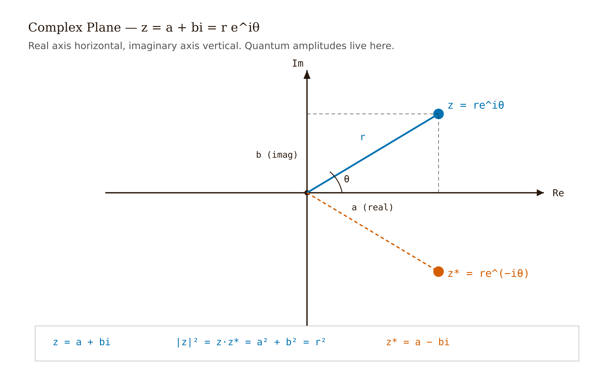
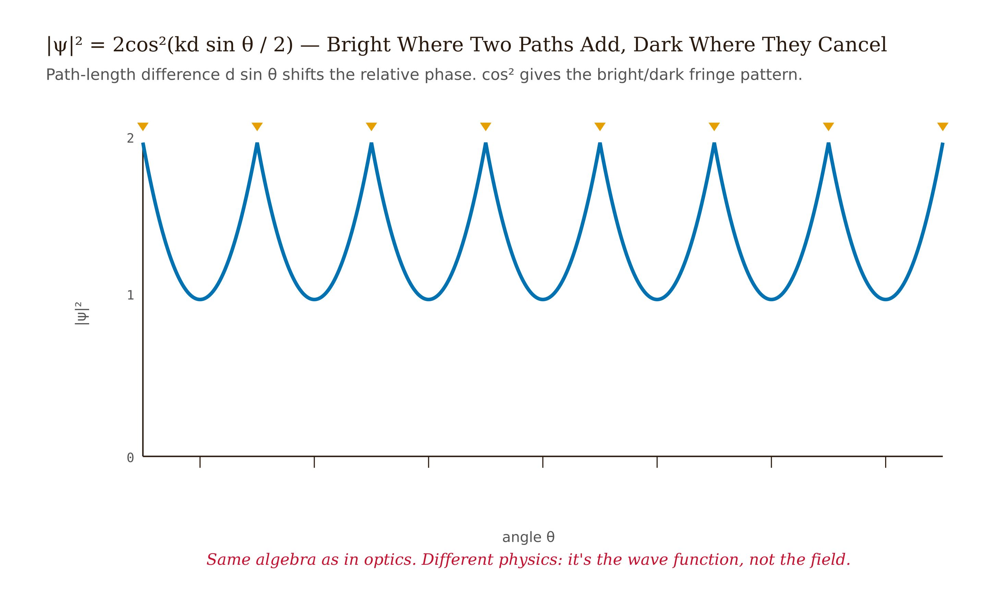
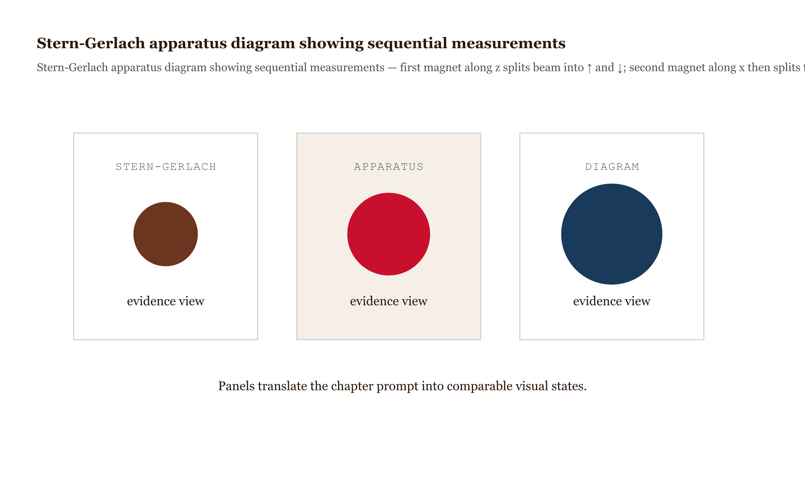
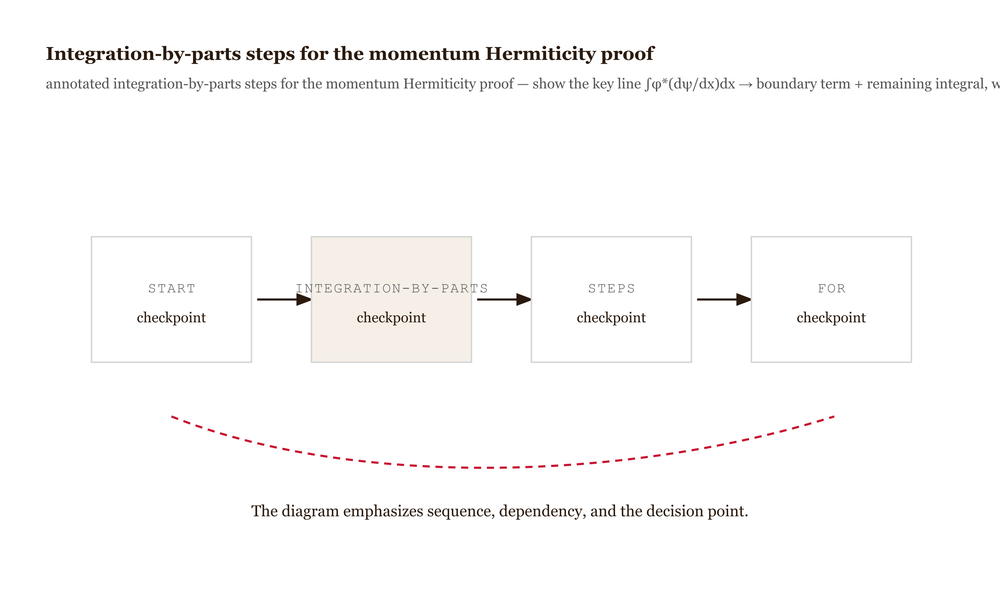

# Chapter 2 — Mathematical Foundations

## TL;DR

- This chapter delivers the mathematical apparatus quantum mechanics requires and shows why complex numbers are not optional.
- It covers complex arithmetic and Euler's formula, complex vector spaces and inner products, Dirac bra-ket notation, linear operators and eigenvalues, Hermitian operators and the spectral theorem, and the Pauli matrices.
- It states each construction, its defining equation, and the calculations it enables, ending with a Hermiticity check on the momentum operator.

*The language quantum mechanics is written in, and why no simpler language works.*

---

One experiment fixes the mathematical structure. Run electrons one at a time through two slits. Each lands somewhere on the screen behind. After ten thousand electrons, an interference pattern appears: bright bands where many landed, dark bands where almost none did — the same pattern produced by water waves passing through two gaps.

The particles are single electrons. There is no second electron for each to interfere with, so each interferes with itself.

The dark bands require the contributions from the two slits to *cancel* exactly, not merely sum to something small. With contributions $\psi_1$ and $\psi_2$, intensity computed as $|\psi_1 + \psi_2|^2$ cancels when $\psi_1 = -\psi_2$. But the pattern is a sequence of alternating bright and dark bands across the screen, which requires the contributions to vary smoothly in sign and magnitude with angle — a continuously varying *phase*.

Continuously varying phase is described by $e^{i\varphi}$, which requires $i = \sqrt{-1}$, which requires complex numbers. The experiment provides no alternative.

*Figure 2.1 — Double-slit experiment diagram with single-electron sequential buildup *

---

## The arithmetic of complex numbers

A complex number is $z = a + bi$ with $a$ and $b$ real and $i^2 = -1$. The real part is $a$, the imaginary part is $b$. The *complex conjugate* is $z^{*} = a - bi$, obtained by flipping the sign of the imaginary part. The *modulus* is

$$|z| = \sqrt{z^{*} z} = \sqrt{a^2 + b^2},$$

a non-negative real number. Treating $a$ and $b$ as coordinates in the complex plane — real axis horizontal, imaginary axis vertical — the modulus is the distance from the origin.

Euler's formula is the identity that makes complex numbers useful in physics:

$$e^{i\theta} = \cos\theta + i\sin\theta.$$

It follows from matching the Taylor series of $e^{i\theta}$, $\cos\theta$, and $\sin\theta$ term by term. Every complex number can then be written $z = r\,e^{i\theta}$ with $r = |z|$ the distance from the origin and $\theta$ the angle. Multiplying two complex numbers multiplies their distances and *adds* their angles. Conjugation flips the angle: $(re^{i\theta})^{*} = re^{-i\theta}$.

Three facts recur throughout:

*Figure 2.2 — The complex plane showing a point z =*

- $|e^{i\theta}| = 1$ for any real $\theta$. A pure phase factor does not change magnitude.
- $e^{i\theta_1} \cdot e^{i\theta_2} = e^{i(\theta_1 + \theta_2)}$. Phases add under multiplication.
- $(z_1 z_2)^{*} = z_1^{*} z_2^{*}$. Conjugation distributes over multiplication.

Apply this to the double slit. Label the slits; the amplitude at the screen from slit 1 is $\psi_1$ and from slit 2 is $\psi_2$. The quantum-mechanical rule — stated precisely in Unit 3, used here — is to *add the amplitudes* and *square the modulus* for intensity: $\psi = \psi_1 + \psi_2$, intensity $|\psi|^2$.

Take one slit a distance $r$ from the screen point and the other $r + d\sin\theta$ away. Assign equal magnitudes $1/\sqrt{2}$ and phases set by path length:

$$\psi_1 = \frac{1}{\sqrt{2}} e^{ikr}, \qquad \psi_2 = \frac{1}{\sqrt{2}} e^{ik(r + d\sin\theta)},$$

with wavenumber $k = 2\pi/\lambda$. Expand $|\psi_1 + \psi_2|^2$:

$$|\psi|^2 = \frac{1}{2}\left[e^{-ikr} + e^{-ik(r+d\sin\theta)}\right]\left[e^{ikr} + e^{ik(r+d\sin\theta)}\right]$$

$$= \frac{1}{2}\left[1 + e^{ikd\sin\theta} + e^{-ikd\sin\theta} + 1\right] = 1 + \cos(kd\sin\theta).$$

Using $1 + \cos x = 2\cos^2(x/2)$:

$$|\psi|^2 = 2\cos^2\!\left(\frac{kd\sin\theta}{2}\right).$$

Maxima where $d\sin\theta = n\lambda$; zeros where $d\sin\theta = (n + 1/2)\lambda$ — bright and dark bands, as observed. The complex exponentials produce this in four lines. With real numbers the cross term is $2\psi_1\psi_2$, a fixed sign with no oscillation: no dark bands.

*Figure 2.3 — Plot of |ψ|² = 2cos²(kd sinθ / 2)*

Stueckelberg showed in 1960 that quantum mechanics can be reformulated with real numbers if every space is doubled in dimension — one extra real dimension per complex one. It cannot be reformulated with real numbers *in the same dimension*. Renou and collaborators in 2021 tested a class of real-amplitude reformulations using Bell inequalities and ruled them out [Renou et al., *Nature* 600, 625–629 (2021), *verify pagination*]. The complex numbers are measured, not conventional.

---

## Vector spaces and inner products

A *vector space* over $\mathbb{C}$ is a set of objects — here states, written $|\psi\rangle$ — closed under two operations: addition ($|\psi\rangle + |\phi\rangle$) and scalar multiplication by a complex number ($\alpha|\psi\rangle$). Addition is commutative and associative; scalar multiplication distributes. The basic example is $\mathbb{C}^n$, columns of $n$ complex numbers.

An *inner product* measures the relation between two states. It is a map $\langle\cdot|\cdot\rangle: V \times V \to \mathbb{C}$ satisfying three conditions:

1. **Conjugate symmetry:** $\langle\phi|\psi\rangle = \langle\psi|\phi\rangle^{*}$.
2. **Linear in the second slot:** $\langle\phi|\alpha\psi + \beta\chi\rangle = \alpha\langle\phi|\psi\rangle + \beta\langle\phi|\chi\rangle$.
3. **Positive definite:** $\langle\psi|\psi\rangle \geq 0$, with equality only for the zero vector.

Conditions (1) and (2) imply *anti-linearity* in the first slot — scalars come out conjugated: $\langle\alpha\phi|\psi\rangle = \alpha^{*}\langle\phi|\psi\rangle$. This is the physicist convention, used throughout.

The *norm* of a state is $\|\psi\| = \sqrt{\langle\psi|\psi\rangle}$. A *Hilbert space* is a complex vector space with an inner product that is also *complete*: no convergent sequence escapes the space. In finite dimensions ($\mathbb{C}^n$) completeness is automatic. For wave functions on the real line the relevant Hilbert space is $L^2(\mathbb{R})$, the square-integrable functions, where completeness is a theorem.

Concretely in $\mathbb{C}^n$: for $|\psi\rangle = (\alpha_1, \ldots, \alpha_n)^T$ and $|\phi\rangle = (\beta_1, \ldots, \beta_n)^T$,

$$\langle\phi|\psi\rangle = \sum_{i=1}^n \beta_i^{*} \alpha_i.$$

Conjugate the first slot's entries, multiply, sum. Concretely on $L^2(\mathbb{R})$, for wave functions $\psi$ and $\phi$,

$$\langle\phi|\psi\rangle = \int_{-\infty}^\infty \phi^{*}(x)\,\psi(x)\,dx.$$

Same operation, integral instead of sum.

---

## Dirac notation

P. A. M. Dirac introduced bra-ket notation in 1939 [Dirac, *Math. Proc. Cambridge Phil. Soc.* 35, 416–418]. It packages four operations into a notation compact enough that calculations spanning a page in indexed components reduce to a few lines.

**Ket.** $|\psi\rangle$ is the state vector. In $\mathbb{C}^n$, a column.

**Bra.** $\langle\psi|$ is the *dual vector* — the linear functional that maps any ket $|\phi\rangle$ to the number $\langle\psi|\phi\rangle$. In $\mathbb{C}^n$, if $|\psi\rangle = (\alpha_1, \alpha_2)^T$, then $\langle\psi| = (\alpha_1^{*}, \alpha_2^{*})$ as a row. The conversion conjugates the entries *and* transposes, simultaneously. This combined operation is Hermitian conjugation, written $\dagger$: $\langle\psi| = |\psi\rangle^\dagger$.

**Inner product.** $\langle\phi|\psi\rangle$ is a complex number: row times column, or the integral of $\phi^{*}\psi$, depending on the space.

**Outer product.** $|\psi\rangle\langle\phi|$ is an *operator*: it sends a ket $|\chi\rangle$ to $|\psi\rangle\,(\langle\phi|\chi\rangle)$, a complex number times $|\psi\rangle$.

| name | symbol | what it is | concrete form in ℂ² |
| --- | --- | --- | --- |
| ket | $|\psi\rangle$ | state vector | $\begin{pmatrix}\alpha\\ \beta\end{pmatrix}$ |
| bra | $\langle\psi|$ | dual vector | $\begin{pmatrix}\alpha^* & \beta^*\end{pmatrix}$ |
| inner product | $\langle\phi|\psi\rangle$ | complex number | $\phi_1^*\alpha+\phi_2^*\beta$ |
| outer product | $|\psi\rangle\langle\phi|$ | operator | $\begin{pmatrix}\alpha\phi_1^* & \alpha\phi_2^*\\ \beta\phi_1^* & \beta\phi_2^*\end{pmatrix}$ |

Two identities anchor what follows. The first is the *completeness relation*. For any orthonormal basis $\{|n\rangle\}$ — mutually orthogonal unit vectors spanning the space, so $\langle m|n\rangle = \delta_{mn}$ and every state expands in them:

$$\sum_n |n\rangle\langle n| = \hat{I}.$$

Verification: for any $|\psi\rangle$, expand $|\psi\rangle = \sum_n c_n|n\rangle$ with $c_n = \langle n|\psi\rangle$. Then $\sum_n |n\rangle\langle n|\psi\rangle = \sum_n c_n|n\rangle = |\psi\rangle$. The operator acts as the identity. "Inserting the identity" — writing $\hat{I} = \sum_n|n\rangle\langle n|$ between operators — is the most common calculational maneuver in quantum mechanics.

The second identity: the wave function $\psi(x)$ is the *position-basis component* of the abstract state $|\psi\rangle$. Generalized position eigenstates $|x\rangle$ (not normalizable; outside $L^2(\mathbb{R})$ in an extended sense, but useful) satisfy $\langle x|x'\rangle = \delta(x - x')$ and

$$\int dx\,|x\rangle\langle x| = \hat{I}, \qquad \langle x|\psi\rangle = \psi(x).$$

So $|\psi\rangle = \int dx\,\psi(x)|x\rangle$: the wave function is the expansion coefficient of $|\psi\rangle$ in the position basis. Abstract Dirac notation and concrete wave-function notation are the same object in two forms. Insert $\int dx|x\rangle\langle x|$ to move between them.

The most common student error: computing a matrix element $\langle\phi|\hat{A}|\psi\rangle$ by writing $\phi$'s components as a row *without conjugating*. The result is wrong — typically complex when it should be real. Always conjugate when converting a ket to a bra. A complex expectation value for what should be an observable signals a missing conjugation first.

---

## Operators and eigenvalues

A *linear operator* $\hat{A}$ on $V$ maps $V \to V$ and respects addition and scalar multiplication: $\hat{A}(\alpha|\psi\rangle + \beta|\phi\rangle) = \alpha\hat{A}|\psi\rangle + \beta\hat{A}|\phi\rangle$. In $\mathbb{C}^n$ every linear operator is an $n \times n$ matrix.

The *eigenvalue equation* is

$$\hat{A}|a\rangle = a|a\rangle,$$

a vector $|a\rangle$ left pointing in the same direction by $\hat{A}$, scaled by a complex number $a$. The eigenvalues solve the characteristic polynomial $\det(\hat{A} - a\hat{I}) = 0$.

Hermitian operators are the central object. An operator is *Hermitian* if $\hat{A}^\dagger = \hat{A}$, where $\hat{A}^\dagger$ is defined by $\langle\phi|\hat{A}\psi\rangle = \langle\hat{A}^\dagger\phi|\psi\rangle$ for all $|\phi\rangle$, $|\psi\rangle$. In matrix form $\hat{A}^\dagger$ is the conjugate transpose, $(A^\dagger)_{ij} = A_{ji}^{*}$, so Hermitian means $A_{ij} = A_{ji}^{*}$.

The *spectral theorem* for Hermitian operators states three things:

1. All eigenvalues are real.
2. Eigenvectors for different eigenvalues are orthogonal.
3. The eigenvectors form an orthonormal basis.

Proof of (1): if $\hat{A}|a\rangle = a|a\rangle$ and $\hat{A} = \hat{A}^\dagger$, take the inner product of both sides with $|a\rangle$:

$$\langle a|\hat{A}|a\rangle = a\langle a|a\rangle.$$

Also $\langle a|\hat{A}|a\rangle = \langle \hat{A}a|a\rangle = \langle a|a\rangle\, a^{*}$. So $a\langle a|a\rangle = a^{*}\langle a|a\rangle$. Since $\langle a|a\rangle > 0$, $a = a^{*}$ and $a$ is real.

These three properties are why every observable in quantum mechanics is a Hermitian operator: real eigenvalues because outcomes are real numbers, orthogonal eigenstates because distinct outcomes are distinguishable, a complete eigenbasis because the measurement must yield *some* outcome with probability 1.

---

## The three Pauli matrices

The spin-1/2 system is the simplest quantum system: two-dimensional Hilbert space $\mathbb{C}^2$, three Hermitian observables, all essential features visible in $2 \times 2$ matrix arithmetic.

The three Pauli matrices are the spin observables along the $x$, $y$, and $z$ axes:

$$\sigma_x = \begin{pmatrix} 0 & 1 \\ 1 & 0 \end{pmatrix}, \qquad \sigma_y = \begin{pmatrix} 0 & -i \\ i & 0 \end{pmatrix}, \qquad \sigma_z = \begin{pmatrix} 1 & 0 \\ 0 & -1 \end{pmatrix}.$$

All three are Hermitian (check $(A^\dagger)_{ij} = A_{ji}^{*}$). All three have eigenvalues $\pm 1$. Their eigenvectors differ, and that difference is the content of quantum measurement.

$\sigma_z$ is already diagonal. Eigenvectors:

$$|\!\uparrow\rangle = \begin{pmatrix} 1 \\ 0 \end{pmatrix}, \qquad |\!\downarrow\rangle = \begin{pmatrix} 0 \\ 1 \end{pmatrix},$$

spin-up and spin-down along the $z$-axis.

For $\sigma_x$: characteristic polynomial $\lambda^2 - 1 = 0$, eigenvalues $\pm 1$. For $\lambda = +1$, $(\sigma_x - I)|v\rangle = 0$ gives equal components. Normalized:

$$|+_x\rangle = \frac{1}{\sqrt{2}}\begin{pmatrix} 1 \\ 1 \end{pmatrix} = \frac{1}{\sqrt{2}}(|\!\uparrow\rangle + |\!\downarrow\rangle), \qquad |-_x\rangle = \frac{1}{\sqrt{2}}\begin{pmatrix} 1 \\ -1 \end{pmatrix} = \frac{1}{\sqrt{2}}(|\!\uparrow\rangle - |\!\downarrow\rangle).$$

For $\sigma_y$: same eigenvalues. For $\lambda = +1$, $(\sigma_y - I)|v\rangle = 0$ gives $-v_1 - iv_2 = 0$, so $v_2 = iv_1$. Normalized:

$$|+_y\rangle = \frac{1}{\sqrt{2}}\begin{pmatrix} 1 \\ i \end{pmatrix} = \frac{1}{\sqrt{2}}(|\!\uparrow\rangle + i|\!\downarrow\rangle), \qquad |-_y\rangle = \frac{1}{\sqrt{2}}\begin{pmatrix} 1 \\ -i \end{pmatrix} = \frac{1}{\sqrt{2}}(|\!\uparrow\rangle - i|\!\downarrow\rangle).$$

The $i$ in the component of $|+_y\rangle$ is essential. No real-coefficient basis diagonalizes $\sigma_y$: a real $2\times 2$ symmetric matrix with eigenvalues $\pm 1$ cannot be physically equivalent to $\sigma_y$, because the chirality of $\sigma_y$ is encoded in the complex structure. $\sigma_y$ is the point in the introductory course where the $i$ cannot be dismissed as notation.

Non-commuting measurements: start with $|\!\uparrow\rangle$ and apply $\sigma_x$:

$$\sigma_x|\!\uparrow\rangle = \begin{pmatrix} 0 & 1 \\ 1 & 0 \end{pmatrix}\begin{pmatrix} 1 \\ 0 \end{pmatrix} = \begin{pmatrix} 0 \\ 1 \end{pmatrix} = |\!\downarrow\rangle.$$

The spin-$z$-up state is not a spin-$x$ eigenstate; $\sigma_x$ maps it to the orthogonal state. For the measurement probabilities, expand $|\!\uparrow\rangle$ in the $\sigma_x$ eigenbasis: $|\!\uparrow\rangle = (1/\sqrt{2})(|+_x\rangle + |-_x\rangle)$. The probability of measuring $\sigma_x = +1$ in state $|\!\uparrow\rangle$ is $|\langle +_x|\!\uparrow\rangle|^2 = |1/\sqrt{2}|^2 = 1/2$. A particle known to be spin-up along $z$ is completely undetermined along $x$. That is the Stern–Gerlach experiment expressed as basis-change arithmetic.

*Figure 2.4 — Stern-Gerlach apparatus diagram showing sequential measurements *

---

## Hermitian operators in infinite dimensions: checking $\hat{p}$

The momentum operator in the position representation is $\hat{p} = -i\hbar\,d/dx$. Verify it is Hermitian on square-integrable functions vanishing at infinity.

The condition is $\langle\phi|\hat{p}\psi\rangle = \langle\hat{p}\phi|\psi\rangle$:

$$\int_{-\infty}^\infty \phi^{*}(x)\left(-i\hbar\frac{d\psi}{dx}\right)dx = \int_{-\infty}^\infty \left(-i\hbar\frac{d\phi}{dx}\right)^{*}\psi(x)\,dx.$$

The right side is $\int (+i\hbar\,d\phi^{*}/dx)\,\psi\,dx$. Integrate the left side by parts:

$$\int \phi^{*}\frac{d\psi}{dx}\,dx = \left[\phi^{*}\psi\right]_{-\infty}^\infty - \int\frac{d\phi^{*}}{dx}\psi\,dx.$$

The boundary term $[\phi^{*}\psi]_{-\infty}^\infty$ vanishes because $\phi$ and $\psi$ are square-integrable — otherwise $\int|\psi|^2\,dx$ would diverge. So

$$\int\phi^{*}\frac{d\psi}{dx}\,dx = -\int\frac{d\phi^{*}}{dx}\psi\,dx.$$

Multiply both sides by $-i\hbar$:

$$-i\hbar\int\phi^{*}\frac{d\psi}{dx}\,dx = +i\hbar\int\frac{d\phi^{*}}{dx}\psi\,dx. \checkmark$$

Two points. First: the $-i$ in $\hat{p} = -i\hbar\,d/dx$ is load-bearing. Without it, $d/dx$ is *anti-Hermitian* ($\hat{A}^\dagger = -\hat{A}$) by the same argument; the $-i$ converts anti-Hermitian to Hermitian. Every basic QM operator carries such factors of $i$ for this reason. Second: the proof used the boundary conditions. On a finite interval with states not vanishing at the endpoints, the boundary term need not vanish and $\hat{p}$ may fail to be Hermitian on that domain. The domain is part of the operator's definition. In infinite dimensions, *Hermitian* and *self-adjoint* differ — a Hermitian operator may have eigenstates but lack a complete eigenbasis, or fail to admit a unique extension. Griffiths' footnotes note this; Reed and Simon *Methods of Modern Mathematical Physics* Vol. 2 is the reference for when it matters. It matters again in Unit 4 with half-line problems.

*Figure 2.5 — Integration-by-parts steps for the momentum Hermiticity proof *

---

## What the formalism looks like in one picture

Quantum states are vectors in a complex Hilbert space. Observables are Hermitian operators on that space. The eigenvalues of an observable are the possible measurement outcomes. A state $|\psi\rangle$ expanded in the eigenbasis of $\hat{A}$ as $|\psi\rangle = \sum_n c_n|a_n\rangle$ yields outcome $a_n$ with probability $|c_n|^2$. The expectation value is

$$\langle\hat{A}\rangle = \langle\psi|\hat{A}|\psi\rangle = \sum_n a_n|c_n|^2.$$

Five tools: complex numbers, vector spaces with inner products, Dirac notation, eigenvalue equations, Hermitian operators. That is the complete mathematical vocabulary of quantum mechanics. Everything in the following units — the Schrödinger equation, spin, identical particles, entanglement, scattering — is this vocabulary applied to particular problems.

---

## What would change my mind

The requirement of complex amplitudes is settled operationally by a century of experiments. Renou et al. (2021) sharpened it, ruling out a broad class of real-amplitude reformulations on Bell-inequality grounds. A revision would require a reproducible experiment in which a real-amplitude theory in the same Hilbert-space dimension reproduces the measured probabilities — specifically, surviving the Bell test Renou designed. None has appeared.

The Hermitian-operator postulate rests on the spectral theorem and the requirement that measurement outcomes be real. If an open quantum system requires non-Hermitian operators — as in $\mathcal{PT}$-symmetric theories (Bender and Boettcher, 1998) — the analysis becomes more involved. That is an active research area and is not the framework assumed here; the unit's claims are restricted to closed systems.

---

## Still puzzling

**Why $\mathbb{C}$ and not $\mathbb{H}$?** The Stueckelberg argument rules out real QM in fixed dimension; the Renou result sharpens it experimentally. The quaternions $\mathbb{H}$ also admit a sensible inner-product structure (Adler, *Quaternionic Quantum Mechanics and Quantum Fields*, 1995). The conventional answer for why nature uses $\mathbb{C}$ is that no experiment has required $\mathbb{H}$, which is an observation rather than an argument.

**The rigged Hilbert space.** Position eigenstates $|x\rangle$ are not in $L^2(\mathbb{R})$. They live in a strictly larger space — the rigged Hilbert space or Gelfand triple. Undergraduate courses omit this. Ballentine *Quantum Mechanics: A Modern Development* Ch. 1 treats it carefully.
<!-- FACT-CHECK FLAG: UNVERIFIED — see factchecks/02-mathematical-foundations-assertions.md -->

**Why is the state space projective?** $|\psi\rangle$ and $e^{i\alpha}|\psi\rangle$ give identical predictions for every observable. The physical state space is normalized vectors modulo global phase — projective Hilbert space. The formalism carries a redundancy the physics does not need. One account: the redundancy is the cost of linearity, which is required for superposition. Whether a deeper structural reason exists remains open.

---

## LLM exercises

The following exercises are designed to be worked interactively with a language model. Use the model to check your reasoning step by step — not to generate answers, but to test whether you can explain each step clearly enough that the model can follow and push back.

**L1.** Ask the model to give you a random normalized state in $\mathbb{C}^2$ with complex coefficients. Compute its bra by hand. Then compute the norm $\langle\psi|\psi\rangle$ step by step and verify it equals 1. Have the model check each arithmetic step and explain where you are applying the conjugation rule.

**L2.** Give the model any $2 \times 2$ Hermitian matrix you construct. Ask it to compute the eigenvalues and eigenvectors. Then do the same computation yourself from scratch using the characteristic polynomial. Compare the results and ask the model to explain any discrepancy in terms of the steps in the derivation.

**L3.** Dictate a proof to the model that $\hat{p} = -i\hbar\,d/dx$ is Hermitian, in natural language — no formulas allowed in your explanation. Ask the model to translate your words into the integral calculation and identify any step you described incorrectly or imprecisely.

**L4.** Construct the operator $|\!\uparrow\rangle\langle\!\downarrow|$ as a $2 \times 2$ matrix. Ask the model: is this operator Hermitian? What are its eigenvalues? Can you use it as an observable? Walk through each question yourself before asking. Then ask the model whether your conclusions about Hermitian, non-Hermitian, and anti-Hermitian operators were correct.

**L5.** Ask the model to generate a state $|\psi\rangle \in \mathbb{C}^2$ and then walk you through computing $\langle\sigma_z\rangle$, $\langle\sigma_x\rangle$, and $\langle\sigma_y\rangle$ in sequence. After each calculation, check that the result is real. If any result is not real, identify the error before asking the model where it is.

---

## References

*Added by fact-check pass 2026-05-14.*

1. Stueckelberg, E. C. G. "Quantum theory in real Hilbert space." *Helvetica Physica Acta* 33, 727–752 (1960).
2. Renou, M.-O. et al. "Quantum theory based on real numbers can be experimentally falsified." *Nature* 600, 625–629 (2021). https://doi.org/10.1038/s41586-021-04160-4
3. Dirac, P. A. M. "A new notation for quantum mechanics." *Mathematical Proceedings of the Cambridge Philosophical Society* 35, 416–418 (1939). https://doi.org/10.1017/S0305004100021162
4. Reed, M. & Simon, B. *Methods of Modern Mathematical Physics, Vol. II: Fourier Analysis, Self-Adjointness*. Academic Press, 1975.
5. Bender, C. M. & Boettcher, S. "Real Spectra in Non-Hermitian Hamiltonians Having PT Symmetry." *Physical Review Letters* 80, 5243 (1998). https://doi.org/10.1103/PhysRevLett.80.5243
6. Adler, S. L. *Quaternionic Quantum Mechanics and Quantum Fields*. Oxford University Press, 1995.
