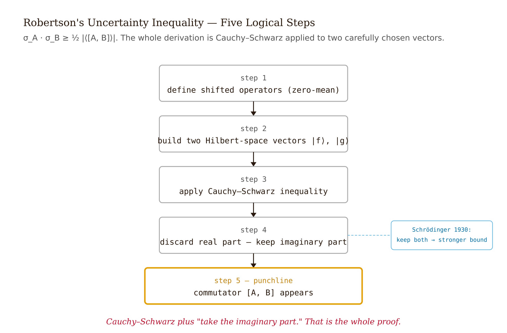

# Chapter 5 — Quantum Formalism

## TL;DR

- This chapter delivers the five postulates of quantum mechanics, the Robertson uncertainty bound with its full derivation, the algebra of compatible observables, and an honest account of the unresolved measurement problem.
- It covers the State, Observable, Born, Collapse, and Time-evolution postulates; the Robertson and Schrödinger bounds and how they differ from Heisenberg's microscope; commutators, the CSCO, and conservation laws; and the live interpretations of quantum mechanics.
- It states which postulates are settled, which one is contested, and exactly where the disagreement lies.

*Four Postulates Are Settled. One Is Not. The Difference Matters.*

---

There are two distinct statements about uncertainty in the literature, and conflating them is a standard error. The first is Werner Heisenberg's 1927 paper in *Zeitschrift für Physik*, which uses the gamma-ray microscope thought experiment. The second is Howard P. Robertson's two-page note in *Physical Review*, 1929, titled "The Uncertainty Principle."

The first statement holds that uncertainty is about measurement: locating an electron requires bouncing a photon off it, which kicks the electron and disturbs its momentum, giving $\Delta x\,\Delta p \gtrsim \hbar$. The balloon analogy — finding a balloon in the dark requires bumping it, and bumping moves it — captures this reading.

The second statement is Robertson's theorem: the inequality is a property of the *state*, with no measurement in the proof. The state has a width in position and a width in momentum, and the product is bounded below by $\hbar/2$. Nothing has to be measured.

Both statements are partially correct. Heisenberg's microscope describes a real effect, formalized as measurement-disturbance uncertainty by Masanao Ozawa in 2003. The Robertson bound is a *different* statement about state preparation. They are related but not identical, and conflating them is the error the balloon analogy reproduces.

This chapter does three things: assembles the five postulates cleanly, derives the Robertson bound from scratch, and gives an honest account of the measurement problem — which is that working physicists do not agree about it.

---

## The five postulates

A theory is the small set of statements from which its applications follow. Quantum mechanics has five postulates, stated below with the physical requirement each enforces.

**Postulate 1 (State).** Every isolated quantum system is associated with a complex Hilbert space $\mathcal{H}$. A pure state is a normalized vector $|\psi\rangle \in \mathcal{H}$, defined up to a global phase: $|\psi\rangle$ and $e^{i\alpha}|\psi\rangle$ represent the same physical state.

**Postulate 2 (Observables).** Every physical observable $A$ corresponds to a Hermitian operator $\hat{A}$ on $\mathcal{H}$. The eigenvalues of $\hat{A}$ are the possible outcomes of measuring $A$.

Hermiticity is required because measurement outcomes are real numbers. If $\hat{A}|a\rangle = a|a\rangle$, then $\langle a|\hat{A}|a\rangle = a$. Take the complex conjugate: $\overline{\langle a|\hat{A}|a\rangle} = \overline{a}$. But $\overline{\langle a|\hat{A}|a\rangle} = \langle a|\hat{A}^\dagger|a\rangle = \langle a|\hat{A}|a\rangle$ when $\hat{A} = \hat{A}^\dagger$. So $a = \overline{a}$, meaning $a$ is real. Hermiticity is the algebraic encoding of "outcomes are real numbers" — forced, not arbitrary.

**Postulate 3 (Born rule).** If the system is in state $|\psi\rangle$ and a measurement of $A$ is performed, the probability of obtaining eigenvalue $a_n$ is

$$P(a_n) = |\langle a_n | \psi \rangle|^2,$$

where $|a_n\rangle$ is the normalized eigenstate corresponding to $a_n$.

**Postulate 4 (Collapse).** Immediately after the measurement yields outcome $a_n$, the state of the system is $|a_n\rangle$. This postulate carries almost all the philosophical weight in quantum mechanics. The last section of this chapter examines it directly.

**Postulate 5 (Time evolution).** Between measurements, the state evolves unitarily:

$$i\hbar\,\frac{\partial}{\partial t}|\psi(t)\rangle = \hat{H}|\psi(t)\rangle.$$

Equivalently, $|\psi(t)\rangle = e^{-i\hat{H}t/\hbar}|\psi(0)\rangle$ for time-independent $\hat{H}$, with evolution operator $\hat{U}(t) = e^{-i\hat{H}t/\hbar}$ unitary: $\hat{U}^\dagger \hat{U} = \hat{1}$. Unitarity is required because probability must be conserved:

$$\langle \psi(t)|\psi(t)\rangle = \langle\psi(0)|\hat{U}^\dagger\hat{U}|\psi(0)\rangle = \langle\psi(0)|\psi(0)\rangle = 1$$

requires $\hat{U}^\dagger\hat{U} = \hat{1}$. Unitarity is the algebraic encoding of "total probability is always one."

| postulate number | name | one-sentence statement | physical requirement enforced |
| --- | --- | --- | --- |
| 1 | State | A system is represented by a normalized vector $|\psi\rangle$ in Hilbert space. | Total probability is 1. |
| 2 | Observables | Measurable quantities are Hermitian operators. | Measurement outcomes are real eigenvalues. |
| 3 | Born rule | Outcome probabilities are squared projection amplitudes, $|\langle a_n|\psi\rangle|^2$. | Probabilities come from state expansion in an eigenbasis. |
| 4 | Collapse | After outcome $a_n$, the state is $|a_n\rangle$. | Repeat measurements give the same outcome. |
| 5 | Time evolution | Between measurements, states evolve by the Schrödinger equation. | Norm and total probability are conserved. |

One structural point: Postulates 1, 2, 3, and 5 are uncontroversial among working physicists and are used unchanged by every interpretation. Postulate 4 is where interpretations diverge. Copenhagen accepts collapse as a postulate; Many-Worlds denies collapse occurs; Bohmian mechanics replaces it with a deterministic guidance equation. The mathematics is identical across all views; the account of what the mathematics describes is not. Hold this structure in mind: four settled postulates, one contested postulate, and a century of literature on the contested one.

---

## The uncertainty principle: what Robertson actually proved

The balloon analogy captures Heisenberg's 1927 intuition: measuring position to precision $\Delta x$ requires a photon of wavelength $\lambda \lesssim \Delta x$, that photon carries momentum $\sim h/\Delta x$, the scattering transfers some of it to the electron, so $\Delta p \gtrsim h/\Delta x$, and $\Delta x\,\Delta p \gtrsim h$. The intuition is correct but is a statement about what *one measurement does to a subsequent one* — measurement disturbance.

Robertson's 1929 paper proved a theorem about the state itself, before any measurement. For any two Hermitian operators $\hat{A}$ and $\hat{B}$ and any state $|\psi\rangle$:

$$\sigma_A\,\sigma_B \;\geq\; \tfrac{1}{2}\bigl|\langle[\hat{A}, \hat{B}]\rangle\bigr|$$

where $\sigma_A^2 = \langle\hat{A}^2\rangle - \langle\hat{A}\rangle^2$ is the variance of $A$ in state $|\psi\rangle$ and $[\hat{A}, \hat{B}] = \hat{A}\hat{B} - \hat{B}\hat{A}$ is the commutator. The derivation uses only linear algebra on a Hilbert space.

Define the shifted operators

$$\hat{A}' = \hat{A} - \langle\hat{A}\rangle, \qquad \hat{B}' = \hat{B} - \langle\hat{B}\rangle.$$

These are still Hermitian, have zero mean, and satisfy $\sigma_A^2 = \langle\hat{A}'^2\rangle$, $\sigma_B^2 = \langle\hat{B}'^2\rangle$. Define two vectors:

$$|f\rangle = \hat{A}'|\psi\rangle, \qquad |g\rangle = \hat{B}'|\psi\rangle.$$

Their squared norms are $\langle f|f\rangle = \sigma_A^2$ and $\langle g|g\rangle = \sigma_B^2$. The Cauchy–Schwarz inequality gives

$$\langle f|f\rangle\,\langle g|g\rangle \;\geq\; |\langle f|g\rangle|^2,$$

so $\sigma_A^2\sigma_B^2 \geq |\langle\psi|\hat{A}'\hat{B}'|\psi\rangle|^2$. For any complex number $z$, $|z|^2 \geq (\text{Im}\,z)^2$, so

$$\sigma_A^2\sigma_B^2 \;\geq\; \bigl(\text{Im}\,\langle\psi|\hat{A}'\hat{B}'|\psi\rangle\bigr)^2.$$

Now the imaginary part. For any complex $z$, $\text{Im}\,z = (z - \overline{z})/(2i)$. The conjugate of $\langle\psi|\hat{A}'\hat{B}'|\psi\rangle$ is $\langle\psi|\hat{B}'^\dagger\hat{A}'^\dagger|\psi\rangle = \langle\psi|\hat{B}'\hat{A}'|\psi\rangle$ (shifted operators remain Hermitian). So

$$\text{Im}\,\langle\psi|\hat{A}'\hat{B}'|\psi\rangle = \frac{1}{2i}\bigl(\langle\psi|\hat{A}'\hat{B}'|\psi\rangle - \langle\psi|\hat{B}'\hat{A}'|\psi\rangle\bigr) = \frac{1}{2i}\langle\psi|[\hat{A}', \hat{B}']|\psi\rangle.$$

The commutator of the shifted operators equals that of the originals: $[\hat{A}', \hat{B}'] = [\hat{A}, \hat{B}]$. And $[\hat{A}, \hat{B}]/i$ is Hermitian, so this imaginary part is real — consistent. Squaring:

$$\sigma_A^2\sigma_B^2 \;\geq\; \frac{1}{4}\bigl|\langle[\hat{A}, \hat{B}]\rangle\bigr|^2,$$

the Robertson bound. The whole proof is Cauchy–Schwarz on shifted operators, isolating the imaginary part, from which the commutator falls out.

*Figure 5.1 — Proof structure flowchart *

For position and momentum, $[\hat{x}, \hat{p}] = i\hbar$ — a constant, independent of the state — so $|\langle[\hat{x}, \hat{p}]\rangle| = \hbar$ for every state, and

$$\sigma_x\,\sigma_p \;\geq\; \frac{\hbar}{2}.$$

The bound is $\hbar/2$, not $\hbar$. The factor of two is part of the answer, and dropping it (as many popular treatments do) is wrong.

Schrödinger in 1930 strengthened the result by keeping both the real and imaginary parts of $\langle\psi|\hat{A}'\hat{B}'|\psi\rangle$ instead of discarding the real part:

$$\sigma_A^2\sigma_B^2 \;\geq\; \left(\tfrac{1}{2}\langle\{\hat{A}', \hat{B}'\}\rangle\right)^2 + \left(\tfrac{1}{2i}\langle[\hat{A}, \hat{B}]\rangle\right)^2$$

where $\{\hat{A}', \hat{B}'\} = \hat{A}'\hat{B}' + \hat{B}'\hat{A}'$ is the anticommutator of the shifted operators (its expectation is twice the covariance). When the covariance is zero, Schrödinger's bound reduces to Robertson's; otherwise it is tighter. The derivation is the same, stopping before discarding the real part.

The balloon analogy correction, stated precisely: the Robertson bound is a statement about the state $|\psi\rangle$. No quantum state has $\sigma_A$ and $\sigma_B$ simultaneously smaller than the right-hand side. The bound holds before anyone measures anything — no apparatus, no photon, no kick. The uncertainty is intrinsic to the state, derived from the algebra of non-commuting operators.

The balloon analogy gets the order-of-magnitude answer right and is faithful to Heisenberg's 1927 motivation, but it gives a wrong picture of what the inequality is. A student trained on it conflates state preparation with measurement disturbance — the conflation physicists removed from the theory by 1930. Masanao Ozawa, in 2003, formalized the measurement-disturbance version into a separate inequality mixing state uncertainty, apparatus noise, and disturbance to subsequent measurements. Experimental tests (Erhart et al., *Nature Physics*, 2012) confirmed Ozawa's version and showed the measurement-disturbance product can be made *smaller* than the naive microscope suggests. The Robertson bound is preparation uncertainty; Ozawa's is measurement-disturbance uncertainty. They are related but distinct inequalities.

| paper | year | type of uncertainty | what varies | mathematical form |
| --- | --- | --- | --- | --- |
| Heisenberg | 1927 | Measurement-disturbance intuition | Apparatus resolution and recoil | $\Delta x\,\Delta p \sim h$ as an order-of-magnitude microscope argument |
| Robertson | 1929 | Preparation uncertainty | The quantum state | $\sigma_A\sigma_B \ge \frac{1}{2}|\langle[\hat A,\hat B]\rangle|$ |
| Schrödinger | 1930 | Preparation uncertainty with covariance | The quantum state | Robertson bound plus the anticommutator/covariance term |
| Ozawa | 2003 | Measurement noise and disturbance | Apparatus noise, disturbance, and state spread | $\epsilon(A)\eta(B)+\epsilon(A)\sigma_B+\sigma_A\eta(B)\ge\frac{1}{2}|\langle[\hat A,\hat B]\rangle|$ |

**Worked example — the harmonic-oscillator ground state saturates the bound.**

**Given.** The harmonic-oscillator ground state

$$\psi_0(x) = \left(\frac{m\omega}{\pi\hbar}\right)^{1/4}\exp\!\left(-\frac{m\omega x^2}{2\hbar}\right),$$

a Gaussian $e^{-\alpha x^2/2}$ with $\alpha = m\omega/\hbar$.

**Find.** The product $\sigma_x\,\sigma_p$ and whether it saturates the Robertson bound.

**Solution.** Computing $\sigma_x$ and $\sigma_p$ directly:

$$\sigma_x^2 = \langle x^2\rangle = \frac{1}{2\alpha} = \frac{\hbar}{2m\omega}, \qquad \sigma_p^2 = \langle p^2\rangle = \frac{\hbar^2\alpha}{2} = \frac{\hbar m\omega}{2}.$$

The product:

$$\sigma_x\,\sigma_p = \sqrt{\frac{\hbar}{2m\omega}}\cdot\sqrt{\frac{\hbar m\omega}{2}} = \frac{\hbar}{2}.$$

**Check.** Exactly the floor. The ground state achieves equality in the Robertson bound — a minimum-uncertainty state. For the $n$-th excited state the same computation (using ladder operators to evaluate $\langle\hat{x}^2\rangle$ and $\langle\hat{p}^2\rangle$) gives $\sigma_x\sigma_p = (n + 1/2)\hbar$, which exceeds $\hbar/2$ for all $n \geq 1$. Only the ground state saturates.

The zero-point energy and the saturation of the Robertson bound are the same fact from two angles. The state's product-of-widths floor and its energy floor are two faces of one constraint: a confined quantum state cannot have zero kinetic energy and cannot be simultaneously sharp in $x$ and $p$. These are one property of the harmonic oscillator, not two.

---

## Compatible observables and commutators

The Robertson bound describes operators that do not commute. The next question is what happens when they do.

Two Hermitian operators $\hat{A}$ and $\hat{B}$ are compatible if $[\hat{A}, \hat{B}] = 0$. The Robertson bound then gives $\sigma_A\sigma_B \geq 0$, trivially satisfied — no joint-uncertainty floor. Further, compatible operators admit a common eigenbasis: there exists a basis $\{|n\rangle\}$ in which every $|n\rangle$ is simultaneously an eigenstate of both $\hat{A}$ and $\hat{B}$, labeled by both eigenvalues $(a_n, b_n)$. The state can be sharp in both observables at once, because the measurements do not interfere.

Examples. $[\hat{x}, \hat{p}_y] = 0$: position along one axis and momentum along a perpendicular axis are compatible. $[\hat{x}, \hat{p}_x] = i\hbar$: position and momentum along the same axis are incompatible. $[\hat{L}_x, \hat{L}_y] = i\hbar\hat{L}_z$ (Chapter 7): angular momentum components along different axes are incompatible. $[\hat{L}^2, \hat{L}_z] = 0$: the squared magnitude of angular momentum and one component are compatible.

That last pair explains how hydrogen orbitals are labeled. The operators $\hat{H}$, $\hat{L}^2$, $\hat{L}_z$ all commute and share a common eigenbasis. Their eigenvalues — $n$, $\ell$, $m$ — label the states, which is why these particular quantum numbers appear. The label set is the set of commuting operators whose eigenvalues uniquely specify every basis state. This structure is a complete set of commuting observables, or CSCO.

A CSCO is a maximal set of mutually commuting Hermitian operators whose joint eigenvalues uniquely identify every state in the eigenbasis. For hydrogen the CSCO is $\{\hat{H}, \hat{L}^2, \hat{L}_z, \hat{S}_z\}$, yielding labels $(n, \ell, m, m_s)$. The periodic table's quantum numbers are the CSCO's joint eigenvalues. These labels, arranged this way, exist because this is the largest set of operators that all commute.

There is a connection to conservation laws. In the Heisenberg picture (operators evolve, states stay fixed), the time derivative of any observable $\hat{O}$ with no explicit time dependence is

$$\frac{d\hat{O}}{dt} = \frac{i}{\hbar}[\hat{H}, \hat{O}].$$

If $[\hat{H}, \hat{O}] = 0$, then $d\hat{O}/dt = 0$ — the observable is a constant of the motion. Operators that commute with the Hamiltonian are conserved quantities. The connection between symmetry, commuting operators, and conservation laws runs through Chapters 6 and 7. The CSCO structure is the quantum version of that connection.

One misconception to correct: non-commuting does not mean unmeasurable. You can measure $\hat{x}$ and then $\hat{p}$ in sequence; each measurement is well defined individually. What you cannot do is prepare a state simultaneously sharp in both, because the Robertson bound forbids it. The cost of sequential measurement is that the second disturbs the first: after measuring $\hat{x}$ and obtaining $x_0$, the state is approximately $|x_0\rangle$, completely uncertain in $p$. Measuring $\hat{p}$ collapses to some $|p_0\rangle$, completely uncertain in $x$. Re-measuring $\hat{x}$ gives a random result. Non-commuting observables have no simultaneous values.

---

## The measurement problem: what is actually unsettled

The preceding sections — postulates, Robertson bound, commutators — are well settled. The content below is not. The distinction matters and is not papered over here.

Postulate 4 says that upon measurement the state collapses to the corresponding eigenstate. The difficulty is that a measurement is itself a physical interaction between a quantum system and a physical apparatus. The apparatus is made of atoms, which are quantum. So why is the apparatus described classically? Why are there two laws of evolution — unitary Schrödinger evolution between measurements, discontinuous collapse during them — with the switch governed by "when a measurement occurs"? And what counts as a measurement?

John Bell, in *Physics World* in 1990 ("Against 'Measurement'"), argued that a fundamental theory should not contain the word "measurement" in its postulates. The apparatus is made of quantum constituents and should evolve by the same dynamics as the system. If collapse is real, it should follow from the dynamics, not be inserted by hand. Sixty-two years after Schrödinger, the field still lacked an exact formulation physicists agreed on, and it still does.

The live interpretations diverge here. The chapter names them without adjudicating.

**Copenhagen** (Bohr, Heisenberg, circa 1927). Quantum systems are described by $|\psi\rangle$; the apparatus is described classically; collapse is a postulate. This is the textbook version, the default for calculation. Strength: operational clarity. Weakness: the unspecified quantum-classical boundary and the unspecified definition of "measurement."

**Many-Worlds / Everett** (Hugh Everett III, *Reviews of Modern Physics*, 1957). There is no collapse. The combined system-plus-apparatus-plus-observer evolves unitarily; apparent collapse is the observer becoming correlated with one branch of a larger superposition. All outcomes occur in different branches. Strength: removes the postulate Bell objected to. Weakness: probabilities now refer to branches — the meaning of assigning probability $|\langle a_n|\psi\rangle|^2$ to outcome $a_n$ when all outcomes occur somewhere is contested. Decision-theoretic derivations (Deutsch 1999, Wallace 2010) attempt an answer; critics dispute whether they are circular.

**Bohmian / pilot-wave** (de Broglie 1927, Bohm 1952). Particles have definite positions at all times, guided by a pilot wave $\psi$ evolving by Schrödinger's equation. Collapse follows from the dynamics. Strength: deterministic, no measurement problem. Weakness: explicitly nonlocal in a way that is consistent with quantum predictions but awkward to extend to relativistic quantum field theory.

**QBism** (Caves, Fuchs, Schack, circa 2002). The wave function is the agent's degree of belief about future measurement outcomes. The Born rule is a normative rule for updating those beliefs, and collapse is a Bayesian update. Strength: the measurement problem dissolves because $|\psi\rangle$ was never a physical thing. Weakness: many physicists reject the anti-realist reading of $|\psi\rangle$, which appears to make quantum mechanics about belief rather than the world.

**Dynamical collapse models** (Ghirardi, Rimini, Weber, 1986; Continuous Spontaneous Localization, Pearle 1989). The Schrödinger equation is modified by a small nonlinear stochastic term causing spontaneous localization at a rate proportional to mass. For a single particle the modification is negligible; for a macroscopic object the collective effect forces a definite classical state. Collapse becomes a real physical process. Strength: testable — the models predict small deviations from standard quantum mechanics. Weakness: no positive experimental signal has appeared; cantilever and matter-wave experiments keep tightening upper bounds on the GRW/CSL parameters without confirming the models.

**Decoherence** (Zurek and others, circa 1970s onward). Not strictly an interpretation but a mechanism. Interaction with the environment rapidly suppresses interference between macroscopically distinct states, producing apparent classical behavior. Decoherence explains the absence of observable live-cat/dead-cat superpositions. It does not explain which specific outcome you observe — it eliminates the off-diagonal coherences but leaves the diagonal terms, and the question of which diagonal term you got is the measurement problem restated. Decoherence is part of the answer every interpretation must incorporate, but not a complete answer by itself.

| name | what replaces collapse | what ψ represents | strength | weakness |
| --- | --- | --- | --- | --- |
| Copenhagen | Collapse as a postulate | A state used to predict measurement outcomes | Clear operational recipe | Vague measurement boundary |
| Many-Worlds / Everett | Branching under unitary evolution | A real universal wave function | Removes collapse postulate | Probability in branching worlds is contested |
| Bohmian / pilot-wave | Deterministic particle trajectories guided by $\psi$ | A real guiding field | Definite ontology | Explicit nonlocality and difficult QFT extension |
| QBism | Bayesian updating by an agent | Personal degrees of belief | Dissolves the measurement problem | Anti-realist reading is controversial |
| Dynamical collapse | Stochastic physical localization | A physical state subject to modified dynamics | Testable deviations from standard QM | No confirmed signal |
| Decoherence | Environmental suppression of interference | Standard quantum state of system plus environment | Explains classical-looking records | Does not select a single outcome |

In 2013, Maximilian Schlosshauer, Johannes Kofler, and Anton Zeilinger surveyed 33 physicists at a specialist foundations conference. The most popular position was Copenhagen-flavored (around 42%), followed by information-based or QBism-adjacent views (around 24%), then Many-Worlds (around 18%), with smaller minorities for Bohm, collapse models, and others. The sample is small and self-selected — foundations specialists, not a random draw — but the conclusion is robust: *there is no consensus*. Working physicists disagree about what their most successful theory describes.

One misconception to correct explicitly: "the observer's consciousness causes wave function collapse." This is the von Neumann–Wigner interpretation, sketched by Wigner in a 1961 essay and largely abandoned even by him. The 2013 survey found essentially no support for it. The pop-science framing of "the observer creates reality" trades on this idea and should be rejected. There is a genuine measurement problem; consciousness is not the mainstream answer; decoherence is the mainstream mechanism for the quantum-to-classical transition; the interpretive disagreement is about whether decoherence plus something — and which something — closes the problem.

One recent result sharpened the debate. Daniela Frauchiger and Renato Renner, in *Nature Communications* in 2018, constructed a thought experiment in which different observers, each reasoning consistently within quantum mechanics, reach contradictory conclusions about a measurement outcome. Every interpretation resolves the paradox by giving up a different assumption: Copenhagen by restricting which observers count, Many-Worlds by clarifying what "outcome" means across branches. Vilasini and Renner's 2024 follow-up ([*Nature Communications* 15, 7155](https://doi.org/10.1038/s41467-024-47170-2)) examined which assumption each interpretation must drop. No interpretation failed — each survives by making its choice explicit — but the choice is forced. The foundations are still under active construction.

---

## Where the postulates stand

The situation, stated plainly.

The five postulates work. They predict experimental outcomes to many decimal places across every domain tested. Postulates 1, 2, 3, and 5 are not in serious dispute; every computation in this course rests on them, and no credible experimental challenge exists. Postulate 4 — collapse — has a well-defined mathematical content that all physicists use and none seriously proposes discarding. What is in dispute is what it *means*, what it *describes*, and whether it should be derivable from the other four rather than postulated separately.

A working physicist can compute with all five postulates without committing to an interpretation. The calculation is interpretation-independent; the prediction is the same under Copenhagen, Many-Worlds, Bohm, and QBism. The interpretation question matters for what the theory is *about* — whether the wave function describes reality, our beliefs, a branching multiverse, or a pilot field. That question is open, and this chapter does not pretend otherwise.

---

## Exercises

**Warm-up**

**W1.** State the five postulates from memory in one sentence each. For each, identify the physical requirement it enforces — "real measurement outcomes," "conserved probability," and so on. Then identify which single postulate every interpretation of quantum mechanics modifies, replaces, or reinterprets, and state in one sentence what each of the six interpretations surveyed in this chapter does to it. *(The first part is recall; the second part tests whether the student has absorbed the settled/contested distinction.)*

**W2.** Prove in two lines that the eigenvalues of any Hermitian operator are real. Then prove in two lines that eigenvectors corresponding to distinct eigenvalues are orthogonal. Both are the same style of calculation as the Hermiticity argument in the postulate discussion — start from $\hat{A}|a\rangle = a|a\rangle$, take an inner product, use $\hat{A} = \hat{A}^\dagger$. *(Direct application of the Hermitian machinery; a student who cannot do these two proofs does not yet own Postulate 2.)*

**W3.** Compute $[\hat{x}, \hat{p}]$ explicitly by acting on an arbitrary test function $f(x)$, using $\hat{x}f = xf$ and $\hat{p}f = -i\hbar\,\partial_x f$. Verify that $[\hat{x}, \hat{p}]f = i\hbar f$ for all $f$, so $[\hat{x}, \hat{p}] = i\hbar\hat{1}$. *(The commutation relation is used throughout the rest of the course; this exercise ensures the student can derive it rather than just cite it.)*

**Application**

**A1.** For the $n = 1$ infinite-square-well state $\psi_1(x) = \sqrt{2/L}\sin(\pi x/L)$, compute $\sigma_x$ and $\sigma_p$ explicitly. Confirm that $\sigma_x\sigma_p > \hbar/2$, so the Robertson bound is satisfied but not saturated. Compute the ratio $\sigma_x\sigma_p\,/\,(\hbar/2)$ numerically and compare to the harmonic-oscillator ground state (ratio = 1) and the harmonic-oscillator $n = 1$ state (ratio = 3). Which state comes closest to saturating the bound, and why does the box ground state not saturate it? *(The Gaussian shape is the key — the box wave function is not Gaussian, and that is why equality fails.)*

**A2.** Use the ladder operators to compute $\sigma_x$ and $\sigma_p$ for the $n$-th harmonic-oscillator eigenstate. Write $\hat{x}$ and $\hat{p}$ in terms of $\hat{a}_\pm$, apply $\hat{a}_-|n\rangle = \sqrt{n}\,|n-1\rangle$ and $\hat{a}_+|n\rangle = \sqrt{n+1}\,|n+1\rangle$, and show that $\sigma_x\sigma_p = (n + 1/2)\hbar$. Confirm that only $n = 0$ saturates the Robertson bound. *(Builds ladder-operator fluency while revisiting the Chapter 4 ground-state result from the formalism angle.)*

**A3.** A beam of spin-1/2 particles is prepared in state $|\uparrow_z\rangle$. It passes through three Stern–Gerlach magnets oriented $z$, then $x$, then $z$. Using $|\uparrow_x\rangle = (|\uparrow_z\rangle + |\downarrow_z\rangle)/\sqrt{2}$ and the Born rule, compute the probability that a particle emerges from the final $z$-magnet in state $|\uparrow_z\rangle$. Then explain in two sentences why the final $z$-measurement gives a 50/50 split even though the beam started as pure $|\uparrow_z\rangle$. *(Tests the Born rule and Postulate 4 together; the explanation requires the student to name what the intermediate $x$-measurement did to the state.)*

**Synthesis**

**S1.** The Robertson derivation in this chapter discards the real part of $\langle\psi|\hat{A}'\hat{B}'|\psi\rangle$ at the step $|z|^2 \geq (\text{Im}\,z)^2$. Schrödinger's 1930 strengthening keeps it. (a) Write down the Schrödinger bound explicitly, identifying the anticommutator term. (b) For the harmonic-oscillator ground state, compute $\tfrac{1}{2}\langle\{\hat{x}', \hat{p}'\}\rangle$ (the covariance term) and show it vanishes, so the Robertson and Schrödinger bounds coincide for this state. (c) Identify a state for which the covariance would not vanish — what does a nonzero covariance mean physically in terms of the joint distribution of $x$ and $p$? *(Ties the algebraic structure of the proof to the geometry of phase-space distributions; the covariance question is the one Schrödinger's paper was actually answering.)*

**S2.** Pick one interpretation of quantum mechanics from this chapter. State clearly what it says about Postulate 4 — whether it retains collapse as a postulate, replaces it with something else, or reinterprets what collapse means. Then identify one specific experimental scenario — not a thought experiment, a real class of laboratory experiment — for which your chosen interpretation gives the same prediction as Copenhagen, and one for which the predictions would differ (even if the difference is currently unmeasurable). Conclude with whether you find the interpretation more or less satisfying than Copenhagen and name your reason precisely. *(The student must engage the physics, not just describe the interpretation; the instruction to name a real experiment forces them off pure philosophy. There is no right answer — only honest ones.)*

**Challenge**

**C1.** The Robertson bound states $\sigma_A\sigma_B \geq \tfrac{1}{2}|\langle[\hat{A},\hat{B}]\rangle|$. For most observables, the right-hand side depends on the state $|\psi\rangle$ through the expectation value of the commutator. For position and momentum, $[\hat{x},\hat{p}] = i\hbar$ is a *c*-number — it does not depend on the state — so the bound is the same for every state: $\sigma_x\sigma_p \geq \hbar/2$ always. (a) Find a pair of observables for which the commutator is *not* a *c*-number (i.e., it depends on the state), and write down their commutator. (b) Show that for eigenstates of $\hat{L}_z$ with eigenvalue $m\hbar$, the Robertson bound for $\hat{L}_x$ and $\hat{L}_y$ is $\sigma_{L_x}\sigma_{L_y} \geq \tfrac{1}{2}|m|\hbar^2$. (c) For $m = 0$ the bound gives zero — does this mean you can simultaneously know $L_x$ and $L_y$ exactly? Explain using the commutation relations $[\hat{L}_x, \hat{L}_y] = i\hbar\hat{L}_z$. *(The $m = 0$ case is a subtlety that Griffiths §4.3 addresses and that trips up most students; the Robertson bound can be zero even when the operators do not commute, if the state is special enough.)*

---

## LLM Exercises

**LLM-E1.** Ask a language model to state the five postulates of quantum mechanics. Evaluate the response: does it give exactly five, and are they the right five? Does it correctly identify which postulate encodes conservation of probability (Postulate 5 / unitarity) and which encodes real measurement outcomes (Postulate 2 / Hermiticity)? Does it include Postulate 4 (collapse) without noting that it is the contested one?

**LLM-E2.** Ask a language model to explain the uncertainty principle using an analogy. Then ask it whether the analogy describes preparation uncertainty, measurement-disturbance uncertainty, or both. Evaluate whether it can distinguish Robertson 1929 from Heisenberg 1927. Ask it to state the Robertson bound with the correct factor of $\hbar/2$ (not $\hbar$). Does it get the factor right on the first try?

**LLM-E3.** Paste the Robertson derivation from this chapter into a language model — from "Define the shifted operators..." through the final Robertson bound — and ask it to verify every step. Where does it confirm the algebra, where does it flag a real error, and where does it hallucinate a problem that does not exist? Pay particular attention to the step where the imaginary part is extracted from $\langle\psi|\hat{A}'\hat{B}'|\psi\rangle$ — this is the step most often glossed over.

**LLM-E4.** Ask a language model: "Which interpretation of quantum mechanics is correct?" Evaluate whether the response honestly represents the lack of consensus, or whether it picks a winner. A strong response names the major interpretations, states what each one says about collapse, and acknowledges that working physicists disagree. A weak response quietly endorses Copenhagen (or Many-Worlds) without flagging the disagreement. Compare the response to the Schlosshauer-Kofler-Zeilinger 2013 survey result.

**LLM-E5.** Give a language model this sentence from a popular-physics book: "The act of observation causes the wave function to collapse — the observer creates reality." Ask it to evaluate the claim carefully. A strong response will distinguish the measurement problem (genuine, unresolved) from the consciousness-causes-collapse interpretation (not the mainstream answer), invoke decoherence as the standard mechanism for the quantum-to-classical transition, and identify what is misleading about the "observer creates reality" framing without dismissing the underlying question as trivial.

---

## References

*Added by fact-check pass 2026-05-14.*

1. Robertson, H. P. "The Uncertainty Principle." *Physical Review* 34, 163–164 (1929). https://journals.aps.org/pr/abstract/10.1103/PhysRev.34.163
2. Ozawa, M. "Universally valid reformulation of the Heisenberg uncertainty principle on noise and disturbance in measurement." *Physical Review A* 67, 042105 (2003). https://doi.org/10.1103/PhysRevA.67.042105
3. Erhart, J., Sponar, S., Sulyok, G., Badurek, G., Ozawa, M. & Hasegawa, Y. "Experimental demonstration of a universally valid error–disturbance uncertainty relation in spin measurements." *Nature Physics* 8, 185–189 (2012). https://doi.org/10.1038/nphys2194
4. Schrödinger, E. "Zum Heisenbergschen Unschärfeprinzip." *Sitzungsber. Preuss. Akad. Wiss.* 14, 296–303 (1930).
5. Bell, J. S. "Against 'measurement.'" *Physics World* 3 (8), 33–40 (1990).
6. Everett, H., III. "'Relative State' Formulation of Quantum Mechanics." *Reviews of Modern Physics* 29, 454–462 (1957). https://doi.org/10.1103/RevModPhys.29.454
7. Bohm, D. "A Suggested Interpretation of the Quantum Theory in Terms of 'Hidden' Variables." *Physical Review* 85, 166, 180 (1952).
8. Schlosshauer, M., Kofler, J. & Zeilinger, A. "A Snapshot of Foundational Attitudes Toward Quantum Mechanics." *Studies in History and Philosophy of Modern Physics* 44, 222–230 (2013). https://doi.org/10.1016/j.shpsb.2013.04.004
9. Frauchiger, D. & Renner, R. "Quantum theory cannot consistently describe the use of itself." *Nature Communications* 9, 3711 (2018). https://doi.org/10.1038/s41467-018-05739-8
10. Wigner, E. P. "Remarks on the Mind-Body Question," in *The Scientist Speculates*, ed. I. J. Good, Heinemann (1961), pp. 284–302.
