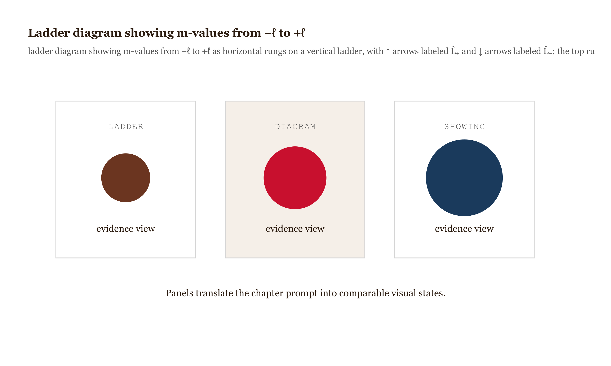
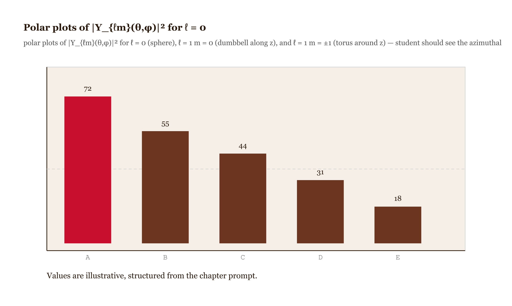
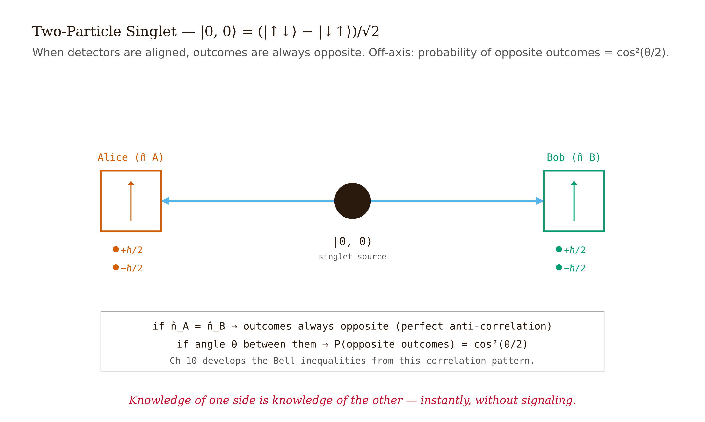

# Chapter 7 — Angular Momentum

## TL;DR

- Derives the full angular-momentum spectrum from one commutation relation, using algebra alone.
- Covers: the commutation relations, ladder operators and the spectrum, spherical harmonics and the exclusion of half-integers for orbital angular momentum, spin-1/2 and the Pauli matrices, the $720^\circ$ rotation, and the two-spin singlet.
- Supplies the operators, the eigenvalues, and the judgment for when each applies.

*One Commutation Relation. One Derivation. Every Eigenvalue You'll Ever Need.*

---

The letter $\ell$ appears in three roles. It labels the eigenvalue of $\hat{L}^2$ — carrying an unexplained $(\ell+1)$ factor. It labels the state. And it bounds $m_\ell$ to the range $-\ell$ to $+\ell$. These three roles are not independent, and the standard presentation does not show why.

Most introductory treatments state $\hat{L}^2 \psi = \hbar^2\ell(\ell+1)\psi$ without derivation. The $(\ell+1)$ then looks like an arbitrary correction, and $|m_\ell| \leq \ell$ like a separate fact. Both follow from one derivation.

The entire spectrum follows from one fact and two requirements. The fact: the angular-momentum components do not commute, $[\hat{L}_x, \hat{L}_y] = i\hbar \hat{L}_z$. The requirements: physical operators have real expectation values, and the spectrum of $\hat{L}_z$ is bounded in any finite-norm state. Two auxiliary operators carry these constraints through the algebra, and every eigenvalue follows. No spatial integration, no differential equations — pure algebra.

With the spectrum established, spin reduces to a choice of representation of the same algebra. The $(\ell+1)$ factor is then fixed by the algebra, not arbitrary.

---

## The commutation relations

Classical angular momentum is $\vec{L} = \vec{r} \times \vec{p}$. In components:

$$L_x = yp_z - zp_y, \quad L_y = zp_x - xp_z, \quad L_z = xp_y - yp_x.$$

Promote each variable to an operator. The canonical commutator $[\hat{x}_i, \hat{p}_j] = i\hbar\delta_{ij}$ — with $[\hat{x}_i, \hat{x}_j] = [\hat{p}_i, \hat{p}_j] = 0$ — gives the components nontrivial commutators among themselves.

Compute $[\hat{L}_x, \hat{L}_y]$ explicitly; it is the cornerstone of everything that follows.

$$[\hat{L}_x, \hat{L}_y] = [\hat{y}\hat{p}_z - \hat{z}\hat{p}_y,\; \hat{z}\hat{p}_x - \hat{x}\hat{p}_z].$$

Expand by bilinearity. Most of the four terms vanish; the only nonzero pairs come from $[\hat{x}_i, \hat{p}_i] = i\hbar$. The surviving terms:

- $[\hat{y}\hat{p}_z, \hat{z}\hat{p}_x] = \hat{y}[\hat{p}_z, \hat{z}]\hat{p}_x = \hat{y}(-i\hbar)\hat{p}_x = -i\hbar\,\hat{y}\hat{p}_x.$
- $[\hat{y}\hat{p}_z, \hat{x}\hat{p}_z] = 0$ (no shared index).
- $[\hat{z}\hat{p}_y, \hat{z}\hat{p}_x] = 0$ (likewise).
- $[\hat{z}\hat{p}_y, \hat{x}\hat{p}_z] = [\hat{z}, \hat{p}_z]\hat{p}_y\hat{x} = (i\hbar)\hat{p}_y\hat{x} = i\hbar\,\hat{x}\hat{p}_y.$

Sum:

$$[\hat{L}_x, \hat{L}_y] = -i\hbar\,\hat{y}\hat{p}_x + i\hbar\,\hat{x}\hat{p}_y = i\hbar(\hat{x}\hat{p}_y - \hat{y}\hat{p}_x) = i\hbar\hat{L}_z.$$

The cyclic versions $[\hat{L}_y, \hat{L}_z] = i\hbar\hat{L}_x$ and $[\hat{L}_z, \hat{L}_x] = i\hbar\hat{L}_y$ follow from the same calculation. These three relations are the *defining relations* of an angular-momentum algebra. Any three operators with this Lie-bracket structure qualify as angular-momentum components, whether or not they originate in $\vec{r}\times\vec{p}$. The case that does not is spin.

One consequence. The operator $\hat{L}^2 = \hat{L}_x^2 + \hat{L}_y^2 + \hat{L}_z^2$ commutes with every component. Proof for $\hat{L}_z$:

$$[\hat{L}^2, \hat{L}_z] = [\hat{L}_x^2, \hat{L}_z] + [\hat{L}_y^2, \hat{L}_z] + [\hat{L}_z^2, \hat{L}_z].$$

The last term vanishes. The first is $[\hat{L}_x^2, \hat{L}_z] = \hat{L}_x[\hat{L}_x, \hat{L}_z] + [\hat{L}_x, \hat{L}_z]\hat{L}_x = -i\hbar(\hat{L}_x\hat{L}_y + \hat{L}_y\hat{L}_x)$. The second is $[\hat{L}_y^2, \hat{L}_z] = +i\hbar(\hat{L}_y\hat{L}_x + \hat{L}_x\hat{L}_y)$. They cancel exactly, so $[\hat{L}^2, \hat{L}_z] = 0$ and $\hat{L}^2$ and $\hat{L}_z$ are simultaneously diagonalizable.

Label their common eigenstates $|\ell, m\rangle$:

$$\hat{L}^2 |\ell, m\rangle = \lambda |\ell, m\rangle, \quad \hat{L}_z |\ell, m\rangle = m\hbar |\ell, m\rangle.$$

The values $\lambda = \hbar^2\ell(\ell+1)$ and the bound on $m$ are derived next.

---

## The ladder operators and the spectrum

Define

$$\hat{L}_\pm = \hat{L}_x \pm i\hat{L}_y.$$

These are not Hermitian — they are mutual adjoints, $\hat{L}_+^\dagger = \hat{L}_-$ — so they are not observables. They are computational tools. From the commutation relations:

$$[\hat{L}_z, \hat{L}_\pm] = \pm\hbar\hat{L}_\pm, \qquad [\hat{L}^2, \hat{L}_\pm] = 0.$$

The second relation: $\hat{L}_\pm$ leaves the $\hat{L}^2$ eigenvalue unchanged. The first: it shifts the $\hat{L}_z$ eigenvalue. Explicitly, if $\hat{L}_z|\ell, m\rangle = m\hbar|\ell, m\rangle$, then

$$\hat{L}_z(\hat{L}_+|\ell, m\rangle) = (\hat{L}_+\hat{L}_z + \hbar\hat{L}_+)|\ell, m\rangle = (m+1)\hbar\cdot\hat{L}_+|\ell, m\rangle.$$

So $\hat{L}_+|\ell, m\rangle$ is an $\hat{L}_z$ eigenstate with eigenvalue $(m+1)\hbar$. The raising operator advances $m$ by one rung at fixed $\hat{L}^2$ eigenvalue; the lowering operator $\hat{L}_-$ retreats by one rung.

*Figure 7.1 — Ladder diagram showing m-values from −ℓ to +ℓ*

The ladder is bounded because expectation values are bounded. The operator $\hat{L}^2 - \hat{L}_z^2 = \hat{L}_x^2 + \hat{L}_y^2$ is a sum of squared Hermitian operators, so its expectation value is non-negative in any state:

$$\langle \hat{L}_x^2 + \hat{L}_y^2 \rangle \geq 0.$$

In $|\ell, m\rangle$ this gives $\lambda - m^2\hbar^2 \geq 0$, so $m^2 \leq \lambda/\hbar^2$. The $m$-values are bounded. There is a top rung $|\ell, m_{\max}\rangle$ annihilated by the raising operator and a bottom rung $|\ell, m_{\min}\rangle$ annihilated by the lowering operator.

Compute $\lambda$. Use the product identity

$$\hat{L}_-\hat{L}_+ = (\hat{L}_x - i\hat{L}_y)(\hat{L}_x + i\hat{L}_y) = \hat{L}_x^2 + \hat{L}_y^2 + i[\hat{L}_x, \hat{L}_y] = \hat{L}^2 - \hat{L}_z^2 - \hbar\hat{L}_z.$$

Apply to the top rung, where $\hat{L}_+|\ell, m_{\max}\rangle = 0$:

$$0 = \hat{L}_-\hat{L}_+|\ell, m_{\max}\rangle = (\hat{L}^2 - \hat{L}_z^2 - \hbar\hat{L}_z)|\ell, m_{\max}\rangle = (\lambda - m_{\max}^2\hbar^2 - m_{\max}\hbar^2)|\ell, m_{\max}\rangle.$$

So

$$\lambda = m_{\max}(m_{\max} + 1)\hbar^2.$$

Define $\ell \equiv m_{\max}$:

$$\lambda = \hbar^2\ell(\ell+1).$$

The $(\ell+1)$ is not a correction. It comes from the cross-term $i[\hat{L}_x, \hat{L}_y] = -\hbar\hat{L}_z$ in the expansion of $\hat{L}_-\hat{L}_+$. The non-commutativity of the components enters the eigenvalue irreducibly. If the components commuted, the eigenvalue would be $\ell^2\hbar^2$, the bottom rung would sit at $-\ell$ with no asymmetry. Because they do not commute, the algebra forces both the asymmetry and the factor.

The same calculation on the bottom rung — using $\hat{L}_+\hat{L}_- = \hat{L}^2 - \hat{L}_z^2 + \hbar\hat{L}_z$ and $\hat{L}_-|\ell, m_{\min}\rangle = 0$ — gives $\lambda = m_{\min}(m_{\min}-1)\hbar^2$. With $\lambda = \ell(\ell+1)\hbar^2$, the equation $m_{\min}(m_{\min}-1) = \ell(\ell+1)$ has solutions $m_{\min} = -\ell$ and $m_{\min} = \ell+1$. The second contradicts $m_{\min} \leq m_{\max} = \ell$, leaving $m_{\min} = -\ell$.

The ladder runs from $m = -\ell$ to $m = +\ell$ in unit steps, so $2\ell$ is a non-negative integer and $\ell \in \{0, \frac{1}{2}, 1, \frac{3}{2}, 2, \ldots\}$. The algebra permits both integers and half-integers; which are realized depends on the Hilbert space the operators act on.

---

## Spherical harmonics and why half-integers fail for orbital angular momentum

When $\hat{L}^2$ and $\hat{L}_z$ act on functions of $(\theta, \phi)$ on the sphere, their simultaneous eigenfunctions are the spherical harmonics $Y_{\ell m}(\theta, \phi)$. In spherical coordinates $\hat{L}_z = -i\hbar\partial/\partial\phi$, so the $\phi$-dependence is $e^{im\phi}$.

The constraint: single-valuedness requires $\psi(\phi) = \psi(\phi + 2\pi)$, hence $e^{im \cdot 2\pi} = 1$, forcing $m$ to be an integer. With the ladder running in unit steps from $-\ell$ to $+\ell$, $\ell$ is then a non-negative integer. Half-integer orbital angular momentum is excluded by single-valuedness on the sphere. The algebra permits $\ell = 1/2$; the geometry of $S^2$ does not.

This is the structural divide between orbital and spin angular momentum. Orbital angular momentum acts on function spaces over the sphere — integer only. Spin acts on a separate finite-dimensional complex vector space with no spatial interpretation — half-integer allowed, because single-valuedness never applies.

The first few spherical harmonics:

$$Y_{0,0} = \frac{1}{\sqrt{4\pi}}, \qquad Y_{1,0} = \sqrt{\frac{3}{4\pi}}\cos\theta, \qquad Y_{1,\pm 1} = \mp\sqrt{\frac{3}{8\pi}}\sin\theta\,e^{\pm i\phi}.$$

*Figure 7.2 — Polar plots of |Y_{ℓm}(θ,φ)|² for ℓ = 0*

The chemists' $p$ orbitals are real combinations of $Y_{1,\pm 1}$:

$$p_x = \frac{1}{\sqrt{2}}(Y_{1,-1} - Y_{1,1}), \qquad p_y = \frac{i}{\sqrt{2}}(Y_{1,-1} + Y_{1,1}).$$

Only $p_z = Y_{1,0}$ is an $\hat{L}_z$ eigenstate (eigenvalue 0). The combinations $p_x$ and $p_y$ are not $\hat{L}_z$ eigenstates; they are equal-weight superpositions of $m = +1$ and $m = -1$. The real basis gives dumbbell-shaped orbitals aligned with bond axes; the complex $Y_{\ell m}$ basis is what a magnetic field couples to through $\hat{L}_z$. Both are valid bases for the same subspace. A basis choice is not a physical statement about the state.

---

## Spin-1/2 and the Pauli matrices

Spin operators satisfy the same algebra:

$$[\hat{S}_x, \hat{S}_y] = i\hbar\hat{S}_z, \quad \text{and cyclically.}$$

The derivation of the previous section applies verbatim. For spin-1/2, the smallest nontrivial representation acts on a two-dimensional complex space, with $s = 1/2$ and $m_s = \pm 1/2$.

Write $\hat{S}_i = (\hbar/2)\sigma_i$. The **Pauli matrices** are

$$\sigma_x = \begin{pmatrix} 0 & 1 \\ 1 & 0 \end{pmatrix}, \quad \sigma_y = \begin{pmatrix} 0 & -i \\ i & 0 \end{pmatrix}, \quad \sigma_z = \begin{pmatrix} 1 & 0 \\ 0 & -1 \end{pmatrix}.$$

Four properties carry the load:

1. $\sigma_i^2 = I$.
2. $\mathrm{Tr}(\sigma_i) = 0$.
3. Anticommutation: $\{\sigma_i, \sigma_j\} = 2\delta_{ij}I$.
4. Commutation: $[\sigma_i, \sigma_j] = 2i\epsilon_{ijk}\sigma_k$.

Properties 3 and 4 combine to $\sigma_i\sigma_j = \delta_{ij}I + i\epsilon_{ijk}\sigma_k$. The Pauli matrices are the simplest nontrivial two-dimensional matrices satisfying the angular-momentum algebra. In the $\hat{S}_z$ basis the eigenstates are

$$|\uparrow\rangle = \begin{pmatrix} 1 \\ 0 \end{pmatrix}, \quad |\downarrow\rangle = \begin{pmatrix} 0 \\ 1 \end{pmatrix},$$

and the eigenstates of $\hat{S}_x$ and $\hat{S}_y$ are

$$|+x\rangle = \tfrac{1}{\sqrt{2}}(|\uparrow\rangle + |\downarrow\rangle), \quad |-x\rangle = \tfrac{1}{\sqrt{2}}(|\uparrow\rangle - |\downarrow\rangle), \quad |+y\rangle = \tfrac{1}{\sqrt{2}}(|\uparrow\rangle + i|\downarrow\rangle), \quad |-y\rangle = \tfrac{1}{\sqrt{2}}(|\uparrow\rangle - i|\downarrow\rangle).$$

A spin in $|+z\rangle$ measured along $\hat{x}$ yields $\pm\hbar/2$ each with probability $1/2$, since $|\uparrow\rangle$ is a uniform superposition of $|+x\rangle$ and $|-x\rangle$. Knowing $S_z$ exactly determines nothing about $S_x$. The Robertson bound from Chapter 5 with $[\hat{S}_x, \hat{S}_z] = -i\hbar\hat{S}_y$ states this quantitatively.

---

## The $720^\circ$ rotation: spinors are not vectors

A classical vector in three-dimensional space returns to itself after a $360^\circ$ rotation. A spin-1/2 wave function does not.

Under a rotation by angle $\theta$ about axis $\hat{n}$, a spin-1/2 state transforms as

$$\hat{U}(\theta, \hat{n}) = \exp\!\left(-i\frac{\theta}{2}\hat{n}\cdot\vec{\sigma}\right).$$

The operative feature is the factor $\theta/2$, not $\theta$. Set $\theta = 2\pi$. Using $(\hat{n}\cdot\vec{\sigma})^2 = I$ and expanding the exponential:

$$\hat{U}(2\pi) = \cos\pi \cdot I - i\sin\pi\cdot(\hat{n}\cdot\vec{\sigma}) = -I.$$

A $360^\circ$ rotation sends every spin-1/2 state to its negative; the state returns to itself only after $720^\circ$. This is measurable.

In 1975 Werner, Colella, Overhauser, and Eagen split a neutron beam, rotated one path by $2\pi$ with a magnetic field, and recombined the paths in an interferometer. The interference pattern shifted by exactly $\pi$, confirming that the rotated beam acquired a minus sign relative to the unrotated beam. Rauch and collaborators confirmed it independently the same year. A $360^\circ$ rotation changes a neutron's quantum state in a physically measurable way; a $720^\circ$ rotation does not.

Spin-1/2 lives in a spinor space transforming under $\mathrm{SU}(2)$, the group of $2\times 2$ unitary matrices with unit determinant. This group is a *double cover* of the rotation group $\mathrm{SO}(3)$: two distinct $\mathrm{SU}(2)$ elements, $+I$ and $-I$, correspond to the same physical rotation. The factor of two in the exponential is the factor of two in the $720^\circ$ result, and it is confirmed in the laboratory.

This rules out a classical-rotation picture for spin. A classical spinning top returns to itself after $360^\circ$; spin-1/2 does not. The behavior is measured, not a theoretical quirk.

---

## The singlet: two spins, one state, and the bridge to Bell

Two spin-1/2 particles span a Hilbert space of dimension $2 \times 2 = 4$. The total angular momentum takes values $j \in \{0, 1\}$, giving $1 + 3 = 4$ states — one singlet, one triplet.

Build them with the ladder operators. The top state has both spins up, total $\hat{S}_z$ eigenvalue $+\hbar$:

$$|1, +1\rangle = |\uparrow\uparrow\rangle.$$

Apply the total lowering operator $\hat{S}_- = \hat{S}_{1-} + \hat{S}_{2-}$. For a single spin-1/2, $\hat{S}_-|\uparrow\rangle = \hbar|\downarrow\rangle$ and $\hat{S}_-|\downarrow\rangle = 0$, so

$$\hat{S}_-|\uparrow\uparrow\rangle = \hbar|\downarrow\uparrow\rangle + \hbar|\uparrow\downarrow\rangle.$$

The general lowering formula gives $\hat{S}_-|1,+1\rangle = \hbar\sqrt{2}\,|1,0\rangle$. Equating:

$$|1, 0\rangle = \frac{1}{\sqrt{2}}(|\uparrow\downarrow\rangle + |\downarrow\uparrow\rangle).$$

One more step gives $|1, -1\rangle = |\downarrow\downarrow\rangle$. The triplet:

$$|1, +1\rangle = |\uparrow\uparrow\rangle, \qquad |1, 0\rangle = \tfrac{1}{\sqrt{2}}(|\uparrow\downarrow\rangle + |\downarrow\uparrow\rangle), \qquad |1, -1\rangle = |\downarrow\downarrow\rangle.$$

The singlet has $j = 0$, so $m = 0$. It lives in the $m = 0$ subspace spanned by $\{|\uparrow\downarrow\rangle, |\downarrow\uparrow\rangle\}$. By orthogonality to $|1, 0\rangle$, it is the other combination:

$$|0, 0\rangle = \frac{1}{\sqrt{2}}(|\uparrow\downarrow\rangle - |\downarrow\uparrow\rangle).$$

Check: $\hat{S}_z|0,0\rangle = 0$ (the terms cancel). Using $\hat{S}^2 = \hat{S}_1^2 + \hat{S}_2^2 + 2\hat{S}_1\cdot\hat{S}_2$ confirms $\hat{S}^2|0,0\rangle = 0$, hence $j = 0$.

The singlet has three properties.

**Antisymmetry.** Swapping particles 1 and 2 exchanges $|\uparrow\downarrow\rangle$ and $|\downarrow\uparrow\rangle$, so $|0,0\rangle \to -|0,0\rangle$. The triplet states are symmetric under exchange; the singlet is antisymmetric. This is the seed of the spin-statistics theorem developed in Chapter 8.

**Rotational invariance.** Applying the same rotation to both spins leaves $|0,0\rangle$ unchanged up to phase. The singlet is the unique two-particle state invariant under all simultaneous rotations — a direct consequence of $j = 0$.

**Maximal entanglement.** The singlet cannot be written as a product $|\alpha\rangle_1|\beta\rangle_2$. The two particles have no individual spin state, only a joint one. Measuring $S_z$ on particle 1 as $+\hbar/2$ puts particle 2 in $|\downarrow\rangle$ with certainty; $-\hbar/2$ puts it in $|\uparrow\rangle$. Perfect anti-correlation.

That much could be classical — like a pair of gloves split into two boxes, each definite but unknown until opened. The non-classical part is the rotational invariance. Because the singlet has the same form in every basis, the perfect anti-correlation holds for $S_x$, $S_y$, or any axis $\hat{n}$. Writing $|0,0\rangle$ in the $|+x\rangle, |-x\rangle$ basis gives $(1/\sqrt{2})(|+x\rangle_1|-x\rangle_2 - |-x\rangle_1|+x\rangle_2)$ — perfect anti-correlation along $\hat{x}$, not only $\hat{z}$.

*Figure 7.3 — Two-particle singlet measurement schematic *

Einstein, Podolsky, and Rosen asked in 1935 whether each particle carries pre-existing definite values for $S_z$, $S_x$, and every direction simultaneously, which measurement merely reveals. Bohm reformulated the argument in terms of the spin singlet in 1951. Bell answered it in 1964 with an inequality: if pre-existing definite values exist, the correlations must satisfy a bound. Quantum mechanics, via the singlet, predicts a violation, and experiment confirms it repeatedly. Chapter 10 carries out the full calculation. This chapter has built the state on which the argument rests — its origin, its three properties, and why it is irreducible.

---

## What the algebra has built

The derivation: from $[\hat{L}_x, \hat{L}_y] = i\hbar\hat{L}_z$ alone — no coordinates, no wave functions — $\hat{L}^2$ has eigenvalues $\hbar^2\ell(\ell+1)$ and $\hat{L}_z$ has eigenvalues $m\hbar$ from $-\ell$ to $+\ell$ in unit steps, with $\ell$ integer or half-integer. The $(\ell+1)$ factor came from the cross-term in $\hat{L}_-\hat{L}_+$; the boundedness of $m$ from the non-negativity of $\hat{L}_x^2 + \hat{L}_y^2$. Single-valuedness on the sphere removed the half-integers for orbital angular momentum. The Pauli matrices supplied the half-integer representation. The singlet followed from the ladder operators on two spin-1/2 particles, by orthogonality.

The same skeleton — commutation relations, ladder operators, bounded spectrum — recurs in the harmonic oscillator (Chapter 4), in hydrogen (Chapter 6), and in quantum field theory, where the same $\hat{a}_\pm$ algebra creates and destroys particles. Learning it here, where the physical meaning is most transparent, pays off across the rest of the course.

The letter $\ell$ does three jobs because it comes from one piece of algebra — the bounded-spectrum argument applied to the ladder operators — which simultaneously fixes the $\hat{L}^2$ eigenvalue, the state label, and the range of $m$. They are one result, not three coincidences.

---

## Exercises

**Warm-up**

**W1.** Compute $[\hat{L}_y, \hat{L}_z]$ explicitly from $\hat{L}_y = \hat{z}\hat{p}_x - \hat{x}\hat{p}_z$ and $\hat{L}_z = \hat{x}\hat{p}_y - \hat{y}\hat{p}_x$, using only $[\hat{x}_i, \hat{p}_j] = i\hbar\delta_{ij}$. Show that the result equals $i\hbar\hat{L}_x$. Run every step — do not cite the cyclic argument without verifying it. *(The cyclic pattern is correct, but the student who has only been told it exists will miss why it holds for the second commutator as well as the first.)*

**W2.** A spin-1/2 particle is prepared in $|\uparrow\rangle = |+z\rangle$. Compute the probabilities of the two outcomes $\pm\hbar/2$ when $\hat{S}_x$ is measured. Then: after the $|+x\rangle$ output is selected, compute the probabilities when $\hat{S}_z$ is measured again. What has happened to the original $z$-spin information, and why? *(Direct application of Born rule plus collapse; the answer to "what happened" requires naming the non-commutativity of $\hat{S}_x$ and $\hat{S}_z$.)*

**W3.** Verify directly that $p_x = (Y_{1,-1} - Y_{1,1})/\sqrt{2}$ is not an eigenstate of $\hat{L}_z$. Compute $\langle p_x | \hat{L}_z | p_x \rangle$ and $\langle p_x | \hat{L}_z^2 | p_x \rangle$. What do the two numbers tell you about the outcome distribution of a $\hat{L}_z$ measurement on an electron in the $p_x$ orbital? *(Tests whether the student can work with linear combinations of spherical harmonics rather than treating them as isolated states.)*

**Application**

**A1.** Using $\sigma_i\sigma_j = \delta_{ij}I + i\epsilon_{ijk}\sigma_k$, prove the identity $(\vec{a}\cdot\vec{\sigma})(\vec{b}\cdot\vec{\sigma}) = (\vec{a}\cdot\vec{b})I + i(\vec{a}\times\vec{b})\cdot\vec{\sigma}$ for arbitrary three-vectors $\vec{a}$, $\vec{b}$. Use this to compute $(\hat{n}\cdot\vec{\sigma})^2$ for a unit vector $\hat{n}$, and from that derive the rotation operator formula $\hat{U}(\theta, \hat{n}) = \cos(\theta/2)I - i\sin(\theta/2)\hat{n}\cdot\vec{\sigma}$. Then verify that $\hat{U}(2\pi, \hat{n}) = -I$ for any $\hat{n}$. *(Chains the Pauli identity through to the $720°$ result; a student who can do this owns the rotation operator.)*

**A2.** Show that the singlet state $|0,0\rangle = (1/\sqrt{2})(|\uparrow\downarrow\rangle - |\downarrow\uparrow\rangle)$ has the same form when expressed in the $|+x\rangle, |-x\rangle$ basis: $|0,0\rangle = (1/\sqrt{2})(|+x\rangle_1|-x\rangle_2 - |-x\rangle_1|+x\rangle_2)$, up to overall phase. Use this to compute the probability of each outcome pair $(\pm\hbar/2, \pm\hbar/2)$ when both particles are measured along $\hat{x}$. Confirm that the outcomes are perfectly anti-correlated. *(The calculation makes rotational invariance concrete rather than asserted; if the student can repeat it for $\hat{y}$, they are ready for Chapter 10.)*

**Synthesis**

**S1.** The ladder-operator derivation showed that $\ell$ can be an integer or half-integer, and that single-valuedness on the sphere excludes the half-integers for orbital angular momentum. Construct the analogous argument for spin: explain why the single-valuedness constraint does not apply to spin, and identify what Hilbert space spin-1/2 lives on instead of the function space $L^2(S^2)$. Then state clearly why both representations — integer $\ell$ for orbital, half-integer $s$ for spin — satisfy the same commutation relations $[\hat{J}_x, \hat{J}_y] = i\hbar\hat{J}_z$, and why this is sufficient for the eigenvalue spectrum derived in this chapter to apply to both. *(Forces the student to articulate the orbital/spin distinction in terms of representation theory rather than just memorizing that one is integer and the other is not.)*

**S2.** The triplet state $|1,0\rangle = (1/\sqrt{2})(|\uparrow\downarrow\rangle + |\downarrow\uparrow\rangle)$ and the singlet $|0,0\rangle = (1/\sqrt{2})(|\uparrow\downarrow\rangle - |\downarrow\uparrow\rangle)$ differ by a single sign. (a) Show that measuring $\hat{S}_z$ on each particle gives the same outcome distribution $\{(+\hbar/2,-\hbar/2), (-\hbar/2,+\hbar/2)\}$ each with probability $1/2$ for both states. (b) Show that measuring $\hat{S}_x$ on each particle gives anti-correlated outcomes for the singlet but correlated outcomes for $|1,0\rangle$. (c) What single experiment distinguishes the singlet from the $m=0$ triplet state? *(The sign difference is physically meaningful and can be detected; part (c) requires the student to identify which measurement axis reveals the distinction and why.)*

**Challenge**

**C1.** The derivation of this chapter showed that the eigenvalue of $\hat{L}^2$ is $\hbar^2\ell(\ell+1)$, not $\hbar^2\ell^2$. The difference comes from the commutator cross-term. Now ask the question in reverse: suppose you were told the eigenvalue is $\hbar^2\ell^2$ (no $(\ell+1)$ factor). What would have to be different about the angular momentum algebra for this to be true — specifically, what would have to be true about $[\hat{L}_x, \hat{L}_y]$? Describe the physical consequences: would the Robertson bound $\sigma_{L_x}\sigma_{L_y} \geq \tfrac{1}{2}|\langle[\hat{L}_x,\hat{L}_y]\rangle|$ still constrain simultaneous measurements, and would there still be a ladder structure? *(A counterfactual that forces the student to understand which feature of the algebra produces each feature of the spectrum, rather than treating the derivation as a black box.)*

---

## References

*Added by fact-check pass 2026-05-14.*

1. Werner, S. A., Colella, R., Overhauser, A. W. & Eagen, C. F. "Observation of the Phase Shift of a Neutron Due to Precession in a Magnetic Field." *Physical Review Letters* 35, 1053 (1975). https://doi.org/10.1103/PhysRevLett.35.1053
2. Rauch, H., Zeilinger, A., Badurek, G., Wilfing, A., Bauspiess, W. & Bonse, U. "Verification of coherent spinor rotation of fermions." *Physics Letters A* 54, 425–427 (1975).
3. Einstein, A., Podolsky, B. & Rosen, N. "Can Quantum-Mechanical Description of Physical Reality Be Considered Complete?" *Physical Review* 47, 777–780 (1935). https://doi.org/10.1103/PhysRev.47.777
4. Bohm, D. *Quantum Theory*. Prentice Hall, 1951, Ch. 22.
5. Bell, J. S. "On the Einstein-Podolsky-Rosen paradox." *Physics Physique Fizika* 1, 195–200 (1964).
