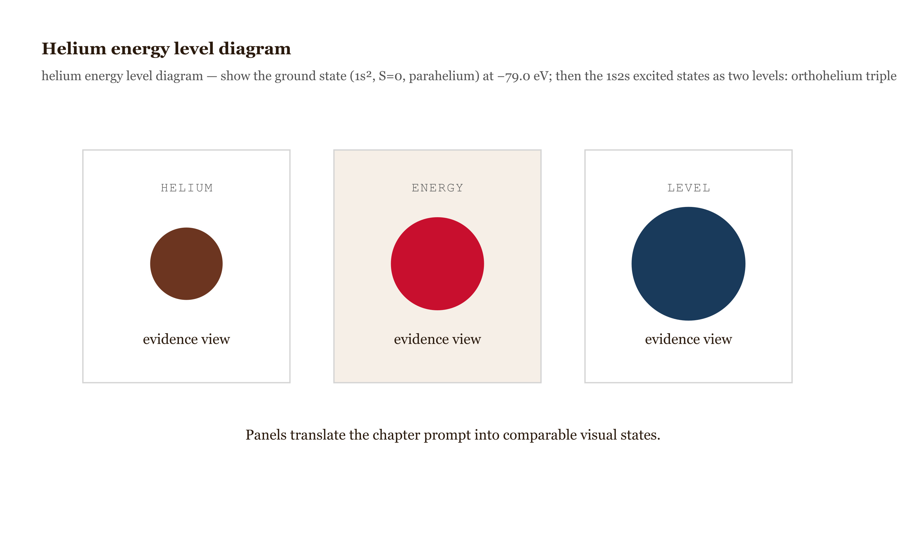
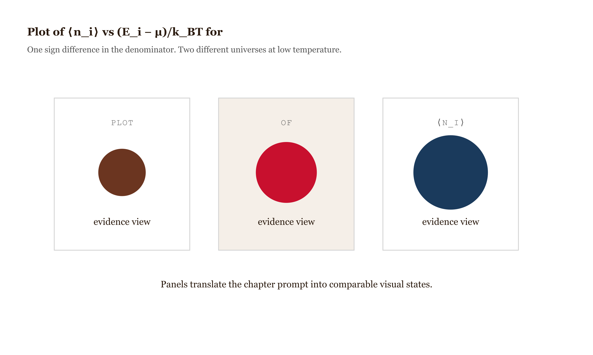

# Chapter 8 — Identical Particles

## TL;DR

- Delivers the rule that identical particles are physically indistinguishable and its consequences for energy and structure.
- Covers: the exchange operator and its $\pm 1$ eigenvalues, the Slater determinant, the exchange correlation, the helium singlet-triplet splitting, the periodic table from antisymmetry plus screening, and Fermi-Dirac versus Bose-Einstein statistics.
- Supplies the operators, the integrals, and the judgment for applying exchange symmetry to atoms and bulk matter.

*Two electrons in helium are not "electron 1 and electron 2." Forgetting that throws away the helium spectrum, the periodic table, and the white dwarf.*

---

Two electrons in a helium atom. Measure the position of one and find it at $\mathbf{r}_1$; measure the position of the other and find it at $\mathbf{r}_2$. Which electron was measured first? The question has no answer.

The two electrons are irreducibly indistinguishable. No physical procedure — color, tag, traceable trajectory — separates "electron 1" from "electron 2." The two-electron Schrödinger equation has identical structure under the swap of labels, and the wave function reflects this. A multi-particle wave function that treats the two electrons as distinct misrepresents the physics.

This has observable consequences. Whether the two-electron wave function is symmetric or antisymmetric under exchange determines which spin states helium's excited configurations admit, which determines how often the two electrons are close together, which sets the Coulomb energy at the level of hundreds of millielectronvolts. The singlet-triplet splitting in helium — two families of states with measurably different energies, historically parahelium and orthohelium — is an experimental fact that a labeled-particle theory cannot express.

Beyond helium: without the antisymmetry constraint, every electron in every atom would occupy the $1s$ orbital. There would be no shell structure, no periodic table, no chemistry. Electron indistinguishability is foundational.

---

## The exchange operator

Define the *exchange operator* $\hat{P}_{12}$ on a two-particle wave function by

$$\hat{P}_{12}\,\psi(\mathbf{r}_1, \mathbf{r}_2) = \psi(\mathbf{r}_2, \mathbf{r}_1).$$

Two consequences. First, $\hat{P}_{12}^2 = \hat{1}$ — swapping twice returns the original — so $\hat{P}_{12}$ has eigenvalues $\pm 1$ only. Second, for identical particles every observable is unchanged under exchange, so the Hamiltonian commutes with the exchange operator:

$$[\hat{H}, \hat{P}_{12}] = 0.$$

Operators that commute with $\hat{H}$ can be simultaneously diagonalized with it. Energy eigenstates can therefore be chosen as eigenstates of $\hat{P}_{12}$ — *symmetric* ($+1$) or *antisymmetric* ($-1$) under exchange.

Nature fixes one of the two options for each particle species permanently — a choice quantum mechanics itself does not derive. Electrons, protons, neutrons, and all half-integer-spin particles are *fermions*: their multi-particle wave functions are antisymmetric under exchange. Photons, Higgs bosons, and all integer-spin particles are *bosons*: symmetric. The spin-statistics connection is not a postulate of non-relativistic quantum mechanics but a theorem — Pauli's spin-statistics theorem, proved in 1940 [Pauli, *Physical Review* 58, 716–722](https://doi.org/10.1103/PhysRev.58.716) — requiring relativistic quantum field theory. Within non-relativistic QM the assignment is postulated; the deeper theorem exists and requires tools not yet built here.

| particle family | spin | exchange symmetry | examples | statistical behavior | key consequence |
| --- | --- | --- | --- | --- | --- |
| Fermions | half-integer | antisymmetric | electron, proton, neutron | Fermi-Dirac | Pauli exclusion and shell structure |
| Bosons | integer | symmetric | photon, Higgs, $^4$He atom | Bose-Einstein | condensation and coherent fields |

The postulate is not limited to nearby electrons. Two electrons at opposite ends of the galaxy are still identical, and in principle the wave function across all electrons in the universe is antisymmetric under exchange of any pair. In practice, exchange effects between distant atoms are negligible because the overlap integral between their localized orbitals is exponentially small with distance. Antisymmetry holds globally; it matters only locally.

In two spatial dimensions the argument breaks down. When two particles exchange positions in 2D, the exchange path can wind around the relative-position singularity in topologically distinct ways, and the exchange phase is not restricted to $\pm 1$ — it can be any complex number $e^{i\theta}$. Such particles are *anyons*, observed in the fractional quantum Hall effect [Bartolomei et al. 2020, *Science* 368, 173–177](https://doi.org/10.1126/science.aaz5601). The $\pm 1$ dichotomy is a property of three spatial dimensions, not of quantum mechanics in general.

---

## The Slater determinant

For $N$ identical fermions, the antisymmetric multi-particle wave function has a closed form. Label the single-particle *spin-orbitals* (spatial wave function times spin state) $\phi_1, \phi_2, \ldots, \phi_N$ and the particles $1, 2, \ldots, N$. The antisymmetric state is

$$\psi(1, 2, \ldots, N) = \frac{1}{\sqrt{N!}} \begin{vmatrix} \phi_1(1) & \phi_1(2) & \cdots & \phi_1(N) \\ \phi_2(1) & \phi_2(2) & \cdots & \phi_2(N) \\ \vdots & \vdots & \ddots & \vdots \\ \phi_N(1) & \phi_N(2) & \cdots & \phi_N(N) \end{vmatrix}.$$

Slater introduced this in 1929 [*Physical Review* 34, 1293–1322](https://doi.org/10.1103/PhysRev.34.1293). The determinant does two things automatically.

*Figure 8.1 — N=3 Slater determinant *

First, antisymmetry is built in. Swapping two particle labels swaps two columns and changes the sign of the determinant. No additional construction is required; the algebra enforces the postulate.

Second — the property that matters most for atomic physics — if two spin-orbitals are identical, two rows coincide and the determinant is zero. The wave function vanishes. Two identical fermions cannot occupy the same single-particle state, not because of a quantum-number rule but because the antisymmetric wave function built from two identical orbitals is zero. This is Pauli exclusion as a property of determinants.

For $N=2$:

$$\psi(1,2) = \frac{1}{\sqrt{2}}\left[\phi_a(1)\phi_b(2) - \phi_a(2)\phi_b(1)\right].$$

For $N=3$ with spin-orbitals $\phi_a, \phi_b, \phi_c$, the determinant expands into $3! = 6$ terms with alternating signs — every permutation of the three particles among the three orbitals, weighted by the permutation sign. The general $N$-particle case has $N!$ terms.

The Slater determinant is the foundation of Hartree–Fock theory, the workhorse of computational quantum chemistry. The approximation: assume the $N$-electron ground state is a single Slater determinant, then minimize $\langle\psi|\hat{H}|\psi\rangle$ over the single-particle orbitals. Everything beyond Hartree–Fock — configuration interaction, coupled cluster, density-functional theory — corrects the single-determinant ansatz. This is the direct consequence of the antisymmetry postulate applied to atoms.

---

## The exchange correlation: why symmetry affects energy

A preliminary example before helium. Two non-interacting identical particles in a 1D infinite well. Particle A occupies orbital $\psi_1(x)$; particle B occupies $\psi_2(x)$. For distinguishable particles, the joint wave function is $\psi_1(x_1)\psi_2(x_2)$ and the joint density is $|\psi_1(x_1)|^2|\psi_2(x_2)|^2$.

For identical fermions with symmetric spin (both spin-up), the spatial wave function is antisymmetric:

$$\psi_A(x_1, x_2) = \frac{1}{\sqrt{2}}\left[\psi_1(x_1)\psi_2(x_2) - \psi_1(x_2)\psi_2(x_1)\right].$$

For identical bosons, the symmetric spatial wave function is

$$\psi_S(x_1, x_2) = \frac{1}{\sqrt{2}}\left[\psi_1(x_1)\psi_2(x_2) + \psi_1(x_2)\psi_2(x_1)\right].$$

Evaluate $\langle(x_1-x_2)^2\rangle$ for each case. Expanding the squared wave functions and integrating, the cross terms produce an *exchange integral* that adds to the fermion average separation and subtracts from the boson one. The result (Griffiths §5.1.2):

$$\langle(x_1-x_2)^2\rangle_\text{fermion} > \langle(x_1-x_2)^2\rangle_\text{distinguishable} > \langle(x_1-x_2)^2\rangle_\text{boson}.$$

No interaction term has been added; the particles are non-interacting. The difference in average separation comes entirely from the symmetry of the spatial wave function. Fermions are statistically further apart than distinguishable particles; bosons are closer. This is the *exchange correlation* — not an "exchange force." There is no additional Hamiltonian term, only the Coulomb force and the antisymmetry constraint. Antisymmetry sets how often the two electrons are close enough for the Coulomb repulsion to matter. That is the mechanism behind the helium spectrum.

*Figure 8.2 — Three plots of |ψ(x₁, x₂)|² as a 2D*

---

## Helium: where the singlet-triplet splitting comes from

For two spin-1/2 particles, the spin states split into a *singlet* (antisymmetric, total spin $S=0$) and a *triplet* (symmetric, total spin $S=1$):

$$|\text{singlet}\rangle = \frac{1}{\sqrt{2}}(|\!\uparrow\downarrow\rangle - |\!\downarrow\uparrow\rangle), \qquad |\text{triplet}\rangle \in \left\{|\!\uparrow\uparrow\rangle,\; \tfrac{1}{\sqrt{2}}(|\!\uparrow\downarrow\rangle + |\!\downarrow\uparrow\rangle),\; |\!\downarrow\downarrow\rangle\right\}.$$

The total wave function — spatial times spin — must be antisymmetric for electrons:

- Spin singlet (antisymmetric) pairs with spatial symmetric: *parahelium*.
- Spin triplet (symmetric) pairs with spatial antisymmetric: *orthohelium*.

The helium ground state has both electrons in $1s$. The only spatial wave function from two copies of $\psi_{1s}$ is the symmetric product $\psi_{1s}(\mathbf{r}_1)\psi_{1s}(\mathbf{r}_2)$, which is automatically symmetric, forcing the spin to be singlet. The ground state is necessarily $S=0$ parahelium.

The first excited state has one electron in $1s$ and one in $2s$. Now the spatial wave function can be symmetric or antisymmetric:

$$\psi_\pm(\mathbf{r}_1, \mathbf{r}_2) = \frac{1}{\sqrt{2}}\left[\psi_{1s}(\mathbf{r}_1)\psi_{2s}(\mathbf{r}_2) \pm \psi_{1s}(\mathbf{r}_2)\psi_{2s}(\mathbf{r}_1)\right].$$

The $+$ combination pairs with spin singlet (parahelium); the $-$ combination pairs with spin triplet (orthohelium). Both have the same zeroth-order energy. The Coulomb repulsion $e^2/(4\pi\varepsilon_0 r_{12})$ splits them.

**Given.** The two spatial states $\psi_\pm$ above, with Coulomb repulsion $e^2/(4\pi\varepsilon_0 r_{12})$ as the perturbation, and zeroth-order energy $E_0$.

**Find.** The energy splitting between parahelium and orthohelium.

**Solution.** Compute $\langle V_{ee}\rangle$ on each spatial state. The diagonal terms give the *direct (Coulomb) integral*

$$J = \int\!\!\int |\psi_{1s}(\mathbf{r}_1)|^2\,|\psi_{2s}(\mathbf{r}_2)|^2\,\frac{e^2}{4\pi\varepsilon_0 r_{12}}\,d^3r_1\,d^3r_2,$$

the classical Coulomb repulsion between the two charge distributions. The cross term gives the *exchange integral*

$$K = \int\!\!\int \psi_{1s}^{*}(\mathbf{r}_1)\psi_{2s}^{*}(\mathbf{r}_2)\,\frac{e^2}{4\pi\varepsilon_0 r_{12}}\,\psi_{1s}(\mathbf{r}_2)\psi_{2s}(\mathbf{r}_1)\,d^3r_1\,d^3r_2,$$

which has no classical analog. It exists only because the cross term in $|\psi_\pm|^2$ is present, due to the $\pm$ structure. For real $1s$ and $2s$ orbitals, $K > 0$. The energy corrections are

$$\langle V_{ee}\rangle_\pm = J \pm K.$$

Parahelium (symmetric spatial, $S=0$) has energy $E_0 + J + K$; orthohelium (antisymmetric spatial, $S=1$) has energy $E_0 + J - K$. Orthohelium lies lower by $2K$.

**Check.** Empirically, the orthohelium $1s2s$ state sits at $-59.2$ eV, parahelium at $-58.4$ eV — a splitting of about 0.8 eV [NIST Atomic Spectra Database](https://www.nist.gov/pml/atomic-spectra-database). Orthohelium is lower, as the calculation predicts.

*Figure 8.3 — Helium energy level diagram *

The spins did not interact directly — there is no $\hat{S}_1 \cdot \hat{S}_2$ term at this order. The spin state forced the symmetry of the spatial wave function, which set how often the electrons are close, which changed the Coulomb energy. The triplet has antisymmetric spatial, so the electrons stay further apart, the repulsion is reduced, and the energy is lower. The spin label marks the spatial symmetry sector. The Coulomb force does the work; antisymmetry channels it.

This generalizes to *Hund's first rule*: for a given configuration, the term with maximum total spin lies lowest. More parallel spins force more antisymmetric spatial pieces, keep electrons further apart, and reduce the Coulomb repulsion. The rule is exchange physics applied configuration by configuration. [Hund 1925, *Zeitschrift für Physik* 33, 345–371](https://doi.org/10.1007/BF01328319).

---

## The periodic table as antisymmetry plus screening

With Pauli exclusion established, the periodic table follows from three ingredients: the approximate hydrogenic energy ordering modified by electron screening, the one-electron-per-spin-orbital limit, and Hund's rule for partially filled subshells.

The *Aufbau* principle is the filling recipe. The *Madelung rule* gives the empirical order: fill orbitals in order of increasing $n + \ell$, and for equal $n + \ell$ in order of increasing $n$:

$$1s,\ 2s,\ 2p,\ 3s,\ 3p,\ 4s,\ 3d,\ 4p,\ 5s,\ 4d,\ 5p, \ldots$$

The physical content is screening. An outer electron in a high-$\ell$ orbital is screened more effectively from the nucleus by inner shells than a low-$\ell$ electron at the same $n$, because low-$\ell$ orbitals penetrate the inner shells more deeply and see a larger effective nuclear charge. This is why $4s$ sits below $3d$ for light atoms — the $4s$ electron, despite its larger $n$, penetrates the core more effectively and is less screened.

*Figure 8.4 — The Madelung diagonal-filling diagram *

Madelung's rule is not exact. Chromium's observed ground configuration is $[\text{Ar}]\,3d^5 4s^1$, not the predicted $3d^4 4s^2$. The half-filled $3d^5$ subshell is stabilized by exchange — five parallel spins, one per $d$-orbital, maximizing spin multiplicity and minimizing the intra-subshell Coulomb energy via Hund's rule — and the small $4s$–$3d$ gap lets the exchange stabilization win. Copper is $3d^{10} 4s^1$ for the analogous reason. There are roughly twenty such exceptions, concentrated in the $d$- and $f$-blocks where orbital energies are near-degenerate. The exceptions are not failures of quantum mechanics; they are places where the Madelung heuristic's approximations break down and the energy competition has to be computed.

Carbon as the worked case.

**Given.** $Z=6$, configuration $1s^2\,2s^2\,2p^2$. Apply Hund's rules to the open $2p$ subshell.

**Find.** The ground-state term symbol.

**Solution.** The filled $1s$ and $2s$ subshells are fixed by Pauli with paired opposite spins; no choice. The $2p$ subshell has two electrons in three orbitals ($m_\ell = -1, 0, +1$). By Hund's first rule the two electrons occupy distinct $m_\ell$ orbitals with parallel spins, total $S = 1$, spatial wave function antisymmetric in those two orbitals. The orbital angular momentum is $M_L = m_{\ell,1} + m_{\ell,2}$, and by Hund's second rule (maximum $L$ consistent with maximum $S$ and Pauli) the total is $L=1$. By Hund's third rule (less-than-half-filled subshell takes minimum $J$), $J = |L - S| = 0$. The ground term is ${}^3P_0$.

**Check.** The NIST Atomic Spectra Database lists carbon's ground term as ${}^3P_0$ [NIST: C I](https://physics.nist.gov/PhysRefData/ASD/levels_form.html), with ${}^3P_1$ at $16.4\,\text{cm}^{-1}$ and ${}^3P_2$ at $43.4\,\text{cm}^{-1}$ above — fine-structure splittings of a few meV, consistent with spin-orbit coupling as a small perturbation on the much larger exchange splitting that set $S=1$.

The same procedure predicts the ground term of the entire first row. H: ${}^2S_{1/2}$. He: ${}^1S_0$. Li: ${}^2S_{1/2}$. Be: ${}^1S_0$. B: ${}^2P_{1/2}$. C: ${}^3P_0$. N: ${}^4S_{3/2}$. O: ${}^3P_2$. F: ${}^2P_{3/2}$. Ne: ${}^1S_0$. Every prediction checks against NIST.

---

## What the statistics look like at large scale

The antisymmetric structure of fermion wave functions has consequences beyond atomic physics. When many fermions fill a band of single-particle states, they stack from the bottom — one per state — and at low temperature the distribution approaches a sharp step at the Fermi energy. The *Fermi–Dirac distribution* is

$$\langle n_i\rangle_\text{FD} = \frac{1}{e^{(E_i - \mu)/k_BT} + 1}.$$

For bosons, the symmetric wave function allows unlimited occupation of any state, and at low temperature bosons cascade into the ground state. The *Bose–Einstein distribution* is

$$\langle n_i\rangle_\text{BE} = \frac{1}{e^{(E_i - \mu)/k_BT} - 1}.$$

The sign in the denominator is the whole story. At high temperature and low density both distributions reduce to the classical Maxwell–Boltzmann form. At low temperature they diverge: bosons condense, fermions do not.

*Figure 8.5 — Plot of ⟨n_i⟩ vs (E_i − μ)/k_BT for*

Bose–Einstein condensation in dilute gases was first observed in rubidium-87 at 170 nK by Cornell and Wieman's group at Boulder [Anderson et al. 1995, *Science* 269, 198–201](https://doi.org/10.1126/science.269.5221.198), and days later in sodium at MIT by Ketterle's group [Davis et al. 1995, *Physical Review Letters* 75, 3969](https://doi.org/10.1103/PhysRevLett.75.3969). Nobel Prize 2001.

On the fermion side, Chandrasekhar showed in 1931 [*Astrophysical Journal* 74, 81–82](https://doi.org/10.1086/143324) that the *degeneracy pressure* from a Fermi sea of electrons supports white dwarfs against gravity up to a limiting mass of $\approx 1.4\,M_\odot$ — the Chandrasekhar limit. Above that mass, electron degeneracy pressure fails and the star collapses to a neutron star or black hole. The same antisymmetry governing the helium spectrum governs the fate of stellar remnants.

---

## What would change my mind

The VIP and VIP-2 collaborations at Gran Sasso have searched for Pauli-violating atomic transitions in copper — transitions forbidden if the antisymmetry postulate held exactly. They have bounded the probability of such violations at the part-per-$10^{29}$ level [Curceanu et al. 2017, *Acta Physica Polonica B* 48, 1741; verify most recent VIP-2 bound, likely 2023–2024 *Physics Letters B* or *Physical Review Letters*][verify]. A positive signal at any level would force a revision of this chapter's central postulate. None has appeared. Separately, an integer-spin fundamental particle behaving as a fermion would force a revision of the spin-statistics theorem and of relativistic QFT. No such particle has been observed.
<!-- FACT-CHECK FLAG: UNVERIFIED — see factchecks/08-identical-particles-assertions.md -->

---

## Still puzzling

**Why is the spin-statistics connection exact?** Pauli's 1940 proof runs through relativistic causality — operators at spacelike separation must commute or anticommute, depending on spin, so that measurements outside each other's light cone do not interfere. Causality and Lorentz invariance are both ingredients. Inside QFT these are non-negotiable, so the theorem is non-negotiable inside QFT. Whether QFT is the whole story is the harder question.

**What is happening in two dimensions?** Anyons exist because the topology of 2D particle exchange admits more than two equivalence classes of paths. The $\pm 1$ postulate is a statement about 3D topology, not about quantum mechanics. The cleanest exposition is Wilczek's 1990 *Fractional Statistics and Anyon Superconductivity*. Whether anyon-based topological quantum computation becomes practical is a hardware question open at this writing.

**Why does Madelung's rule have exceptions?** The exchange stabilization of half-filled and full-filled shells competes with orbital energy ordering, and there is no closed-form rule for when one wins. Computational quantum chemistry handles this by computing, not by applying a rule. The Madelung heuristic is a good first-order organizer; it is not derivable from first principles without the calculation.

**Is the universe one large antisymmetric electron wave function?** In principle, yes. In practice, the overlap between localized orbitals at macroscopic separations is exponentially small and the exchange effects are negligible. Global antisymmetry holds but produces no measurable consequence outside the atomic scale. Whether it is worth thinking about cosmologically is a thought experiment rather than a physics question.

---

## References

*Added by fact-check pass 2026-05-14.*

1. Pauli, W. "The Connection Between Spin and Statistics." *Physical Review* 58, 716–722 (1940). https://doi.org/10.1103/PhysRev.58.716
2. Slater, J. C. "The Theory of Complex Spectra." *Physical Review* 34, 1293–1322 (1929). https://doi.org/10.1103/PhysRev.34.1293
3. Bartolomei, H. et al. "Fractional statistics in anyon collisions." *Science* 368, 173–177 (2020). https://doi.org/10.1126/science.aaz5601
4. Hund, F. "Zur Deutung verwickelter Spektren..." *Zeitschrift für Physik* 33, 345–371 (1925). https://doi.org/10.1007/BF01328319
5. Anderson, M. H. et al. "Observation of Bose-Einstein Condensation in a Dilute Atomic Vapor." *Science* 269, 198–201 (1995). https://doi.org/10.1126/science.269.5221.198
6. Davis, K. B. et al. "Bose-Einstein Condensation in a Gas of Sodium Atoms." *Physical Review Letters* 75, 3969–3973 (1995). https://doi.org/10.1103/PhysRevLett.75.3969
7. Chandrasekhar, S. "The Maximum Mass of Ideal White Dwarfs." *Astrophysical Journal* 74, 81–82 (1931). https://doi.org/10.1086/143324
8. NIST Atomic Spectra Database. https://physics.nist.gov/PhysRefData/ASD/levels_form.html
