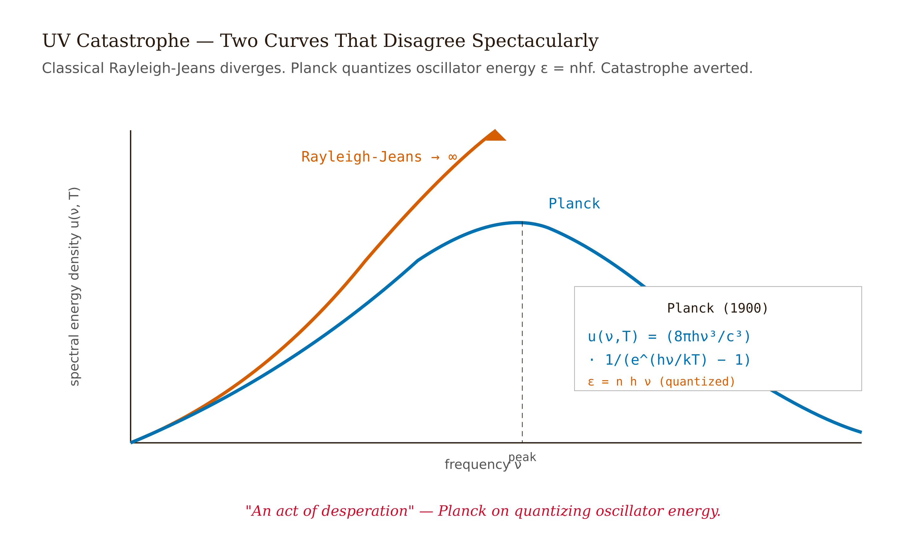
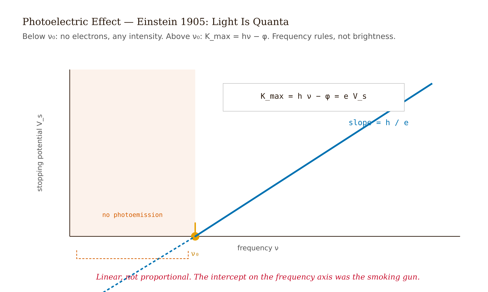
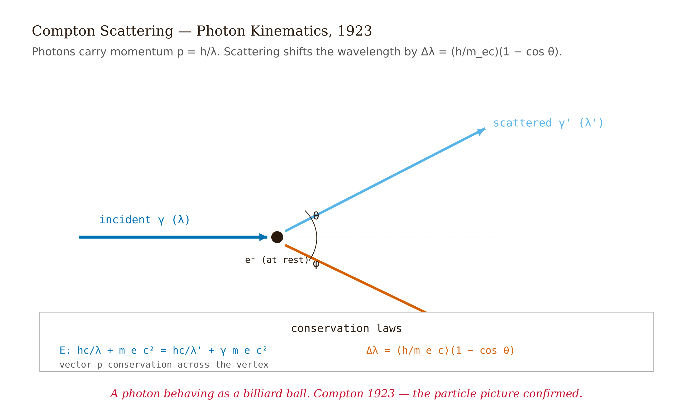
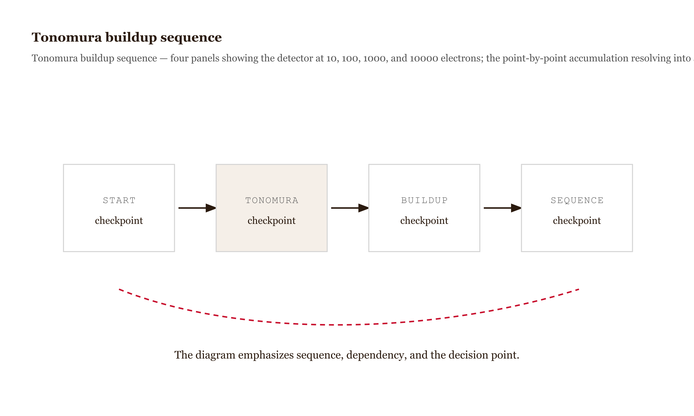
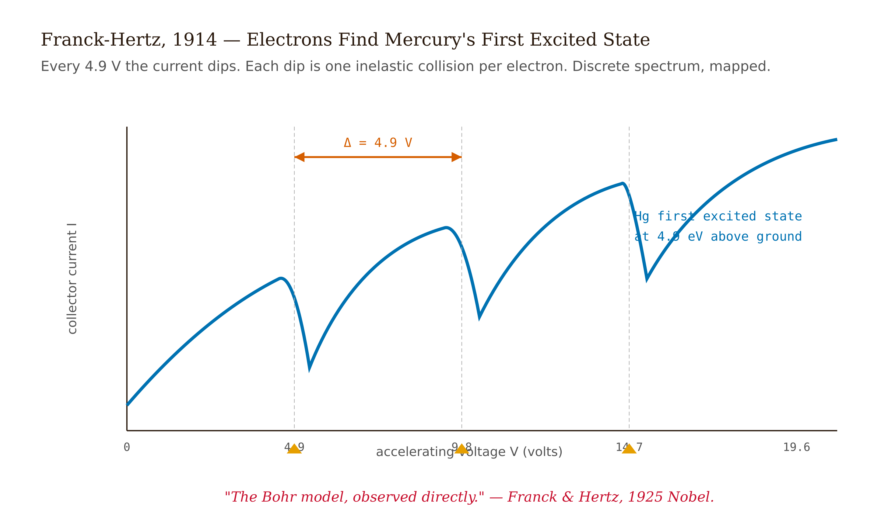

# Chapter 1 — Why Quantum Mechanics?

## TL;DR

- Before reading on, ask yourself: what would it take to overturn a theory everyone agrees is finished? The answer is what built quantum mechanics — a universe that broke every prediction classical physics made.
- The chapter moves through The first confrontation: infinite energy in a box, The second confrontation: a threshold that shouldn't exist, The third confrontation: the wrong color comes back, The fourth confrontation: the electron as a wave, and related ideas.
- Read it for the main argument, the vocabulary it introduces, and the practical judgment it asks you to develop.

*The Theory a Universe Built by Breaking Every Prediction Classical Physics Made.*

---

Here is a question to sit with before any equation appears. Suppose the four greatest theories ever assembled — mechanics, electrodynamics, statistical mechanics, thermodynamics — all agree, and all the world's best physicists tell you the subject is essentially complete, with only decimal places left to fill in. What, realistically, could go wrong? By 1900 that was the consensus: Newton had mechanics, Maxwell had electrodynamics, Boltzmann had statistical mechanics, Clausius had thermodynamics. The laws were known.
<!-- FACT-CHECK FLAG: UNVERIFIED — see factchecks/01-why-quantum-mechanics-assertions.md -->

Most people, asked what could be lurking in the decimal places, predict a small correction — a refinement, a tidier constant. That's the natural guess, and it's exactly wrong. The decimal places turned out to be a different universe.

Why should you trust that claim rather than the consensus of 1900? Because the trouble was not philosophical — it was quantitative, and quantitative trouble cannot be argued away. Classical physics — those four pillars together — made specific, testable predictions about how matter and light should behave. Now ask: where would such a theory be most likely to break? Push it into regimes nobody had reached before — very short wavelengths, very weak beams, very precise spectroscopy. The predictions there didn't fail a little. They gave infinities where experiments gave finite peaks. They gave continuous threshold behavior where experiments gave sharp cutoffs. They had no language at all for results that were reproducible, sharp, and wholly unlike anything the theory anticipated.

Five experiments, spread across roughly a quarter century, did the damage. As you read each one, try to predict what classical physics says before you see what nature said — the gap between the two is the whole lesson. I want to walk through each one and show you the math it forced, not as history, but as a series of confrontations between a beautiful theory and an unwilling universe.

---

## The first confrontation: infinite energy in a box

Start with something simple, and predict the answer before you read on: a metal box, hollow, walls held at a fixed temperature. The walls glow, emit electromagnetic radiation, and that radiation reaches thermal equilibrium with the walls. How is the energy distributed among the different frequencies? Where, would you guess, does most of the energy end up?

Classical statistical mechanics gives a clean answer, and it is worth following its logic exactly, because the logic is sound and the conclusion is a disaster. Each electromagnetic mode in the cavity — and there are infinitely many, because you can have modes of arbitrarily high frequency — gets, on average, energy $k_B T$ by the equipartition theorem. Count the modes in a frequency interval $[\nu, \nu + d\nu]$. There are $8\pi\nu^2/c^3$ of them per unit volume. Multiply by $k_B T$:

$$\rho_{\text{RJ}}(\nu, T) = \frac{8\pi \nu^2}{c^3} k_B T.$$

*Figure 1.1 — Plot of Rayleigh–Jeans vs*

Now look at what that formula does as frequency climbs. It rises without bound. The total energy, $\int_0^\infty \rho_{\text{RJ}} \, d\nu$, diverges. So the honest classical prediction is that a box at room temperature should contain infinite energy in its short-wavelength modes. Does that bother you? It should — and it bothered physicists enough to earn a name: what Paul Ehrenfest later called the "ultraviolet catastrophe."

So which is wrong, the theory or the box? Experimentalists at the Physikalisch-Technische Reichsanstalt in Berlin — Otto Lummer and Ernst Pringsheim — settled it by measuring blackbody spectra with extraordinary precision through the late 1890s. Their measurements showed a finite peak at a characteristic frequency, followed by an exponential fall-off at high frequencies. There was no catastrophe in nature. There was just a shape, and the shape needed explaining.

Max Planck presented his fit on 14 December 1900. The Planck distribution is:

$$\rho(\nu, T) = \frac{8\pi h \nu^3}{c^3} \cdot \frac{1}{e^{h\nu/k_B T} - 1}.$$

The constant $h$ he fitted to the data: $6.55 \times 10^{-27}$ erg·s, within 1% of today's value $h = 6.626 \times 10^{-34}$ J·s.

What single assumption could turn the diverging classical formula into this finite one? Here is the one Planck made. Suppose the oscillators in the cavity walls — the atoms that are absorbing and re-emitting radiation — cannot exchange energy continuously with the field. Suppose instead they can only exchange energy in discrete chunks of size $h\nu$: multiples of a quantum of energy. Then the average thermal energy of an oscillator at frequency $\nu$ is not $k_B T$ (equipartition) but:

$$\langle E \rangle = \frac{\sum_{n=0}^{\infty} n h\nu \, e^{-n h\nu/k_B T}}{\sum_{n=0}^{\infty} e^{-n h\nu/k_B T}}.$$

Let $x = e^{-h\nu/k_B T}$. The numerator is $h\nu \sum n x^n = h\nu \cdot x/(1-x)^2$; the denominator is $\sum x^n = 1/(1-x)$. Dividing:

$$\langle E \rangle = \frac{h\nu}{e^{h\nu/k_B T} - 1}.$$

Now check the limits, because a formula you trust is one whose limits you've checked yourself. At low frequencies, $h\nu \ll k_B T$, and $e^{h\nu/k_B T} - 1 \approx h\nu/k_B T$, so $\langle E \rangle \to k_B T$ — equipartition is recovered. At high frequencies, $h\nu \gg k_B T$, and $\langle E \rangle \to h\nu \, e^{-h\nu/k_B T}$ — exponentially suppressed. The catastrophe is gone. Multiply by the mode-counting density $8\pi\nu^2/c^3$ (classical, unchanged) and you get Planck's distribution.

One thing to get right before moving on, and it is the thing most readers get wrong: did Planck quantize light? Most say yes — and that's almost right, in that quantization entered physics here, but the location of the quantization is not where you'd guess. Planck quantized the energy *exchange* between the cavity walls and the radiation field. The radiation itself, in his 1900 picture, was still a continuous electromagnetic wave. The discrete packets lived in the walls, not in the field. Einstein's paper five years later is what put the packets in the field.

---

## The second confrontation: a threshold that shouldn't exist

Shine light on a clean metal surface and electrons come off. That much was known. Now make a prediction before reading further: to get *more energetic* electrons, do you turn up the brightness or change the color of the light? Almost everyone says brightness — more power, more energy, more violent ejection. Hold that prediction.

What Philipp Lenard reported in 1902 contradicts it. The kinetic energy of the ejected electrons depended on the *frequency* of the light, not on its *intensity*. A very bright red beam — enormous power delivered per unit area — produced no electrons at all from certain metals. A dim ultraviolet beam produced electrons immediately.

Now you can see exactly where the classical picture breaks. Classical wave theory says intensity should matter: a brighter wave delivers more energy per unit time, so an electron tied to the metal surface should be able to accumulate enough energy to escape, given a long enough wait. The wait never comes. The threshold is sharp. The classical picture fails on three counts simultaneously: wrong variable (frequency, not intensity), wrong threshold behavior (sharp cutoff, not gradual), wrong scaling (kinetic energy linear in frequency above threshold, not in intensity).

What kind of object would deliver energy in a way that depends on color, not brightness, and that either works or doesn't with no waiting? Einstein's 1905 paper proposed the answer: light itself arrives in indivisible energy packets — photons — each carrying energy $E = h\nu$. An electron bound to the metal with binding energy $\phi$ (the work function, a property of the metal) absorbs one photon. If $h\nu > \phi$, the electron escapes with kinetic energy:

$$K_{\max} = h\nu - \phi.$$

Below the threshold frequency $\nu_0 = \phi/h$, no electrons emerge regardless of intensity. Above it, intensity controls how many electrons emerge per second; frequency controls how much energy each one has. Notice how this resolves all three failures at once: brightness sets the *number* of packets, color sets the *energy* of each.

*Figure 1.2 — Stopping potential V_s vs*

Could you disprove this if you tried? Robert Millikan spent four years (1912–1916) trying. He measured the stopping potential $V_s$ — the retarding voltage that just halts the most energetic electrons, so $eV_s = K_{\max}$ — as a function of frequency. The slope, by Einstein's equation, is $h/e$. Millikan measured $h = 6.57 \times 10^{-27}$ erg·s. That's within 0.5% of Planck's blackbody value from a completely different experiment. He published his result with the concession that the photoelectric equation worked despite his conviction that the underlying hypothesis was "untenable."

**A worked example.** Sodium has work function $\phi \approx 2.36$ eV (NIST clean-surface value; see references). The threshold wavelength is:

$$\lambda_0 = \frac{hc}{\phi} = \frac{1240 \, \text{eV·nm}}{2.36 \, \text{eV}} \approx 525 \, \text{nm}.$$

That's green light. Illuminate with $\lambda = 400$ nm (violet). Photon energy $h\nu = 1240/400 = 3.10$ eV. The most energetic photoelectron leaves with:

$$K_{\max} = 3.10 \, \text{eV} - 2.36 \, \text{eV} = 0.74 \, \text{eV}.$$

A retarding voltage of 0.74 V stops it exactly.

The lesson: one photon, one electron. Energy arrives in indivisible packets, the threshold is sharp because a packet either has enough or it doesn't, and intensity controls rate, not energy per electron.

---

## The third confrontation: the wrong color comes back

Here is a prediction worth committing to before the data: bounce X-rays off a block of graphite, and the scattered X-rays come back at — what color? The classical answer is precise. In 1923, Arthur Holly Compton at Washington University ran exactly this experiment and measured the wavelength of the scattered radiation as a function of angle. The classical prediction — Thomson scattering — says the electron oscillates at the driving frequency and re-radiates at the *same* frequency. No wavelength shift. Just a redistribution in angle. So the prediction is: same color out as in.

Compton found a shift. The scattered X-rays came out longer in wavelength than the incident X-rays, by an amount that depended only on the angle $\theta$:

$$\Delta\lambda = \lambda' - \lambda = \frac{h}{m_e c}(1 - \cos\theta).$$

The combination $h/m_e c = 2.426 \times 10^{-12}$ m is called the Compton wavelength of the electron. The shifts are small — picometers — but unmistakable and perfectly reproducible.

Where does that shift come from? If you stop treating the X-ray as a wave that shakes the electron, and start treating it as a particle that collides with the electron, the answer falls out of conservation laws alone — the cleanest piece of math in this chapter. Treat the photon as a relativistic particle with energy $E_\gamma = h\nu$ and momentum $p_\gamma = h/\lambda$. The electron is initially at rest. Write conservation of energy and conservation of momentum (two components), then eliminate the electron's recoil angle.

*Figure 1.3 — Compton scattering geometry *

*Conservation of energy:*
$$h\nu + m_e c^2 = h\nu' + E_e.$$

*Conservation of momentum:*
$$\frac{h\nu}{c} = \frac{h\nu'}{c}\cos\theta + p_e \cos\phi, \qquad 0 = \frac{h\nu'}{c}\sin\theta - p_e \sin\phi.$$

Solve for $p_e \cos\phi$ and $p_e \sin\phi$, square and add to eliminate $\phi$:

$$p_e^2 c^2 = (h\nu)^2 - 2(h\nu)(h\nu')\cos\theta + (h\nu')^2.$$

From energy conservation, $E_e = h(\nu - \nu') + m_e c^2$, and the relativistic relation $E_e^2 = p_e^2 c^2 + (m_e c^2)^2$ gives:

$$p_e^2 c^2 = h^2(\nu - \nu')^2 + 2m_e c^2 h(\nu - \nu').$$

Set equal and expand $(h\nu - h\nu')^2$ on the left, cancel common terms, divide by $2(h\nu)(h\nu')$:

$$\frac{m_e c^2(\nu - \nu')}{\nu\nu'} = 1 - \cos\theta.$$

Since $(\nu - \nu')/(\nu\nu') = (\lambda' - \lambda)/c$:

$$\Delta\lambda = \frac{h}{m_e c}(1 - \cos\theta).$$

Half a page of algebra. No quantum mechanics beyond treating the photon as a relativistic particle with $E = h\nu$ and $p = h/\lambda$.

**In Compton's original experiment** he used molybdenum Kα X-rays at $\lambda = 0.0711$ nm. At $\theta = 90°$, $\cos\theta = 0$, so $\Delta\lambda = h/m_e c = 2.43$ pm. He measured 2.23 pm. The agreement was the moment the photon picture became unavoidable.
<!-- FACT-CHECK FLAG: UNVERIFIED — see factchecks/01-why-quantum-mechanics-assertions.md -->

The lesson: the photon carries momentum $h/\lambda$. Planck had quantized energy exchange. Einstein had quantized the field. Compton quantized the momentum, completing the photon as a relativistic particle.

---

## The fourth confrontation: the electron as a wave

By now a symmetry should be nagging at you. If light — conventionally a wave — turns out to behave like a particle, what is the obvious question to ask next? Turn the statement around: does matter, conventionally made of particles, behave like a wave? If you found that question inevitable, you are thinking exactly as de Broglie did.

Louis de Broglie's 1924 doctoral thesis at the University of Paris said yes. He proposed that a particle with momentum $p$ has an associated wavelength:

$$\lambda = \frac{h}{p}.$$

The same relation as for the photon, now applied to matter.

If matter is wavy, why has no one ever seen a baseball diffract? Before dismissing the idea, check the numbers — the answer is hiding in the size of $h$. A 1 kg cricket ball at 1 m/s has $\lambda = 6.6 \times 10^{-34}$ m — twenty orders of magnitude smaller than a proton. No experiment in the universe could detect this. An electron accelerated through 54 V, on the other hand, has a kinetic energy of 54 eV and a de Broglie wavelength of roughly 0.17 nm, comparable to the spacing between planes in a crystal lattice. So the wave is real but only shows itself when the wavelength is comparable to something around it — and for an electron, a crystal lattice is exactly that something. An electron beam aimed at a crystal should diffract, just as X-rays do.

Clinton Davisson and Lester Germer at Bell Labs found this in 1927. They scattered 54 eV electrons off a nickel crystal and saw a sharp diffraction peak at the angle Bragg's condition predicts.

**The calculation.** An electron through $V = 54$ V has kinetic energy $K = 54$ eV $= 8.65 \times 10^{-18}$ J. Its momentum:

$$p = \sqrt{2m_e K} = \sqrt{2(9.11 \times 10^{-31})(8.65 \times 10^{-18})} \approx 3.97 \times 10^{-24} \, \text{kg·m/s}.$$

De Broglie wavelength:

$$\lambda = \frac{h}{p} = \frac{6.626 \times 10^{-34}}{3.97 \times 10^{-24}} \approx 1.67 \times 10^{-10} \, \text{m} = 0.167 \, \text{nm}.$$

Nickel's (111) surface plane spacing is $d = 0.215$ nm. The surface diffraction condition gives $\lambda = d\sin\phi$, so $\sin\phi = 0.167/0.215 = 0.777$, $\phi = 51°$. They measured 50°. Agreement to within one degree.
<!-- FACT-CHECK FLAG: UNVERIFIED — see factchecks/01-why-quantum-mechanics-assertions.md -->

Now here is the experiment that should genuinely disturb you. What if you send the electrons through one at a time, so that no electron ever meets another? The single-electron version was done as a continuous buildup by Akira Tonomura's group at Hitachi in 1989. Electrons arrived one at a time, each registering as a point on the detector. Accumulated over hours, the points formed a diffraction pattern. A single electron, with no other electrons present to interact with, produced interference. Ask yourself what is left to interfere with — and notice there is no classical reading of this. The electron "interferes with itself" in a way that has no analog in Newtonian language.

*Figure 1.4 — Tonomura buildup sequence *

The lesson: matter has wave properties, and those properties are not about the particle's *size* — the wavelength is a property of the associated amplitude, not a physical extent. When the electron is detected, it appears as a point. The wave shows up only in the statistical pattern built from many detections.

---

## The fifth confrontation: energy levels are real

One more prediction before the data. Fire electrons through mercury vapor, slowly turning up the accelerating voltage, and watch the current reaching a collector. If atoms could absorb any amount of energy in a collision, the current should climb smoothly with voltage. So: smooth, or not? In 1914, James Franck and Gustav Hertz ran exactly this. The current rose steadily, then dropped sharply at 4.9 V. It rose again, then dropped at 9.8 V. And again at 14.7 V. Regular dips, spaced exactly 4.9 V apart. Smooth was the wrong guess.

What would produce dips at one fixed, repeated energy? The interpretation: an electron with kinetic energy below 4.9 eV bounces off mercury atoms elastically, losing no energy, and reaches the collector. At 4.9 eV the electron can give that exact amount to the mercury atom, exciting it from its ground state to its first excited state. The electron then lacks enough energy to reach the collector against the retarding field — hence the drop. More voltage, and the electron regains enough energy to reach the collector, until it has 9.8 eV and can excite two mercury atoms in succession. The spacing repeats because the atom accepts only that one quantized amount, over and over.

*Figure 1.5 — Franck–Hertz current vs*

If that interpretation is right, it makes a second, independent prediction you can check — can you see what it is? The excited mercury atoms must decay back to their ground state by emitting photons, and those photons should carry energy 4.9 eV. The wavelength:

$$\lambda = \frac{hc}{E} = \frac{1240 \, \text{eV·nm}}{4.9 \, \text{eV}} \approx 253 \, \text{nm}.$$

Franck and Hertz built a spectroscope and observed a sharp emission line at 253.7 nm whenever the accelerating voltage exceeded 4.9 V. Two completely independent probes — electron stopping voltage and photon wavelength — gave the same energy for the same atomic transition. The energy levels are real.

Why does this matter more than spectroscopy, which already showed sharp lines? Because spectroscopy is indirect: you see emitted photons and back-infer the levels. The Balmer series, the Lyman series — already known, all indirect. Franck–Hertz is direct. You watch the electron lose exactly 4.9 eV in a collision, and then you watch the photon come out at exactly the predicted wavelength.

---

## What the five experiments require

Step back and ask the engineer's question: if you had to build a replacement for classical physics from scratch, what non-negotiable facts would it have to reproduce? After 1927, any such theory had to accommodate five specific, quantitative ones:

1. Energy exchange between matter and the radiation field happens in discrete units of $h\nu$ (Planck, 1900).
2. The electromagnetic field carries energy in indivisible packets of $h\nu$ (Einstein, 1905).
3. Those packets carry momentum $h/\lambda$ (Compton, 1923).
4. Matter has wave properties, with wavelength $h/p$ (de Broglie, 1924; Davisson–Germer, 1927).
5. Atomic systems have discrete internal energy levels (Franck–Hertz, 1914).

| experiment | year | classical prediction | observed result | formula forced |
| --- | --- | --- | --- | --- |
| Blackbody radiation | 1900 | Continuous energy exchange; ultraviolet catastrophe | Spectrum has a finite peak | $E=h\nu$ |
| Photoelectric effect | 1905 | Bright enough light ejects electrons at any frequency | Emission has a threshold frequency | $K_\text{max}=h\nu-\phi$ |
| Compton scattering | 1923 | Light wave transfers energy but has no particle momentum | X-ray wavelength shifts by angle | $\Delta\lambda=\frac{h}{m_ec}(1-\cos\theta)$ |
| Matter waves | 1924-1927 | Electrons are particles with no diffraction wavelength | Electron beams diffract from crystals | $\lambda=h/p$ |
| Franck-Hertz | 1914 | Collisions transfer arbitrary energies | Mercury atoms absorb discrete 4.9 eV packets | $\Delta E=h\nu$ |

Now read those five facts as a list of demands on the new theory, and three structural requirements fall out. Can you spot them before reading on? First, the theory needs a *probabilistic* account of measurement: you cannot predict where a single electron in a diffraction experiment lands; you can predict only the long-run distribution. Second, it needs *wave-equation structure*, to handle interference and de Broglie wavelengths. Third, it needs *eigenvalue structure*, to handle discrete energy levels.

The next chapters build those structures. The mathematics required is the theory of operators on complex vector spaces, and the wave equation that governs how quantum amplitudes evolve in time. The five experiments above are the constraints. What follows is the theory built to meet them.

Before you go on, look back across the five relations and ask what they have in common. Planck's constant $h$ appears in all of them. The Compton shift, the de Broglie wavelength, the photoelectric threshold, the Planck distribution — every one has $h$ in it, and in every case it is the same $h$, $6.626 \times 10^{-34}$ J·s, extracted from independent experiments with completely different setups. Is that a coincidence? It cannot be. It is a constant of nature, setting the scale at which classical descriptions fail. So when you want to understand *why* quantum mechanics looks the way it does, start there: it is the theory forced by the existence of this one number and its appearance in every one of these five confrontations.

---

## Exercises

**Warm-up**

**W1.** Write down the five key formulas from this chapter from memory: the Planck distribution, the photoelectric equation, the Compton shift, the de Broglie relation, and the Franck–Hertz threshold condition. For each, name the one quantity that makes it non-classical — the quantity that goes to zero in the classical limit. *(Tests recall and the classical-limit intuition built throughout the chapter.)*

**W2.** A photon has wavelength 620 nm (red light). Compute its frequency, energy in joules, and energy in eV. Use $E[\text{eV}] \cdot \lambda[\text{nm}] = 1240$ to check your answer. *(Direct application of $E = h\nu$; builds fluency with the 1240 eV·nm shortcut used throughout.)*

**W3.** At what scattering angle $\theta$ does the Compton shift reach its maximum value? What is that maximum shift in picometers? *(Direct substitution into $\Delta\lambda = (h/m_e c)(1-\cos\theta)$; tests whether the student sees that the formula's maximum is a geometric fact.)*

**Application**

**A1.** Copper has work function $\phi = 4.65$ eV. (a) Find the threshold wavelength for photoemission. (b) Light of wavelength 200 nm strikes the surface. Find the maximum kinetic energy of the ejected electrons and the stopping voltage required to halt them. (c) The intensity of the 200 nm beam is doubled. What changes? *(Part (c) is the trap: intensity changes the rate of ejection, not the energy per electron. Tests whether the student has genuinely internalized the one-photon-one-electron picture.)*

**A2.** An electron is accelerated through 150 V. (a) Compute its de Broglie wavelength using the non-relativistic relation $p = \sqrt{2m_e K}$. (b) After computing, check whether the non-relativistic approximation is justified: compare $K$ to $m_e c^2 = 511$ keV. (c) A crystal with interplanar spacing $d = 0.20$ nm is used as a diffraction target. Predict the angle of the first-order diffraction peak. *(Combines §4.4 calculation with a built-in sanity check on the approximation; the approximation check is a habit worth training early.)*

**A3.** In a Franck–Hertz experiment with neon gas, the periodic current dips are observed at 18.7 V, 37.4 V, and 56.1 V. (a) What is the energy of neon's first excited state above the ground state? (b) Predict the wavelength of the photon emitted when the excited neon atom returns to its ground state. In what part of the electromagnetic spectrum does this fall? *(Transfers the mercury analysis to a new element; the wavelength result — visible orange-red — is a satisfying check since neon signs glow that color.)*

**Synthesis**

**S1.** Millikan's photoelectric measurements gave $h = 6.57 \times 10^{-27}$ erg·s. Planck's blackbody fit gave $h = 6.55 \times 10^{-27}$ erg·s. These two experiments involve completely different physical systems — one is about radiation emitted by a hot cavity, the other is about electrons ejected from a metal surface. Write two or three sentences explaining why the agreement of these values is significant, and what it would mean for Einstein's photon hypothesis if the two values had differed by 20%. *(Tests synthesis of §4.1 and §4.2; the counterfactual forces the student to reason about what the constant $h$ actually represents.)*

**S2.** The Tonomura experiment (1989) sent electrons through a double slit one at a time. After 100 electrons, the detector showed random-looking dots. After 70,000 electrons, a clear interference pattern had built up. (a) What does this result rule out as an explanation for diffraction — specifically, what classical mechanism cannot account for it? (b) The de Broglie wavelength of each electron was 0.05 nm. The slit separation was 300 nm. Using the double-slit formula $d\sin\theta = n\lambda$, predict the angle to the first bright fringe. (c) If the electrons were replaced by protons with the same kinetic energy, would the fringe spacing increase, decrease, or stay the same? Justify your answer with a calculation. *(Integrates §4.4 wave-particle reasoning with a quantitative prediction and a comparison that requires understanding what $\lambda = h/p$ actually depends on.)*

**Challenge**

**C1.** In Compton's original experiment, he observed two peaks in the scattered X-ray spectrum at each angle: one at the incident wavelength $\lambda$ (unshifted) and one at $\lambda' = \lambda + \Delta\lambda$ (shifted). The unshifted peak is not predicted by the photon-billiard-ball derivation in §4.3. Propose a physical mechanism that produces the unshifted peak — your explanation should be consistent with the conservation-law framework in §4.3 and should identify what is different about the scattering event that leaves $\lambda$ unchanged. *(Goes beyond the chapter's explicit content; the answer involves scattering off the nucleus rather than a free electron, so the recoiling mass is ~20,000× larger, making $\Delta\lambda$ negligible. Tests whether the student can reason from the formula rather than just apply it.)*

---

## LLM Exercises

**LLM-E1.** Ask a language model to explain the "ultraviolet catastrophe" to you as if you have no background in physics. Then ask it to explain it to you as a physicist. Compare the two explanations: what did it add, what did it simplify, and what did it get wrong or imprecise in each version? Identify one place in each explanation where the model substituted a metaphor for a mechanism.

**LLM-E2.** Paste the Compton scattering derivation from this chapter into a language model and ask it to verify each algebraic step. Where does it agree, where does it flag an error (real or hallucinated), and where does it skip steps without warning? Then ask it to redo the derivation in a different notation (using wavelengths $\lambda, \lambda'$ throughout instead of frequencies). Evaluate whether the result is mathematically equivalent.

**LLM-E3.** Describe the Davisson–Germer experiment to a language model — the 54 V electrons, the nickel crystal, the measured angle of 50° — and ask it to reconstruct the calculation predicting the diffraction angle. Then ask it to explain what the result would mean if the measured angle had been 35° instead of 50°. Evaluate the quality of its physical reasoning, not just its arithmetic.

**LLM-E4.** Ask a language model: "Did Planck quantize light in 1900?" Evaluate the response for precision. The historically and physically correct answer is narrow: he quantized the energy *exchange* between oscillators in the cavity walls and the radiation field, not the field itself. Then ask it to distinguish Planck's 1900 quantization from Einstein's 1905 quantization. Does it maintain the distinction, or does it collapse them?

**LLM-E5.** Give a language model this prompt: "The Franck–Hertz experiment proves the Bohr model." Ask it to evaluate the claim. A strong response should accept what the experiment actually establishes (discrete energy levels in mercury, with the first at 4.9 eV) while distinguishing this from what the Bohr model claims (a specific orbital structure predicting hydrogen's level spacings). Evaluate whether the model draws that line correctly.

---

## References

*Added by fact-check pass 2026-05-14. See `factchecks/01-why-quantum-mechanics-assertions.md` for the verification trail.*

1. Planck, M. "Zur Theorie des Gesetzes der Energieverteilung im Normalspektrum." *Verhandlungen der Deutschen Physikalischen Gesellschaft* 2, 237–245 (1900).
2. Ehrenfest, P. "Welche Züge der Lichtquantenhypothese spielen in der Theorie der Wärmestrahlung eine wesentliche Rolle?" *Annalen der Physik* 36, 91–118 (1911). https://doi.org/10.1002/andp.19113411106
3. Lenard, P. "Über die lichtelektrische Wirkung." *Annalen der Physik* 8, 149–198 (1902). https://doi.org/10.1002/andp.19023130510
4. Einstein, A. "Über einen die Erzeugung und Verwandlung des Lichtes betreffenden heuristischen Gesichtspunkt." *Annalen der Physik* 17, 132–148 (1905).
5. Millikan, R. A. "A Direct Photoelectric Determination of Planck's h." *Physical Review* 7, 355–388 (1916). https://journals.aps.org/pr/abstract/10.1103/PhysRev.7.355
6. Compton, A. H. "A Quantum Theory of the Scattering of X-rays by Light Elements." *Physical Review* 21, 483–502 (1923). https://journals.aps.org/pr/abstract/10.1103/PhysRev.21.483
7. de Broglie, L. *Recherches sur la théorie des quanta*. Ph.D. thesis, Université de Paris (1924); Ann. de Physique 3, 22–128 (1925).
8. Davisson, C. & Germer, L. H. "Diffraction of Electrons by a Crystal of Nickel." *Physical Review* 30, 705–740 (1927). https://link.aps.org/doi/10.1103/PhysRev.30.705
9. Tonomura, A., Endo, J., Matsuda, T., Kawasaki, T. & Ezawa, H. "Demonstration of single-electron buildup of an interference pattern." *American Journal of Physics* 57, 117–120 (1989). https://doi.org/10.1119/1.16104
10. Franck, J. & Hertz, G. "Über Zusammenstöße zwischen Elektronen und den Molekülen des Quecksilberdampfes und die Ionisierungsspannung desselben." *Verhandlungen der Deutschen Physikalischen Gesellschaft* 16, 457–467 (1914).
11. NIST CODATA 2018. "Fundamental Physical Constants." https://physics.nist.gov/cuu/Constants/
